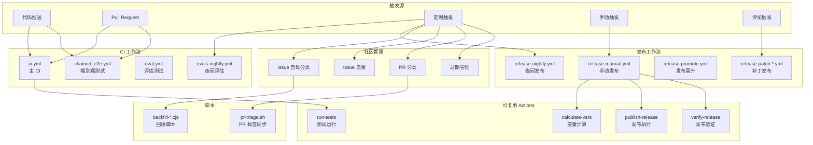

# .github/ - GitHub 配置与自动化

## 概述

`.github/` 目录是 Gemini CLI 项目在 GitHub 平台上的自动化配置中心，包含 CI/CD 工作流、可复用 Actions、自动化脚本、Issue/PR 模板以及依赖管理配置。该目录定义了项目从代码提交、测试、发布到社区管理的完整自动化流程。

## 目录结构

```
.github/
├── CODEOWNERS                                  # 代码所有权配置
├── dependabot.yml                              # Dependabot 依赖更新配置
├── pull_request_template.md                    # PR 模板
│
├── ISSUE_TEMPLATE/                             # Issue 模板
│   ├── bug_report.yml                          # Bug 报告模板（YAML 表单）
│   ├── feature_request.yml                     # 功能请求模板
│   └── website_issue.yml                       # 网站问题模板
│
├── actions/                                    # 可复用的组合 Actions
│   ├── calculate-vars/action.yml               # 计算发布流程的常用变量
│   ├── create-pull-request/action.yml          # 自动创建 PR
│   ├── npm-auth-token/action.yml               # npm 认证令牌管理
│   ├── post-coverage-comment/action.yml        # 发布覆盖率评论
│   ├── publish-release/action.yml              # 构建、准备和发布 npm 包及 GitHub Release
│   ├── push-docker/action.yml                  # 推送 Docker 镜像
│   ├── push-sandbox/action.yml                 # 推送沙箱产物
│   ├── run-tests/action.yml                    # 运行测试套件
│   ├── setup-npmrc/action.yml                  # 配置 .npmrc
│   ├── tag-npm-release/action.yml              # 标记 npm 发布版本
│   └── verify-release/action.yml               # 验证发布结果
│
├── scripts/                                    # 自动化脚本
│   ├── pr-triage.sh                            # PR 分类和标签同步脚本
│   ├── backfill-need-triage.cjs                # 回填需要分类的标签
│   ├── backfill-pr-notification.cjs            # 回填 PR 通知
│   └── sync-maintainer-labels.cjs              # 同步维护者标签
│
└── workflows/                                  # GitHub Actions 工作流
    ├── # === CI/测试 ===
    ├── ci.yml                                  # 主 CI 工作流（Lint + 多平台测试 + CodeQL + 包大小检查）
    ├── chained_e2e.yml                         # 链式端到端测试
    ├── trigger_e2e.yml                         # 触发端到端测试
    ├── smoke-test.yml                          # 冒烟测试
    ├── test-build-binary.yml                   # 测试构建二进制
    ├── links.yml                               # 链接检查
    │
    ├── # === 评估 ===
    ├── eval.yml                                # 单次评估运行
    ├── eval-guidance.yml                       # 评估指导
    ├── evals-nightly.yml                       # 夜间评估运行
    ├── deflake.yml                             # 去除不稳定测试
    │
    ├── # === 发布 ===
    ├── release-manual.yml                      # 手动发布（支持版本、渠道、dry-run 等选项）
    ├── release-nightly.yml                     # 夜间自动发布
    ├── release-promote.yml                     # 发布晋升
    ├── release-rollback.yml                    # 发布回滚
    ├── release-sandbox.yml                     # 沙箱发布
    ├── release-notes.yml                       # 生成发布说明
    ├── release-change-tags.yml                 # 发布变更标签
    ├── release-patch-0-from-comment.yml        # 补丁发布第0步（从评论触发）
    ├── release-patch-1-create-pr.yml           # 补丁发布第1步（创建 PR）
    ├── release-patch-2-trigger.yml             # 补丁发布第2步（触发发布）
    ├── release-patch-3-release.yml             # 补丁发布第3步（执行发布）
    ├── verify-release.yml                      # 验证发布结果
    │
    ├── # === 文档 ===
    ├── docs-page-action.yml                    # 文档页面 Action
    ├── docs-rebuild.yml                        # 文档重建
    │
    ├── # === Issue/PR 管理 ===
    ├── gemini-automated-issue-triage.yml       # Gemini 自动 Issue 分类
    ├── gemini-automated-issue-dedup.yml        # Gemini 自动 Issue 去重
    ├── gemini-scheduled-issue-triage.yml       # 定时 Issue 分类
    ├── gemini-scheduled-issue-dedup.yml        # 定时 Issue 去重
    ├── gemini-scheduled-pr-triage.yml          # 定时 PR 分类
    ├── gemini-scheduled-stale-issue-closer.yml # 定时关闭过期 Issue
    ├── gemini-scheduled-stale-pr-closer.yml    # 定时关闭过期 PR
    ├── gemini-self-assign-issue.yml            # Gemini 自动分配 Issue
    ├── issue-opened-labeler.yml                # Issue 打开时自动标签
    ├── label-backlog-child-issues.yml          # 待办子 Issue 标签
    ├── label-workstream-rollup.yml             # 工作流汇总标签
    ├── no-response.yml                         # 无响应处理
    ├── pr-contribution-guidelines-notifier.yml # PR 贡献指南通知
    ├── pr-rate-limiter.yaml                    # PR 频率限制
    ├── community-report.yml                    # 社区报告
    ├── stale.yml                               # 过期 Issue/PR 管理
    └── unassign-inactive-assignees.yml         # 取消分配不活跃负责人
```

## 架构图



## 核心组件

### CI 工作流 (`ci.yml`)

主 CI 工作流，在代码推送和 PR 时自动触发，包含以下任务：

- **Lint**：ESLint、actionlint、shellcheck、yamllint、Prettier、敏感关键词检查
- **Test (Linux)**：在 Node 20.x/22.x/24.x 上运行，按 cli/others 分片
- **Test (Mac)**：与 Linux 相同的分片策略
- **Test (Windows)**：Windows 专用测试（含 Defender 排除配置）
- **CodeQL**：安全代码分析
- **Bundle Size**：包大小变化检测（仅 PR 时）
- **Link Checker**：Markdown 文档链接有效性检查

### 发布系统

采用多阶段发布流程：

1. **手动发布**（`release-manual.yml`）：支持版本号、npm 渠道（dev/preview/nightly/latest）、dry-run 模式
2. **夜间发布**（`release-nightly.yml`）：自动构建和发布 nightly 版本
3. **补丁发布**（`release-patch-*.yml`）：通过 PR 评论触发的 4 步补丁发布流程
4. **发布晋升**（`release-promote.yml`）：将版本从一个渠道晋升到另一个
5. **发布回滚**（`release-rollback.yml`）：回滚发布

### PR 分类脚本 (`pr-triage.sh`)

自动化 PR 管理脚本，功能包括：

- 检测 PR 是否关联了 Issue
- 自动同步关联 Issue 的标签（area/、priority/ 等）到 PR
- 为缺少关联 Issue 的非草稿 PR 添加 `status/need-issue` 标签
- 支持单个 PR 或批量处理所有开放 PR

### 可复用 Actions

| Action | 功能 |
|--------|------|
| `calculate-vars` | 计算发布流程中的 dry-run 标志等变量 |
| `publish-release` | 构建项目、发布 npm 包、创建 GitHub Release |
| `run-tests` | 统一的测试执行 Action |
| `verify-release` | 验证发布后 npm 包和 GitHub Release 是否正确 |
| `push-docker` | 推送 Docker 镜像到容器注册表 |
| `push-sandbox` | 推送沙箱环境产物 |

## 依赖关系

### 外部 Actions

| Action | 用途 |
|--------|------|
| `actions/checkout` | 代码检出 |
| `actions/setup-node` | Node.js 环境配置 |
| `actions/cache` | 缓存依赖（npm、ESLint、Linters） |
| `actions/upload-artifact` | 上传测试报告 |
| `dorny/test-reporter` | 发布测试报告 |
| `github/codeql-action` | CodeQL 安全分析 |
| `lycheeverse/lychee-action` | 链接检查 |
| `preactjs/compressed-size-action` | 包大小对比 |

## 数据流

### CI 流程

1. **代码推送/PR 触发** -> `ci.yml`
2. **Merge Queue Skipper** 检查是否需要跳过
3. **并行执行**：Lint、Linux 测试、Mac 测试、Windows 测试、CodeQL、包大小检查、链接检查
4. **汇总**：`ci` job 检查所有子任务结果

### 发布流程

1. **手动触发**或**夜间定时触发**
2. **计算变量**（dry-run 模式等）
3. **运行测试套件**（可选跳过）
4. **构建项目**并**发布到 npm**
5. **创建 GitHub Release**（可选）
6. **验证发布结果**

### 社区管理流程

1. **定时触发**（通常每天或每周）
2. **扫描开放 Issue/PR**
3. **自动分类**（使用 Gemini AI 进行 Issue 分类和去重）
4. **标签同步**（PR 标签与关联 Issue 同步）
5. **过期管理**（关闭长期无活动的 Issue/PR）
