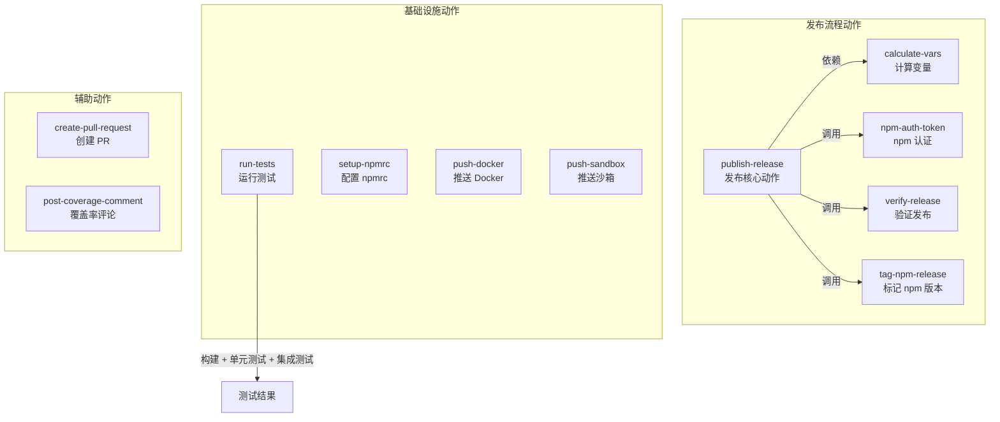
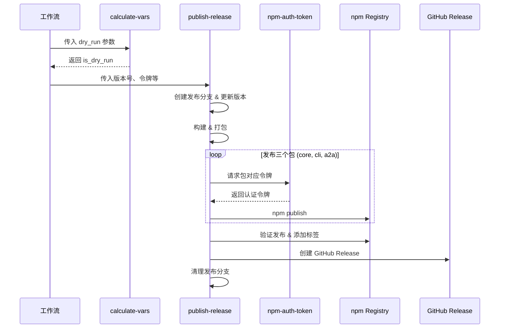

# .github/actions/

## 概述

该目录包含 Gemini CLI 项目的所有 **GitHub 复合动作（Composite Actions）**，用于在 CI/CD 工作流中封装可复用的构建、测试、发布和验证逻辑。共包含 11 个自定义动作，覆盖了从变量计算、npm 认证、测试执行到完整发布流程的各个环节。

## 目录结构

```
.github/actions/
├── calculate-vars/       # 计算发布流程常用变量（如 dry_run 标志）
│   └── action.yml
├── create-pull-request/  # 创建 Pull Request
│   └── action.yml
├── npm-auth-token/       # 根据包名获取对应的 npm 认证令牌
│   └── action.yml
├── post-coverage-comment/ # 在 PR 上发布测试覆盖率评论
│   └── action.yml
├── publish-release/      # 完整的发布流程（构建、发布、GitHub Release）
│   └── action.yml
├── push-docker/          # 推送 Docker 镜像
│   └── action.yml
├── push-sandbox/         # 推送沙箱环境
│   └── action.yml
├── run-tests/            # 运行预检查和集成测试
│   └── action.yml
├── setup-npmrc/          # 配置 .npmrc 文件
│   └── action.yml
├── tag-npm-release/      # 为 npm 包添加发布标签
│   └── action.yml
└── verify-release/       # 验证 npm 发布结果
    └── action.yml
```

## 架构图



## 核心组件

### 1. publish-release（发布核心动作）

最复杂的复合动作，编排完整的发布流程：

- **输入参数**：release-version、npm-tag、多个 wombat-token、dry-run 等
- **流程步骤**：
  1. 配置 Git 用户 → 创建发布分支
  2. 更新包版本号 → 提交并推送
  3. 构建与打包 → 发布 core/cli/a2a 三个包到 npm
  4. 验证发布 → 标记版本标签
  5. 创建 GitHub Release → 清理发布分支

### 2. run-tests（测试动作）

执行完整的测试套件：
- 构建项目（`npm run build`）
- 单元测试（`npm run test:ci`）
- 集成测试 - 无沙箱模式（`npm run test:integration:sandbox:none`）
- 集成测试 - Docker 沙箱模式（`npm run test:integration:sandbox:docker`）

### 3. calculate-vars（变量计算）

解析工作流输入参数，输出标准化变量（如 `is_dry_run`），供下游步骤使用。

### 4. npm-auth-token（npm 认证）

根据传入的包名（core / cli / a2a-server），返回对应的 Wombat 令牌，实现多包的差异化认证。

## 依赖关系

| 动作 | 内部依赖 | 外部依赖 |
|------|---------|---------|
| publish-release | npm-auth-token, verify-release, tag-npm-release | actions/setup-node |
| run-tests | 无 | 无 |
| calculate-vars | 无 | 无 |
| verify-release | 无 | 无 |
| tag-npm-release | 无 | 无 |

## 数据流


