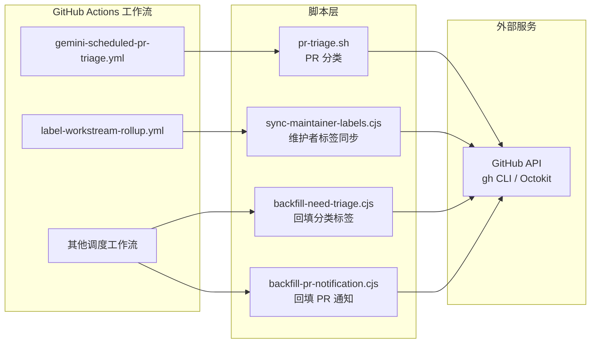
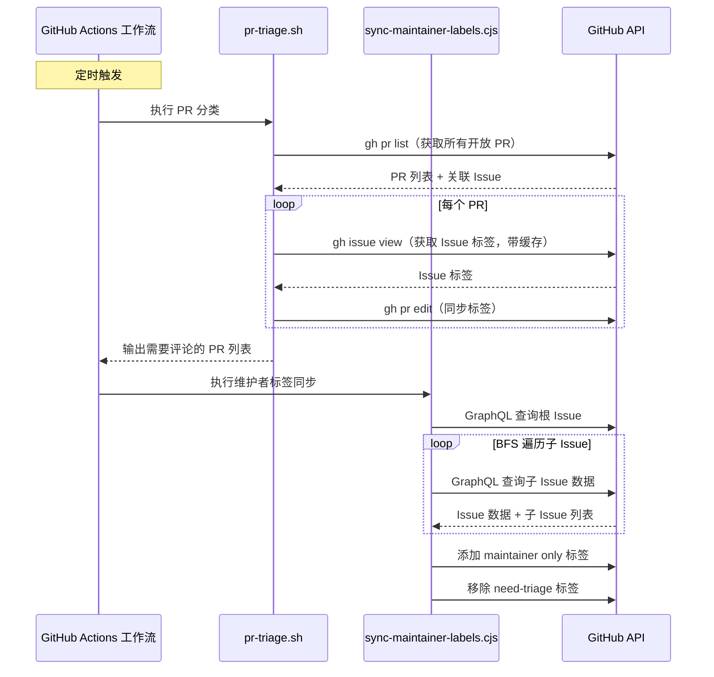

# .github/scripts/

## 概述

该目录包含被 GitHub Actions 工作流调用的 **辅助脚本**，共 4 个文件。这些脚本主要用于 PR 分类（triage）、Issue 标签同步、回填等仓库治理自动化任务。脚本分为 Bash 脚本和 Node.js（CommonJS）脚本两种类型。

## 目录结构

```
.github/scripts/
├── pr-triage.sh                   # PR 分类脚本（Bash）：检查关联 Issue、同步标签
├── sync-maintainer-labels.cjs     # 维护者标签同步（Node.js）：递归遍历根 Issue 的所有子 Issue 并打标签
├── backfill-need-triage.cjs       # 回填 need-triage 标签（Node.js）
└── backfill-pr-notification.cjs   # 回填 PR 通知（Node.js）
```

## 架构图



## 核心组件

### 1. pr-triage.sh -- PR 分类脚本

主要功能：
- **检查所有开放的 PR** 是否关联了 Issue
- 未关联 Issue 的非草稿 PR 会被添加 `status/need-issue` 标签
- 已关联 Issue 的 PR 会从关联 Issue 同步 `area/*`、`priority/*`、`help wanted` 等标签
- 使用 **平面字符串缓存**（兼容 Bash 3.2）避免重复查询 Issue 标签
- 输出需要评论提醒的 PR 列表到 `GITHUB_OUTPUT`

关键技术细节：
- 通过 `gh pr list` 批量获取所有 PR 数据，用 `jq` 提取关联 Issue
- 支持单个 PR 处理（`PR_NUMBER` 环境变量）和批量处理两种模式

### 2. sync-maintainer-labels.cjs -- 维护者标签同步

主要功能：
- 从预定义的 **根 Issue** 出发，递归发现所有子 Issue（BFS 广度优先搜索）
- 两种子 Issue 发现方式：GitHub 原生子 Issue 和 Markdown 任务列表引用
- 为公共仓库中的所有后代 Issue 添加 `maintainer only` 标签
- 同时移除 `status/need-triage` 标签
- 支持 `--dry-run` 模式
- 使用 **GraphQL API** 高效获取 Issue 数据，支持分页

核心常量：
- `ROOT_ISSUES`：3 个根 Issue（#15374, #15456, #15324）
- `PUBLIC_REPO`：`gemini-cli`
- `PRIVATE_REPO`：`maintainers-gemini-cli`

## 依赖关系

| 脚本 | 运行时依赖 | 调用方式 |
|------|-----------|---------|
| pr-triage.sh | `gh` CLI、`jq` | Bash 直接执行 |
| sync-maintainer-labels.cjs | `@octokit/rest` | `node` 执行 |
| backfill-need-triage.cjs | `@octokit/rest` | `node` 执行 |
| backfill-pr-notification.cjs | `@octokit/rest` | `node` 执行 |

## 数据流


