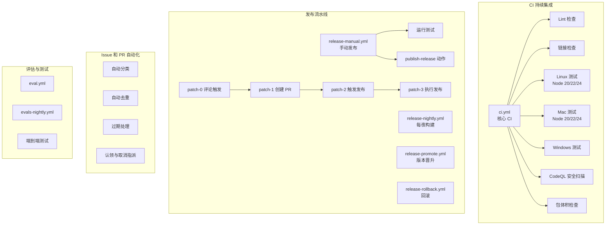
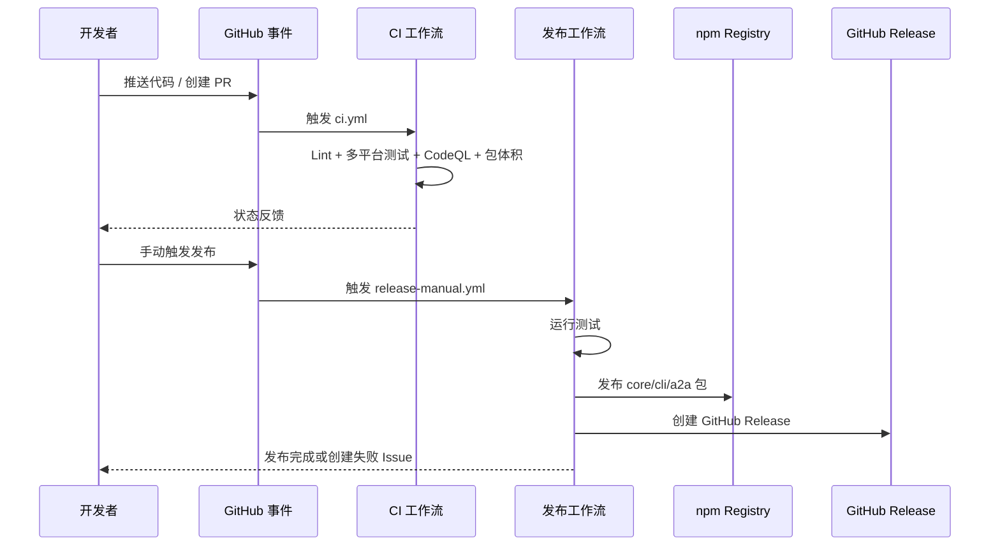

# .github/workflows/

## 概述

该目录包含 Gemini CLI 项目的所有 **GitHub Actions 工作流定义**，共 41 个 YAML 文件。工作流覆盖持续集成（CI）、多渠道发布、评估测试（Evals）、Issue/PR 自动化管理等方面，构成了项目完整的 DevOps 自动化体系。

## 目录结构

```
.github/workflows/
├── ci.yml                          # 核心 CI 工作流（Lint + 多平台测试 + CodeQL + 包体积检查）
├── chained_e2e.yml                 # 链式端到端测试
├── trigger_e2e.yml                 # 触发端到端测试
├── smoke-test.yml                  # 冒烟测试
├── test-build-binary.yml           # 测试构建二进制产物
│
├── release-manual.yml              # 手动发布（核心发布工作流）
├── release-nightly.yml             # 每夜自动构建发布
├── release-promote.yml             # 版本晋升（如 preview → latest）
├── release-rollback.yml            # 发布回滚
├── release-sandbox.yml             # 沙箱环境发布
├── release-notes.yml               # 生成发布说明
├── release-change-tags.yml         # 发布变更标签
├── release-patch-0-from-comment.yml # 补丁发布流程（步骤0：从评论触发）
├── release-patch-1-create-pr.yml   # 补丁发布流程（步骤1：创建 PR）
├── release-patch-2-trigger.yml     # 补丁发布流程（步骤2：触发发布）
├── release-patch-3-release.yml     # 补丁发布流程（步骤3：执行发布）
├── verify-release.yml              # 验证发布结果
│
├── eval.yml                        # 评估测试
├── eval-guidance.yml               # 评估指导测试
├── evals-nightly.yml               # 每夜评估测试
├── deflake.yml                     # 去除不稳定测试
│
├── gemini-automated-issue-triage.yml    # Gemini 自动 Issue 分类
├── gemini-scheduled-issue-triage.yml    # 定时 Issue 分类
├── gemini-automated-issue-dedup.yml     # 自动 Issue 去重
├── gemini-scheduled-issue-dedup.yml     # 定时 Issue 去重
├── gemini-scheduled-pr-triage.yml       # 定时 PR 分类
├── gemini-scheduled-stale-issue-closer.yml # 定时关闭过期 Issue
├── gemini-scheduled-stale-pr-closer.yml    # 定时关闭过期 PR
├── gemini-self-assign-issue.yml         # Issue 自行认领
├── issue-opened-labeler.yml             # 新 Issue 自动打标签
├── label-backlog-child-issues.yml       # Backlog 子 Issue 标签
├── label-workstream-rollup.yml          # 工作流标签汇总
├── no-response.yml                      # 无响应自动关闭
├── stale.yml                            # 过期处理
├── unassign-inactive-assignees.yml      # 取消不活跃的指派
│
├── community-report.yml             # 社区报告
├── docs-page-action.yml             # 文档页面构建
├── docs-rebuild.yml                 # 文档重建
├── links.yml                        # 链接检查
├── pr-contribution-guidelines-notifier.yml # PR 贡献指南通知
└── pr-rate-limiter.yaml             # PR 速率限制
```

## 架构图



## 核心组件

### 1. ci.yml -- 核心 CI 工作流

触发条件：push 到 main/release 分支、PR、merge_group、手动触发。

包含 8 个 Job：
- **merge_queue_skipper**：合并队列跳过检测
- **lint**：ESLint、actionlint、shellcheck、yamllint、Prettier、敏感关键词检查等
- **link_checker**：Markdown 文件链接检查
- **test_linux**：Linux 上 Node 20/22/24 x cli/others 分片矩阵测试
- **test_mac**：Mac 上相同矩阵测试（continue-on-error）
- **test_windows**：Windows 上 cli/others 分片测试
- **codeql**：CodeQL 静态安全分析
- **bundle_size**：PR 包体积变化检查

### 2. release-manual.yml -- 手动发布工作流

手动触发，输入参数包括版本号、分支、npm 渠道（dev/preview/nightly/latest）、dry_run 等。流程：Checkout → 安装依赖 → 运行测试 → 调用 publish-release 动作 → 失败时自动创建 Issue。

### 3. 补丁发布链 (release-patch-0/1/2/3)

四步链式工作流，实现从 Issue 评论触发到最终发布补丁版本的完整自动化流程。

### 4. Issue/PR 自动化工作流群

基于 Gemini AI 的自动分类、去重，以及过期处理、速率限制等，形成完善的仓库治理自动化。

## 依赖关系

| 工作流 | 依赖的 Actions | 触发方式 |
|--------|---------------|---------|
| ci.yml | actions/checkout, actions/setup-node, actions/cache, github/codeql-action, dorny/test-reporter | push, PR, merge_group |
| release-manual.yml | .github/actions/run-tests, .github/actions/publish-release | workflow_dispatch |
| release-nightly.yml | .github/actions/publish-release | schedule |
| release-patch-* | 链式 workflow_dispatch | 逐步触发 |

## 数据流


