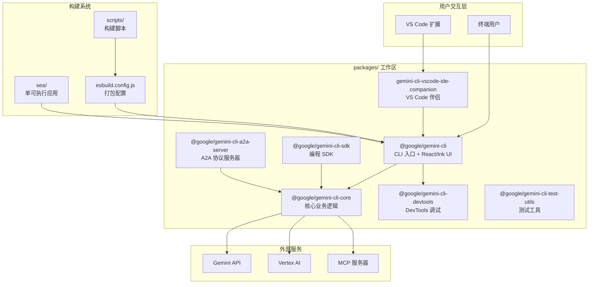
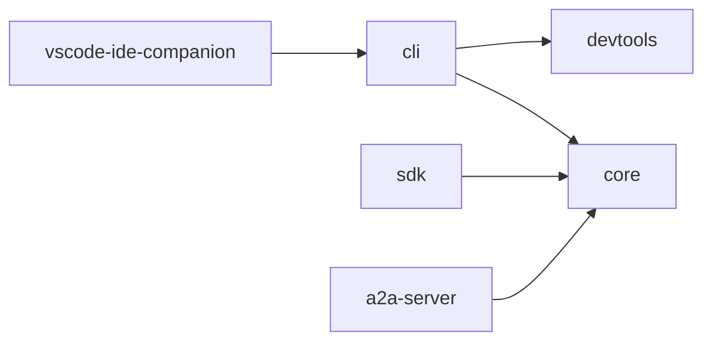
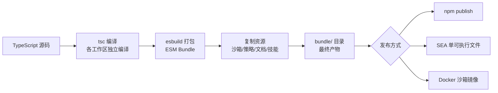
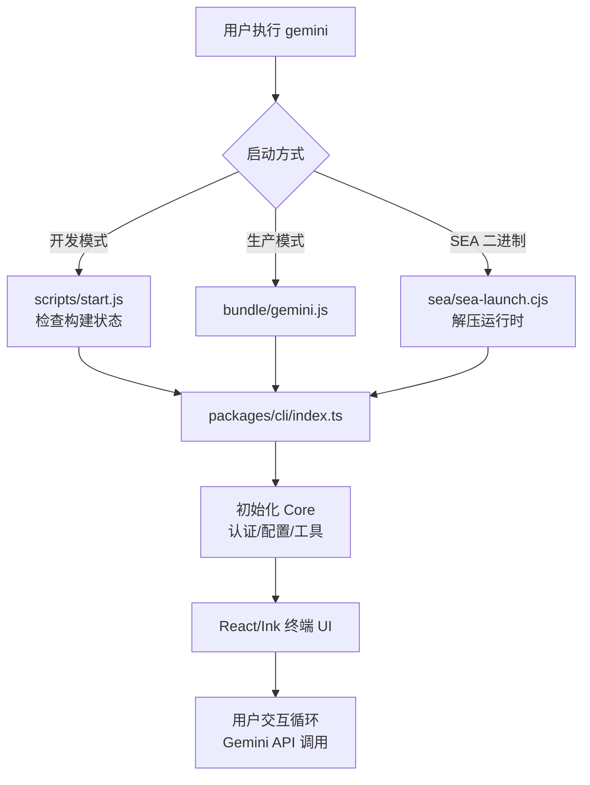

# Gemini CLI 项目根目录

## 概述

Gemini CLI 是 Google 开源的 AI 命令行代理工具，将 Gemini 大模型的能力直接带入终端环境。项目采用 **npm workspaces** 管理的 monorepo 架构，使用 TypeScript 编写，通过 esbuild 进行打包构建。整个项目基于 Apache 2.0 协议开源，支持多种认证方式（Google OAuth、API Key、Vertex AI），并提供内置工具（文件操作、Shell 命令、网页搜索）和 MCP 协议扩展能力。

## 目录结构

```
gemini-cli/
├── packages/                # Monorepo 工作区 - 核心代码包
│   ├── cli/                 # CLI 主入口和终端 UI（基于 React/Ink）
│   ├── core/                # 核心业务逻辑（提示词、工具、API 调用等）
│   ├── sdk/                 # SDK 包，提供编程接口
│   ├── a2a-server/          # Agent-to-Agent (A2A) 协议服务器
│   ├── devtools/            # React DevTools 调试支持
│   ├── test-utils/          # 测试工具库
│   └── vscode-ide-companion/# VS Code 伴侣扩展
├── scripts/                 # 构建、部署、测试、发布脚本
├── schemas/                 # JSON Schema 定义（settings.schema.json）
├── sea/                     # Node.js Single Executable Application 启动器
├── third_party/             # 第三方依赖（如 ripgrep 下载器）
├── evals/                   # 模型评估测试
├── integration-tests/       # 端到端集成测试
├── docs/                    # 项目文档
├── package.json             # 根 package.json（monorepo 配置）
├── tsconfig.json            # 根 TypeScript 配置
├── esbuild.config.js        # esbuild 打包配置
├── eslint.config.js         # ESLint 代码规范配置
├── Makefile                 # Make 快捷命令
├── Dockerfile               # 沙箱容器镜像定义
├── CONTRIBUTING.md          # 贡献指南
├── GEMINI.md                # AI 辅助开发上下文文件
└── README.md                # 项目说明文档
```

## 架构图



## 核心组件

### package.json（根配置）

- **名称**: `@google/gemini-cli`，版本通过 nightly/preview/stable 三轨发布
- **Monorepo**: 使用 `npm workspaces`，工作区为 `packages/*`
- **入口**: `bundle/gemini.js`（esbuild 打包产物）
- **引擎要求**: Node.js >= 20.0.0
- **核心依赖**: `ink`（终端 UI，使用 `@jrichman/ink` 分支）、`simple-git`、`node-fetch-native`
- **可选依赖**: `@lydell/node-pty`（伪终端支持）、`keytar`（密钥存储）
- **关键脚本**:
  - `npm start` - 开发模式启动
  - `npm run build` - 构建所有工作区
  - `npm run bundle` - esbuild 打包
  - `npm run test` - 运行单元测试
  - `npm run preflight` - 完整预提交检查

### tsconfig.json（TypeScript 配置）

- **目标**: ES2022，模块系统为 NodeNext
- **严格模式**: 全部开启（strict、noImplicitAny、strictNullChecks 等）
- **增量编译**: 启用 composite 和 incremental
- **JSX**: 使用 react-jsx（支持 Ink 组件）
- **库**: ES2023

### esbuild.config.js（打包配置）

项目使用 esbuild 进行生产构建，配置了两个独立的构建目标：

1. **CLI 构建**（`cliConfig`）:
   - 入口: `packages/cli/index.ts` -> `bundle/gemini.js`
   - 启用代码分割（splitting）
   - 注入版本号和沙箱镜像 URI
   - WASM 嵌入式加载器
   - 排除原生模块（node-pty、keytar 等）

2. **A2A 服务器构建**（`a2aServerConfig`）:
   - 入口: `packages/a2a-server/src/http/server.ts`
   - 输出: `packages/a2a-server/dist/a2a-server.mjs`

### eslint.config.js（代码规范）

采用 TypeScript ESLint 扁平配置，规则严格：
- 禁止 `require()`，强制 ES6 import
- 禁止抛出非 Error 对象
- 强制 `node:` 协议前缀
- 包内禁止自引用，强制相对路径
- API 响应接口字段必须标记为可选（Code Assist 目录）
- 生产代码禁止 `Object.create()` 和 `Reflect`

### Makefile

提供便捷的 Make 命令入口，包括 `install`、`build`、`test`、`lint`、`start`、`debug`、`run-npx`、`create-alias` 等。

## 依赖关系

### 内部依赖



### 外部关键依赖

| 类别 | 依赖包 | 用途 |
|------|--------|------|
| 终端 UI | `ink`（@jrichman/ink 分支） | React 终端渲染框架 |
| 终端 PTY | `@lydell/node-pty` | 伪终端支持（可选） |
| Git 操作 | `simple-git` | Git 命令封装 |
| HTTP | `node-fetch-native` | HTTP 请求 |
| 密钥存储 | `keytar` | 系统密钥链（可选） |
| 构建 | `esbuild` | JavaScript/TypeScript 打包 |
| 测试 | `vitest` | 测试框架 |
| 代码规范 | `eslint` + `prettier` | Lint 和格式化 |
| 版本管理 | `semver` | 语义化版本解析 |

## 数据流

### 构建流程



### CLI 启动流程



### 发布流程

项目采用三轨发布策略：
1. **Nightly**: 每日 UTC 00:00 自动发布，包含 main 分支最新变更
2. **Preview**: 每周二 UTC 23:59 发布，用于提前测试
3. **Stable**: 每周二 UTC 20:00 发布，为上周 Preview 的正式推广版本
