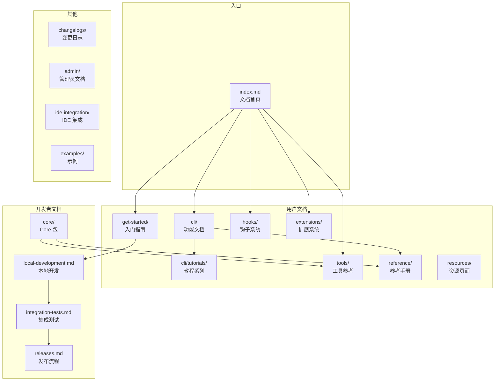

# docs/ - 项目文档

## 概述

`docs/` 目录是 Gemini CLI 项目的官方用户文档和开发者文档中心。文档面向两类读者：终端用户（安装、配置、使用 Gemini CLI）和贡献者（本地开发、测试、发布流程）。文档使用 Markdown 格式编写，采用主题式分层目录结构组织。

## 目录结构

```
docs/
├── index.md                                # 文档首页（安装、快速入门导航）
├── local-development.md                    # 本地开发指南（Tracing、Jaeger、Genkit）
├── integration-tests.md                    # 集成测试说明
├── issue-and-pr-automation.md              # Issue 和 PR 自动化说明
├── npm.md                                  # npm 发布相关
├── releases.md                             # 发布流程说明
├── release-confidence.md                   # 发布信心评估
│
├── get-started/                            # 入门指南
│   ├── index.md                            # 快速入门
│   ├── installation.md                     # 安装说明
│   ├── authentication.md                   # 认证设置
│   └── gemini-3.md                         # Gemini 3 支持
│
├── cli/                                    # CLI 功能文档
│   ├── cli-reference.md                    # CLI 命令速查表
│   ├── settings.md                         # 配置项说明
│   ├── system-prompt.md                    # 系统提示词
│   ├── custom-commands.md                  # 自定义命令
│   ├── skills.md                           # 技能系统
│   ├── creating-skills.md                  # 创建技能
│   ├── model.md                            # 模型选择
│   ├── model-routing.md                    # 模型路由
│   ├── model-steering.md                   # 模型引导
│   ├── generation-settings.md              # 生成参数设置
│   ├── plan-mode.md                        # 计划模式
│   ├── sandbox.md                          # 沙箱模式
│   ├── headless.md                         # 无头模式
│   ├── acp-mode.md                         # ACP 模式
│   ├── session-management.md               # 会话管理
│   ├── checkpointing.md                    # 检查点
│   ├── rewind.md                           # 回退功能
│   ├── token-caching.md                    # Token 缓存
│   ├── gemini-md.md                        # GEMINI.md 文件
│   ├── gemini-ignore.md                    # .geminiignore 文件
│   ├── git-worktrees.md                    # Git 工作树支持
│   ├── notifications.md                    # 通知功能
│   ├── themes.md                           # 主题配置
│   ├── telemetry.md                        # 遥测数据
│   ├── trusted-folders.md                  # 可信文件夹
│   ├── enterprise.md                       # 企业功能
│   └── tutorials/                          # 教程系列
│       ├── automation.md                   # 自动化工作流
│       ├── file-management.md              # 文件管理
│       ├── mcp-setup.md                    # MCP 设置
│       ├── memory-management.md            # 记忆管理
│       ├── plan-mode-steering.md           # 计划模式引导
│       ├── session-management.md           # 会话管理教程
│       ├── shell-commands.md               # Shell 命令教程
│       ├── skills-getting-started.md       # 技能入门
│       ├── task-planning.md                # 任务规划
│       └── web-tools.md                    # 网络工具教程
│
├── core/                                   # Core 包文档
│   ├── index.md                            # Core 概述
│   ├── subagents.md                        # 子 Agent（实验性）
│   ├── local-model-routing.md              # 本地模型路由（实验性）
│   └── remote-agents.md                    # 远程 Agent
│
├── tools/                                  # 工具参考文档
│   ├── file-system.md                      # 文件系统工具
│   ├── shell.md                            # Shell 命令工具
│   ├── memory.md                           # 记忆工具
│   ├── planning.md                         # 规划工具
│   ├── ask-user.md                         # 用户询问工具
│   ├── web-fetch.md                        # 网页抓取工具
│   ├── web-search.md                       # 网络搜索工具
│   ├── mcp-server.md                       # MCP 服务器工具
│   ├── activate-skill.md                   # 技能激活工具
│   ├── todos.md                            # TODO 工具
│   └── internal-docs.md                    # 内部文档工具
│
├── hooks/                                  # 钩子系统文档
│   ├── index.md                            # 钩子概述
│   ├── writing-hooks.md                    # 编写钩子
│   ├── reference.md                        # 钩子参考
│   └── best-practices.md                   # 钩子最佳实践
│
├── extensions/                             # 扩展系统文档
│   ├── index.md                            # 扩展概述
│   ├── writing-extensions.md               # 编写扩展
│   ├── reference.md                        # 扩展参考
│   ├── best-practices.md                   # 扩展最佳实践
│   └── releasing.md                        # 发布扩展
│
├── reference/                              # 参考手册
│   ├── commands.md                         # 命令参考
│   ├── configuration.md                    # 配置参考
│   ├── keyboard-shortcuts.md               # 快捷键参考
│   ├── tools.md                            # 工具参考
│   ├── policy-engine.md                    # 策略引擎
│   └── memport.md                          # 记忆导入处理器
│
├── resources/                              # 资源页面
│   ├── faq.md                              # 常见问题
│   ├── quota-and-pricing.md                # 配额与定价
│   ├── tos-privacy.md                      # 服务条款与隐私
│   ├── troubleshooting.md                  # 故障排除
│   └── uninstall.md                        # 卸载说明
│
├── changelogs/                             # 变更日志
│   ├── index.md                            # 变更日志索引
│   ├── latest.md                           # 最新稳定版
│   └── preview.md                          # 预览版
│
├── admin/                                  # 管理员文档
│   └── enterprise-controls.md              # 企业管控
│
├── ide-integration/                        # IDE 集成文档
│   ├── index.md                            # IDE 集成概述
│   └── ide-companion-spec.md               # IDE Companion 规范
│
└── examples/                               # 示例
    └── proxy-script.md                     # 代理脚本示例
```

## 架构图



## 核心组件

### 入门指南 (`get-started/`)

面向新用户的快速入门文档，涵盖安装、认证配置和首次使用体验。包含对 Gemini 3 模型的支持说明。

### CLI 功能文档 (`cli/`)

详尽描述 Gemini CLI 所有功能特性的参考文档，包括：

- **配置体系**：settings、system-prompt、GEMINI.md、.geminiignore
- **运行模式**：计划模式、沙箱模式、无头模式、ACP 模式
- **模型管理**：模型选择、路由、引导、生成参数
- **会话管理**：会话恢复、检查点、回退
- **扩展能力**：自定义命令、技能系统

### 教程系列 (`cli/tutorials/`)

面向实际使用场景的分步教程，覆盖文件管理、Shell 命令、MCP 设置、记忆管理、会话管理等日常工作流。

### 工具参考 (`tools/`)

每个工具一个文档页面，详细描述工具的功能、参数、使用示例和注意事项。

### 钩子系统 (`hooks/`)

描述事件驱动的钩子机制，允许在 Agent 生命周期的关键节点（如工具调用前后、模型调用前后）执行自定义逻辑。

### 扩展系统 (`extensions/`)

描述基于 MCP 协议的扩展系统，涵盖扩展的编写、最佳实践、参考 API 和发布流程。

### Core 包文档 (`core/`)

描述 `packages/core` 的架构和功能，包括 Gemini API 交互、工具管理与编排、提示词工程、会话状态管理等核心职责。

## 依赖关系

### 内部引用

- 文档间通过相对路径大量交叉引用
- `core/index.md` 引用 `reference/tools.md`、`reference/policy-engine.md` 等
- `cli/` 下的文档引用 `reference/` 下的详细参考

### 文档构建

- 使用 Markdown 格式
- 通过 GitHub Actions 工作流自动构建和部署（`docs-page-action.yml`、`docs-rebuild.yml`）

## 数据流

### 文档组织逻辑

文档按照用户旅程和主题进行组织：

1. **入门** -> `get-started/`：安装 -> 认证 -> 快速开始
2. **日常使用** -> `cli/` + `cli/tutorials/`：功能说明 + 实操教程
3. **深度定制** -> `hooks/` + `extensions/` + `reference/`：钩子 -> 扩展 -> 配置参考
4. **开发贡献** -> `local-development.md` + `integration-tests.md` + `releases.md`
5. **运维管理** -> `admin/` + `resources/`：企业管控 + FAQ + 故障排除
