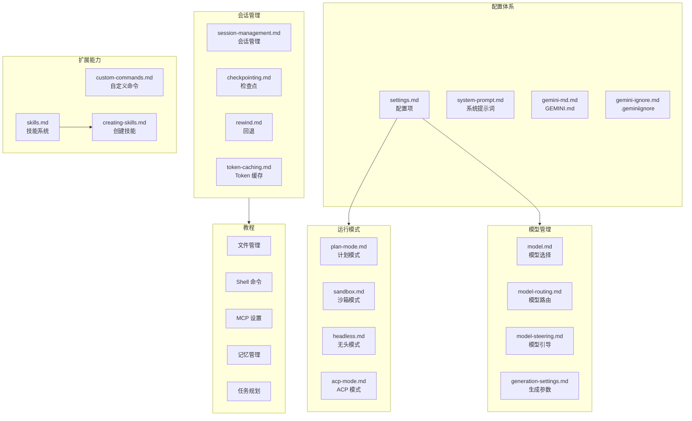

# docs/cli/ - CLI 功能文档

## 概述

`docs/cli/` 目录包含 Gemini CLI 所有功能特性的详细文档。这些文档面向日常使用 Gemini CLI 的开发者，涵盖配置、运行模式、模型管理、会话管理和扩展能力等方面。同时包含一个 `tutorials/` 子目录，提供面向具体场景的分步教程。

## 目录结构

```
cli/
├── cli-reference.md              # CLI 命令速查表
├── settings.md                   # 配置项说明
├── system-prompt.md              # 系统提示词配置
├── custom-commands.md            # 自定义命令
├── skills.md                     # 技能系统概述
├── creating-skills.md            # 创建自定义技能
├── model.md                      # 模型选择
├── model-routing.md              # 模型路由
├── model-steering.md             # 模型引导
├── generation-settings.md        # 生成参数设置
├── plan-mode.md                  # 计划模式
├── sandbox.md                    # 沙箱模式
├── headless.md                   # 无头模式（脚本集成）
├── acp-mode.md                   # ACP 模式
├── session-management.md         # 会话管理
├── checkpointing.md              # 检查点功能
├── rewind.md                     # 回退功能
├── token-caching.md              # Token 缓存
├── gemini-md.md                  # GEMINI.md 指令文件
├── gemini-ignore.md              # .geminiignore 忽略规则
├── git-worktrees.md              # Git 工作树支持
├── notifications.md              # 通知功能
├── themes.md                     # 主题配置
├── telemetry.md                  # 遥测数据说明
├── trusted-folders.md            # 可信文件夹
├── enterprise.md                 # 企业功能
│
└── tutorials/                    # 实操教程
    ├── automation.md             # 自动化工作流
    ├── file-management.md        # 文件管理
    ├── mcp-setup.md              # MCP 服务器设置
    ├── memory-management.md      # 记忆管理
    ├── plan-mode-steering.md     # 计划模式引导
    ├── session-management.md     # 会话管理
    ├── shell-commands.md         # Shell 命令
    ├── skills-getting-started.md # 技能入门
    ├── task-planning.md          # 任务规划
    └── web-tools.md              # 网络工具
```

## 架构图



## 核心组件

### 配置体系

- **settings.md**：全面描述所有可配置项及其默认值
- **system-prompt.md**：系统提示词的自定义方法
- **gemini-md.md**：GEMINI.md 文件的编写规范和加载机制
- **gemini-ignore.md**：控制哪些文件被 Agent 忽略

### 运行模式

- **plan-mode.md**：Agent 先制定计划再执行，适合复杂任务
- **sandbox.md**：在隔离沙箱中运行命令，保护系统安全
- **headless.md**：非交互模式，用于脚本和 CI/CD 集成
- **acp-mode.md**：Agent Communication Protocol 模式

### 教程系列

10 篇面向具体使用场景的分步教程，涵盖文件操作、Shell 命令、MCP 配置、记忆管理、会话管理、技能使用、网络工具等日常工作流。

## 依赖关系

### 内部引用

- 被 `docs/index.md` 作为主要使用文档引用
- `skills.md` 和 `creating-skills.md` 与 `.gemini/skills/` 配置关联
- `headless.md` 被 CI/CD 集成文档引用
- 教程引用对应的功能文档页面
