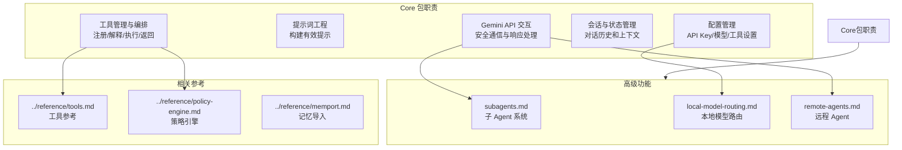

# docs/core/ - Core 包文档

## 概述

`docs/core/` 目录描述 Gemini CLI 核心包（`packages/core`）的架构和功能。Core 包是 Gemini CLI 的后端部分，负责与 Gemini API 通信、管理工具、处理来自 CLI 前端（`packages/cli`）的请求。

## 目录结构

```
core/
├── index.md                    # Core 包概述和导航
├── subagents.md                # 子 Agent 系统（实验性功能）
├── local-model-routing.md      # 本地模型路由（实验性，使用本地 Gemma 模型）
└── remote-agents.md            # 远程 Agent 支持
```

## 架构图



## 核心组件

| 文档 | 描述 |
|------|------|
| `index.md` | Core 包概述，描述其五大核心职责：API 交互、提示词工程、工具编排、会话管理、配置管理 |
| `subagents.md` | 子 Agent 系统：创建和使用专门化的子 Agent 处理复杂任务（实验性） |
| `local-model-routing.md` | 使用本地 Gemma 模型进行模型路由决策（实验性） |
| `remote-agents.md` | 远程 Agent 支持，允许与外部 Agent 通信 |

## 依赖关系

### 内部引用

- `index.md` 引用 `../reference/tools.md`（工具参考）
- `index.md` 引用 `../reference/policy-engine.md`（策略引擎）
- `index.md` 引用 `../reference/memport.md`（记忆导入）
- 被 `docs/index.md` 间接引用
