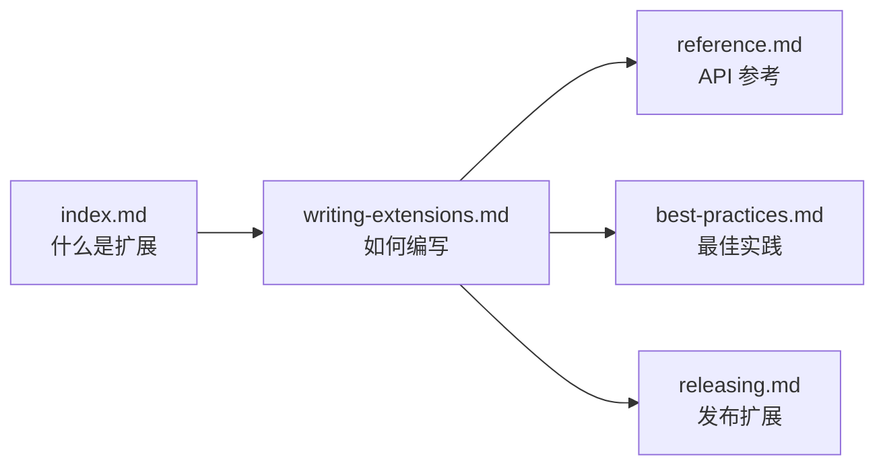

# docs/extensions/ - 扩展系统文档

## 概述

`docs/extensions/` 目录描述 Gemini CLI 基于 MCP（Model Context Protocol）协议的扩展系统。扩展允许第三方开发者为 Gemini CLI 添加新的工具和能力，如数据库查询、云服务操作、自定义 API 集成等。

## 目录结构

```
extensions/
├── index.md                # 扩展系统概述
├── writing-extensions.md   # 编写扩展指南
├── reference.md            # 扩展 API 参考
├── best-practices.md       # 扩展最佳实践
└── releasing.md            # 发布扩展
```

## 架构图



## 核心组件

| 文档 | 描述 |
|------|------|
| `index.md` | MCP 扩展系统的概念介绍和架构说明 |
| `writing-extensions.md` | 编写 MCP 扩展的完整指南 |
| `reference.md` | 扩展 API 参考（协议规范、工具定义） |
| `best-practices.md` | 扩展开发的最佳实践和安全考虑 |
| `releasing.md` | 扩展发布流程和版本管理 |

## 依赖关系

### 内部引用

- 与 `docs/tools/mcp-server.md` 关联
- 与 `integration-tests/extensions-install.test.ts` 和 `extensions-reload.test.ts` 测试关联
- 被 `docs/cli/tutorials/mcp-setup.md` 教程引用
