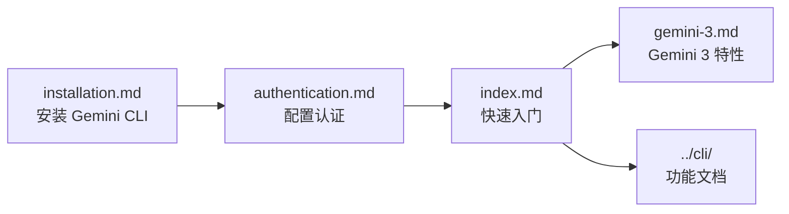

# docs/get-started/ - 入门指南

## 概述

`docs/get-started/` 目录包含 Gemini CLI 的入门文档，面向首次接触 Gemini CLI 的用户，指导他们完成安装、认证配置和第一次使用体验。

## 目录结构

```
get-started/
├── index.md              # 快速入门（第一次使用 Gemini CLI 的引导）
├── installation.md       # 安装说明（npm、系统要求、多种安装方式）
├── authentication.md     # 认证设置（个人账户、企业账户、API Key）
└── gemini-3.md           # Gemini 3 模型支持（新模型特性和使用方法）
```

## 架构图



## 核心组件

| 文档 | 描述 |
|------|------|
| `index.md` | 第一次使用 Gemini CLI 的快速上手指南 |
| `installation.md` | 详细的安装说明，包括 npm 全局安装、系统要求等 |
| `authentication.md` | 认证方式说明，支持 Google 个人账户和企业账户 |
| `gemini-3.md` | Gemini 3 模型在 Gemini CLI 中的支持和使用 |

## 依赖关系

### 内部引用

- 被 `docs/index.md` 作为首要导航目标引用
- `authentication.md` 被 `cli/enterprise.md` 引用
- `index.md` 引导用户前往 `cli/cli-reference.md` 等后续文档
