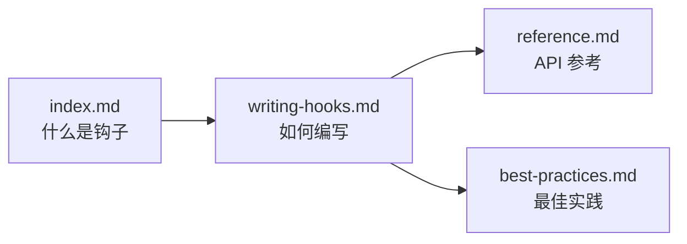

# docs/hooks/ - 钩子系统文档

## 概述

`docs/hooks/` 目录描述 Gemini CLI 的事件驱动钩子系统。钩子允许用户在 Agent 生命周期的关键节点（如工具调用前后、模型调用前后、Agent 启动/停止时）注入自定义逻辑，实现输入验证、输出修改、工具审批、通知等高级功能。

## 目录结构

```
hooks/
├── index.md              # 钩子系统概述
├── writing-hooks.md      # 编写钩子指南
├── reference.md          # 钩子 API 参考（事件类型、参数、返回值）
└── best-practices.md     # 钩子最佳实践
```

## 架构图



## 核心组件

| 文档 | 描述 |
|------|------|
| `index.md` | 钩子系统的概念介绍和使用场景 |
| `writing-hooks.md` | 编写自定义钩子的完整指南 |
| `reference.md` | 钩子事件类型、参数和返回值的 API 参考 |
| `best-practices.md` | 钩子编写的最佳实践和常见陷阱 |

## 依赖关系

### 内部引用

- 与 `integration-tests/hooks-system.test.ts` 和 `hooks-agent-flow.test.ts` 测试关联
- 被 `docs/index.md` 作为高级功能文档引用
