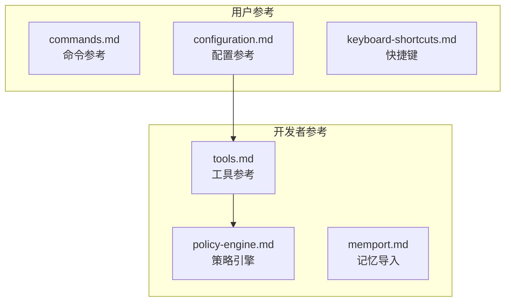

# docs/reference/ - 参考手册

## 概述

`docs/reference/` 目录包含 Gemini CLI 的技术参考手册，提供命令、配置、工具、策略引擎和快捷键等方面的完整参考信息。这些文档面向需要查阅详细技术规格的高级用户和开发者。

## 目录结构

```
reference/
├── commands.md              # 命令参考（所有 CLI 命令和选项）
├── configuration.md         # 配置参考（所有配置文件和选项）
├── keyboard-shortcuts.md    # 快捷键参考
├── tools.md                 # 工具参考（工具的定义、注册和使用方式）
├── policy-engine.md         # 策略引擎（细粒度工具执行控制）
└── memport.md               # 记忆导入处理器（@file.md 语法）
```

## 架构图



## 核心组件

| 文档 | 描述 |
|------|------|
| `commands.md` | 所有 CLI 命令、标志和选项的完整参考 |
| `configuration.md` | 配置文件格式、所有配置项及其默认值 |
| `keyboard-shortcuts.md` | 交互模式下的快捷键列表 |
| `tools.md` | 工具系统的技术规格（定义、注册、执行流程） |
| `policy-engine.md` | 策略引擎的规则定义和工具执行控制 |
| `memport.md` | GEMINI.md 中 `@file.md` 导入语法的处理器文档 |

## 依赖关系

### 内部引用

- `tools.md` 被 `docs/core/index.md` 引用
- `policy-engine.md` 被 `docs/core/index.md` 引用
- `configuration.md` 被 `docs/cli/settings.md` 引用
- `commands.md` 被 `docs/cli/cli-reference.md` 引用
