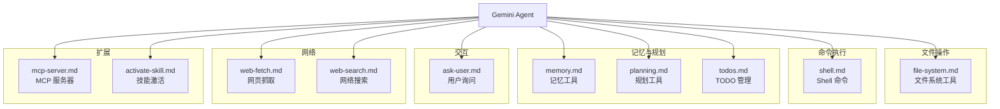

# docs/tools/ - 工具参考文档

## 概述

`docs/tools/` 目录包含 Gemini CLI 内置工具的详细参考文档。每个工具对应一个文档页面，描述其功能、参数、使用场景和示例。这些工具是 Gemini CLI Agent 与外部世界交互的主要接口。

## 目录结构

```
tools/
├── file-system.md        # 文件系统工具（read_file, write_file, replace, list_directory）
├── shell.md              # Shell 命令工具（run_shell_command）
├── memory.md             # 记忆工具（save_memory, 持久化指令）
├── planning.md           # 规划工具（任务分解与管理）
├── ask-user.md           # 用户询问工具（交互式确认和输入）
├── web-fetch.md          # 网页抓取工具（获取 URL 内容）
├── web-search.md         # 网络搜索工具（Google 网络搜索）
├── mcp-server.md         # MCP 服务器工具（模型上下文协议扩展）
├── activate-skill.md     # 技能激活工具（加载和激活技能）
├── todos.md              # TODO 管理工具
└── internal-docs.md      # 内部文档工具
```

## 架构图



## 核心组件

| 工具 | 功能 | 关键操作 |
|------|------|---------|
| `file-system` | 文件系统交互 | `read_file`, `write_file`, `replace`, `list_directory` |
| `shell` | 执行 Shell 命令 | `run_shell_command` (支持前台/后台) |
| `memory` | 持久化记忆 | `save_memory` (写入 GEMINI.md) |
| `planning` | 任务规划管理 | 任务分解、进度追踪 |
| `ask-user` | 用户交互 | 确认请求、信息收集 |
| `web-fetch` | 网页内容获取 | URL 抓取和内容提取 |
| `web-search` | Google 搜索 | 网络搜索和结果返回 |
| `mcp-server` | MCP 扩展 | 通过 MCP 协议连接外部工具 |
| `activate-skill` | 技能系统 | 加载和激活 SKILL.md 技能 |

## 依赖关系

### 内部引用

- 被 `docs/core/index.md` 引用（`reference/tools.md` 是工具的总参考）
- 被 `docs/cli/tutorials/` 中的教程引用
- `mcp-server.md` 与 `docs/extensions/` 关联
- `activate-skill.md` 与 `docs/cli/skills.md` 关联
