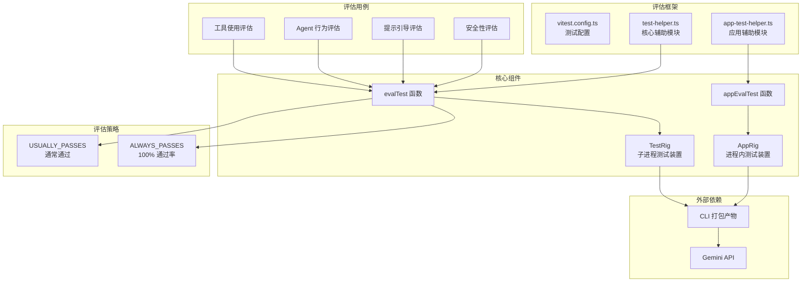

# evals/ - 行为评估测试

## 概述

`evals/` 目录包含 Gemini CLI 的**行为评估测试**(Behavioral Evaluations)。与传统集成测试验证系统功能是否正确不同，行为评估测试验证的是模型是否**选择**了正确的操作。例如，"当用户要求保存代码时，模型是否决定写入磁盘？"。

行为评估是提示词（prompt）变更、工具定义变更以及其他模型引导机制的关键反馈循环，同时也是衡量功能可靠性和防止回归的重要工具。

## 目录结构

```
evals/
├── README.md                                    # 行为评估的完整说明文档
├── vitest.config.ts                             # Vitest 测试配置（超时 5 分钟，输出 JSON 报告）
├── test-helper.ts                               # 核心测试辅助模块（evalTest, EvalCase, TestRig 等）
├── test-helper.test.ts                          # test-helper 自身的单元测试
├── app-test-helper.ts                           # 应用级测试辅助模块（appEvalTest, AppRig）
├── answer-vs-act.eval.ts                        # 评估：回答 vs 执行操作的决策
├── ask_user.eval.ts                             # 评估：询问用户的行为
├── automated-tool-use.eval.ts                   # 评估：自动工具使用（eslint --fix, prettier --write）
├── cli_help_delegation.eval.ts                  # 评估：CLI 帮助委托
├── concurrency-safety.eval.ts                   # 评估：并发安全性
├── edit-locations-eval.eval.ts                  # 评估：编辑位置
├── frugalReads.eval.ts                          # 评估：节约读取
├── frugalSearch.eval.ts                         # 评估：节约搜索
├── generalist_agent.eval.ts                     # 评估：通用 Agent 调用
├── generalist_delegation.eval.ts                # 评估：通用 Agent 委托
├── gitRepo.eval.ts                              # 评估：Git 仓库操作
├── grep_search_functionality.eval.ts            # 评估：Grep 搜索功能
├── hierarchical_memory.eval.ts                  # 评估：层级记忆
├── interactive-hang.eval.ts                     # 评估：交互式挂起检测
├── model_steering.eval.ts                       # 评估：模型引导
├── plan_mode.eval.ts                            # 评估：计划模式
├── redundant_casts.eval.ts                      # 评估：冗余类型转换
├── sandbox_recovery.eval.ts                     # 评估：沙箱恢复
├── save_memory.eval.ts                          # 评估：记忆保存
├── shell-efficiency.eval.ts                     # 评估：Shell 命令效率
├── subagents.eval.ts                            # 评估：子 Agent
├── tool_output_masking.eval.ts                  # 评估：工具输出遮蔽
├── tracker.eval.ts                              # 评估：追踪器
├── validation_fidelity.eval.ts                  # 评估：验证保真度
└── validation_fidelity_pre_existing_errors.eval.ts  # 评估：预存错误的验证保真度
```

## 架构图



## 核心组件

### `evalTest` 函数 (`test-helper.ts`)

行为评估的核心入口函数，接收两个参数：

- **`policy: EvalPolicy`** - 一致性期望策略
  - `ALWAYS_PASSES`：期望 100% 通过，运行在每次 CI 中，失败可以阻断 PR
  - `USUALLY_PASSES`：期望大部分时间通过，仅在夜间运行中执行（需设置 `RUN_EVALS=1`）
- **`evalCase: EvalCase`** - 测试用例定义对象

### `EvalCase` 接口

```typescript
interface EvalCase {
  name: string;                           // 评估名称
  params?: { settings?: Record<string, unknown>; };  // 可选参数
  prompt: string;                         // 发送给模型的提示词
  timeout?: number;                       // 超时时间
  files?: Record<string, string>;         // 测试文件（路径 -> 内容）
  messages?: Record<string, unknown>[];   // 预加载的会话历史
  sessionId?: string;                     // 恢复会话 ID
  approvalMode?: 'default' | 'auto_edit' | 'yolo' | 'plan';  // 审批模式
  assert: (rig: TestRig, result: string) => Promise<void>;    // 断言函数
}
```

### `appEvalTest` 函数 (`app-test-helper.ts`)

用于 UI/交互密集型评估的辅助函数，使用进程内的 `AppRig` 替代子进程的 `TestRig`，支持断点设置和交互式驾驶。

### TestRig

来自 `@google/gemini-cli-test-utils` 的测试装置，以子进程方式启动完整的 CLI，提供：
- 临时测试目录管理
- 文件创建和读取
- 工具调用日志读取
- CLI 运行和结果收集

### 重试与容错机制

`internalEvalTest` 实现了最多 3 次重试，专门针对 API 500/503 错误进行重试和跳过处理，避免基础设施不稳定导致误判。

## 依赖关系

### 内部依赖

| 模块 | 用途 |
|------|------|
| `@google/gemini-cli-test-utils` | 提供 TestRig、打印调试信息等工具 |
| `@google/gemini-cli-core` | 提供 Storage、parseAgentMarkdown、SESSION_FILE_PREFIX 等核心功能 |
| `packages/cli/src/test-utils/AppRig.js` | 提供进程内应用测试装置 |
| `packages/cli/test-setup.ts` | 测试环境初始化 |

### 外部依赖

| 包名 | 用途 |
|------|------|
| `vitest` | 测试框架 |
| `node:fs` | 文件系统操作 |
| `node:path` | 路径处理 |
| `node:crypto` | 生成随机 UUID |
| `node:child_process` | 执行 git 命令 |

## 数据流

### 评估执行流程

1. **初始化阶段**：创建 TestRig 实例，准备日志目录，设置测试文件和 git 仓库
2. **文件准备**：根据 `evalCase.files` 写入测试文件，初始化 git 仓库并执行 `git init` + `git commit`
3. **会话预加载**（可选）：如果提供了 `messages`，写入会话文件供 `--resume` 使用
4. **运行 CLI**：通过 TestRig 以子进程方式启动 CLI，传入提示词
5. **断言验证**：调用 `evalCase.assert` 验证模型的决策行为（如工具调用、文件变更）
6. **结果记录**：将工具调用日志写入 `evals/logs/` 目录，失败时保留活动日志
7. **错误重试**：遇到 API 500/503 错误时自动重试最多 3 次

### 评估晋升流程

1. 所有新评估必须以 `USUALLY_PASSES` 策略创建
2. 在夜间运行中至少完成 7 次运行
3. 在所有支持的模型上达到 100% 通过率后，由 Agent 自动晋升为 `ALWAYS_PASSES`
