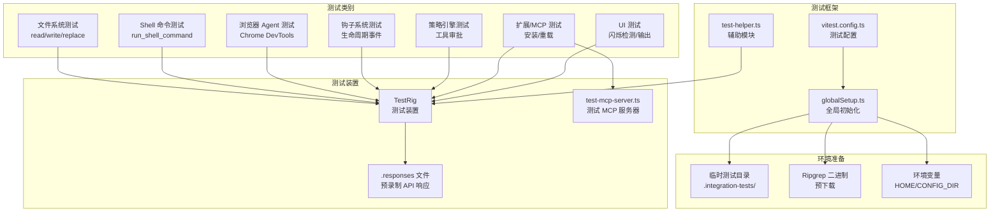

# integration-tests/ - 集成测试

## 概述

`integration-tests/` 目录包含 Gemini CLI 的**集成测试**。与 `evals/` 中的行为评估不同，集成测试验证的是系统功能是否正确运行（例如："文件写入工具是否真的将内容写入磁盘？"），而非模型的决策行为。

集成测试使用预录制的 API 响应文件（`.responses` 文件）作为模拟，不需要真正调用 Gemini API，因此执行速度更快且结果确定性更高。

## 目录结构

```
integration-tests/
├── vitest.config.ts                          # Vitest 配置（超时 5 分钟，重试 2 次，8-16 线程并行）
├── globalSetup.ts                            # 全局设置（临时目录、ripgrep 下载、环境变量）
├── test-helper.ts                            # 测试辅助模块（导出 TestRig 等工具）
├── tsconfig.json                             # TypeScript 配置
├── test-mcp-server.ts                        # 测试用 MCP 服务器
│
├── # === 测试文件 (.test.ts) ===
├── acp-env-auth.test.ts                      # ACP 环境认证测试
├── acp-telemetry.test.ts                     # ACP 遥测测试
├── api-resilience.test.ts                    # API 弹性测试
├── browser-agent.test.ts                     # 浏览器 Agent 端到端测试
├── browser-policy.test.ts                    # 浏览器策略测试
├── checkpointing.test.ts                     # 检查点测试
├── clipboard-linux.test.ts                   # Linux 剪贴板测试
├── concurrency-limit.test.ts                 # 并发限制测试
├── context-compress-interactive.test.ts      # 上下文压缩交互测试
├── ctrl-c-exit.test.ts                       # Ctrl+C 退出测试
├── deprecation-warnings.test.ts              # 弃用警告测试
├── extensions-install.test.ts                # 扩展安装测试
├── extensions-reload.test.ts                 # 扩展重新加载测试
├── file-system-interactive.test.ts           # 文件系统交互测试
├── file-system.test.ts                       # 文件系统基础测试
├── flicker.test.ts                           # UI 闪烁检测测试
├── google_web_search.test.ts                 # Google 网络搜索测试
├── hooks-agent-flow.test.ts                  # 钩子 Agent 流程测试
├── hooks-system.test.ts                      # 钩子系统测试
├── json-output.test.ts                       # JSON 输出测试
├── list_directory.test.ts                    # 目录列表测试
├── mcp_server_cyclic_schema.test.ts          # MCP 服务器循环 Schema 测试
├── mixed-input-crash.test.ts                 # 混合输入崩溃测试
├── parallel-tools.test.ts                    # 并行工具测试
├── plan-mode.test.ts                         # 计划模式测试
├── policy-headless.test.ts                   # 无头策略测试
├── read_many_files.test.ts                   # 多文件读取测试
├── replace.test.ts                           # 替换工具测试
├── resume_repro.test.ts                      # 会话恢复复现测试
├── ripgrep-real.test.ts                      # Ripgrep 真实调用测试
├── run_shell_command.test.ts                 # Shell 命令执行测试
├── simple-mcp-server.test.ts                 # 简单 MCP 服务器测试
├── skill-creator-scripts.test.ts             # 技能创建脚本测试
├── skill-creator-vulnerabilities.test.ts     # 技能创建安全漏洞测试
├── stdin-context.test.ts                     # 标准输入上下文测试
├── stdout-stderr-output.test.ts              # 标准输出/错误输出测试
├── symlink-install.test.ts                   # 符号链接安装测试
├── telemetry.test.ts                         # 遥测测试
├── test-mcp-support.test.ts                  # MCP 支持测试
├── user-policy.test.ts                       # 用户策略测试
├── utf-bom-encoding.test.ts                  # UTF BOM 编码测试
├── write_file.test.ts                        # 文件写入测试
│
└── # === 响应文件 (.responses) ===
    # 每个 .responses 文件对应特定测试场景的预录制 API 响应
    ├── api-resilience.responses
    ├── browser-agent.*.responses             # 多个浏览器测试场景
    ├── concurrency-limit.responses
    ├── context-compress-interactive.*.responses
    ├── hooks-system.*.responses              # 多个钩子测试场景
    ├── json-output.*.responses
    ├── parallel-tools.responses
    ├── policy-headless-*.responses
    ├── stdout-stderr-output*.responses
    ├── resume_repro.responses
    ├── test-mcp-support.responses
    └── user-policy.responses
```

## 架构图



## 核心组件

### `globalSetup.ts` - 全局测试环境初始化

负责在所有测试运行前设置测试环境：

- **创建隔离的临时目录**：在 `.integration-tests/<timestamp>/` 下创建独立运行目录
- **环境隔离**：将 `HOME` 和 `GEMINI_CONFIG_DIR` 设置为临时目录，避免干扰用户本地配置
- **预下载 Ripgrep**：在测试启动前确保 ripgrep 二进制可用，避免并行测试中的竞态条件
- **旧数据清理**：自动清理超过 5 个的旧测试运行目录
- **拆卸清理**：测试完成后清理临时目录（除非设置了 `KEEP_OUTPUT`）

### `test-helper.ts` - 测试辅助模块

从 `@google/gemini-cli-test-utils` 导出核心工具，并添加 `skipFlaky` 标志用于跳过不稳定测试。

### `.responses` 文件 - 预录制 API 响应

每个 `.responses` 文件包含了对应测试场景的预录制 API 响应数据，使得集成测试可以在不调用真实 Gemini API 的情况下运行，确保测试的确定性和速度。

### `test-mcp-server.ts` - 测试 MCP 服务器

提供一个简单的 MCP（Model Context Protocol）服务器实现，用于测试扩展系统和 MCP 协议支持。

## 依赖关系

### 内部依赖

| 模块 | 用途 |
|------|------|
| `@google/gemini-cli-test-utils` | 提供 TestRig、normalizePath 等测试工具 |
| `@google/gemini-cli-core` | 提供 disableMouseTracking、canUseRipgrep 等核心功能 |
| `packages/core/src/tools/ripGrep.js` | Ripgrep 工具集成 |

### 外部依赖

| 包名 | 用途 |
|------|------|
| `vitest` | 测试框架（含并行执行和重试支持） |
| `node:fs/promises` | 异步文件操作 |
| `node:path` | 路径处理 |
| `node:url` | URL/文件路径转换 |
| `node:child_process` | 子进程执行（Chrome 检测等） |

## 数据流

### 集成测试执行流程

1. **全局初始化**（`globalSetup.ts`）
   - 创建隔离临时目录 `.integration-tests/<timestamp>/`
   - 设置 HOME、GEMINI_CONFIG_DIR 等环境变量
   - 预下载 ripgrep 二进制
   - 清理旧的测试运行目录

2. **单个测试执行**
   - 创建 TestRig 实例
   - 设置测试专用工作目录和文件
   - 加载对应的 `.responses` 文件作为 API 模拟
   - 执行 CLI 命令并捕获输出
   - 验证工具调用日志、文件变更、输出内容

3. **测试清理**
   - 每个测试结束后清理 TestRig
   - 全局拆卸时清理临时目录（可通过 `KEEP_OUTPUT=true` 保留）

### 测试分类

| 类别 | 典型测试 | 验证内容 |
|------|---------|---------|
| 文件系统 | file-system.test.ts, write_file.test.ts | 文件读写、路径处理 |
| Shell 命令 | run_shell_command.test.ts | 命令执行、输出捕获 |
| 浏览器 Agent | browser-agent.test.ts | Chrome DevTools 端到端流程 |
| 钩子系统 | hooks-system.test.ts | 生命周期事件、输入修改、工具阻止 |
| 策略引擎 | policy-headless.test.ts, user-policy.test.ts | 工具审批、只读模式 |
| 扩展 | extensions-install.test.ts, test-mcp-support.test.ts | MCP 服务器安装和通信 |
| 上下文管理 | context-compress-interactive.test.ts | 上下文压缩、会话恢复 |
| 遥测 | telemetry.test.ts, acp-telemetry.test.ts | 遥测数据收集和上报 |
