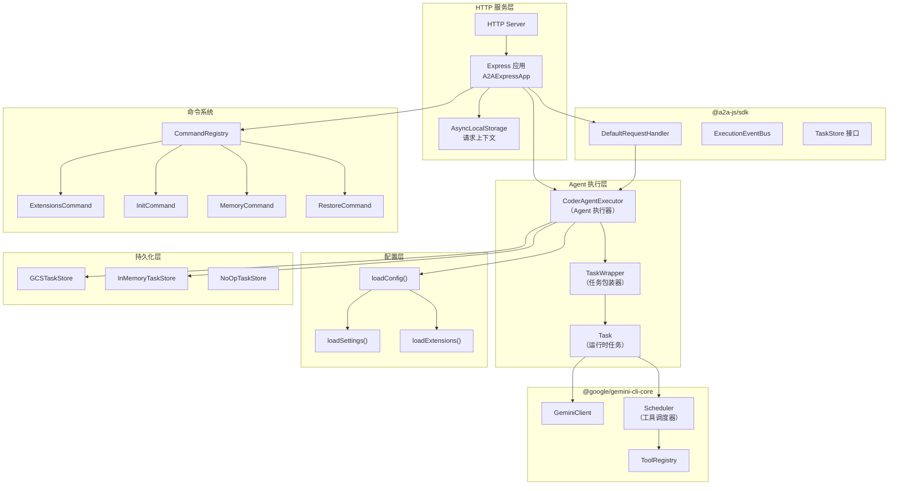
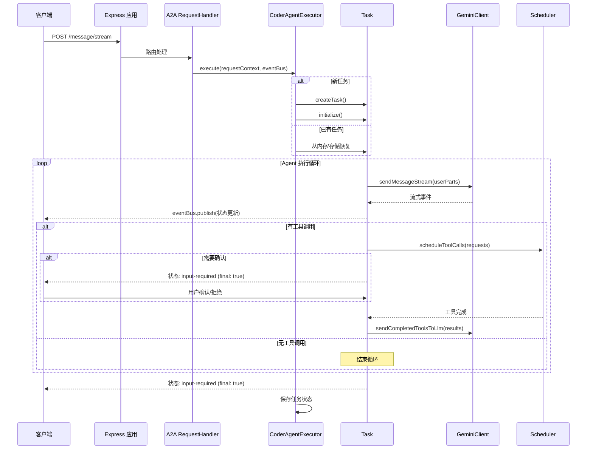

# packages/a2a-server

## 概述

`@google/gemini-cli-a2a-server` 是 Gemini CLI 的 A2A（Agent-to-Agent）协议服务器实现。它基于 `@a2a-js/sdk` 和 Express 框架，将 Gemini CLI 的代码生成能力暴露为一个符合 A2A 协议的 HTTP 服务，支持任务创建、流式消息传输、工具调用确认、任务取消和状态持久化等功能。

## 目录结构

```
packages/a2a-server/
├── index.ts                     # 包入口文件
├── package.json                 # 包配置
├── tsconfig.json                # TypeScript 配置
├── vitest.config.ts             # 测试配置
├── GEMINI.md                    # Gemini 上下文文件
├── README.md                    # 原始 README
├── development-extension-rfc.md # 扩展开发 RFC 文档
└── src/
    ├── index.ts                 # 模块导出入口
    ├── types.ts                 # 核心类型定义（CoderAgentEvent 等）
    ├── agent/                   # Agent 执行核心
    │   ├── executor.ts          # CoderAgentExecutor - Agent 执行器
    │   ├── task.ts              # Task - 任务管理（LLM交互、工具调度）
    │   ├── executor.test.ts
    │   └── task.test.ts / task-event-driven.test.ts
    ├── commands/                # 服务端命令系统
    │   ├── command-registry.ts  # CommandRegistry - 命令注册表
    │   ├── types.ts             # Command 接口定义
    │   ├── extensions.ts        # 扩展管理命令
    │   ├── init.ts              # 项目初始化命令
    │   ├── memory.ts            # 内存管理命令
    │   └── restore.ts           # 检查点恢复命令
    ├── config/                  # 服务端配置
    │   ├── config.ts            # 配置加载与认证
    │   ├── settings.ts          # 设置文件加载与合并
    │   └── extension.ts         # 扩展加载
    ├── http/                    # HTTP 服务层
    │   ├── app.ts               # Express 应用与路由
    │   ├── server.ts            # 服务器启动入口
    │   ├── requestStorage.ts    # AsyncLocalStorage 请求上下文
    │   └── endpoints.test.ts
    ├── persistence/             # 持久化层
    │   └── gcs.ts               # GCS (Google Cloud Storage) 任务持久化
    └── utils/                   # 工具函数
        ├── logger.ts            # Winston 日志器
        ├── executor_utils.ts    # 执行器辅助函数
        └── testing_utils.ts     # 测试辅助工具
```

## 架构图



## 核心组件

### CoderAgentExecutor (`src/agent/executor.ts`)

实现 `AgentExecutor` 接口，是 A2A 协议的核心执行器：

- `execute(requestContext, eventBus)` - 处理用户消息，管理完整的 Agent 执行循环
- `createTask(taskId, contextId, agentSettings)` - 创建新任务
- `reconstruct(sdkTask, eventBus)` - 从持久化的 SDKTask 恢复任务
- `cancelTask(taskId, eventBus)` - 取消正在执行的任务
- 支持主执行循环和辅助消息处理（多请求并发）

### Task (`src/agent/task.ts`)

运行时任务管理器，封装了与 Gemini API 的完整交互逻辑：

- `acceptUserMessage(requestContext, signal)` - 处理用户消息（文本 / 工具确认）
- `acceptAgentMessage(event)` - 处理 LLM 流式事件
- `scheduleToolCalls(requests, signal)` - 批量调度工具调用
- `waitForPendingTools()` / `cancelPendingTools(reason)` - 工具等待/取消
- `sendCompletedToolsToLlm(completedCalls, signal)` - 将工具结果回传 LLM
- 事件驱动的工具状态管理（通过 MessageBus 订阅）

### CommandRegistry (`src/commands/command-registry.ts`)

命令注册与管理系统，内置四个命令：
- `ExtensionsCommand` - 管理扩展（列出已安装扩展）
- `InitCommand` - 项目初始化（生成 GEMINI.md）
- `MemoryCommand` - 内存管理（显示/刷新/列出/添加）
- `RestoreCommand` - 检查点恢复（恢复/列出检查点）

### 配置系统 (`src/config/`)

- `loadConfig()` - 加载完整配置：认证、模型、MCP 服务器、遥测等
- `loadSettings()` - 从用户目录和工作区加载并合并 settings.json
- `loadExtensions()` - 从工作区和用户主目录加载 Gemini CLI 扩展
- `loadEnvironment()` - 加载 .env 文件

### GCSTaskStore (`src/persistence/gcs.ts`)

基于 Google Cloud Storage 的任务持久化实现：
- 任务元数据以 gzip 压缩 JSON 存储
- 工作区文件以 tar.gz 归档存储
- `NoOpTaskStore` - 包装器，save 操作为空，load 委托给真实存储

## 依赖关系

### 内部依赖
- `@google/gemini-cli-core` - 核心库（Config、GeminiClient、Scheduler 等）

### 外部依赖
- `@a2a-js/sdk` (0.3.11) - A2A 协议 SDK
- `express` (^5.1.0) - HTTP 框架
- `@google-cloud/storage` (^7.16.0) - GCS 持久化
- `winston` (^3.17.0) - 日志
- `uuid` (^13.0.0) - UUID 生成
- `fs-extra` (^11.3.0) - 增强的文件操作
- `tar` (^7.5.8) - 归档操作
- `strip-json-comments` (^3.1.1) - JSON 注释处理

## 数据流

### 用户消息处理流程


