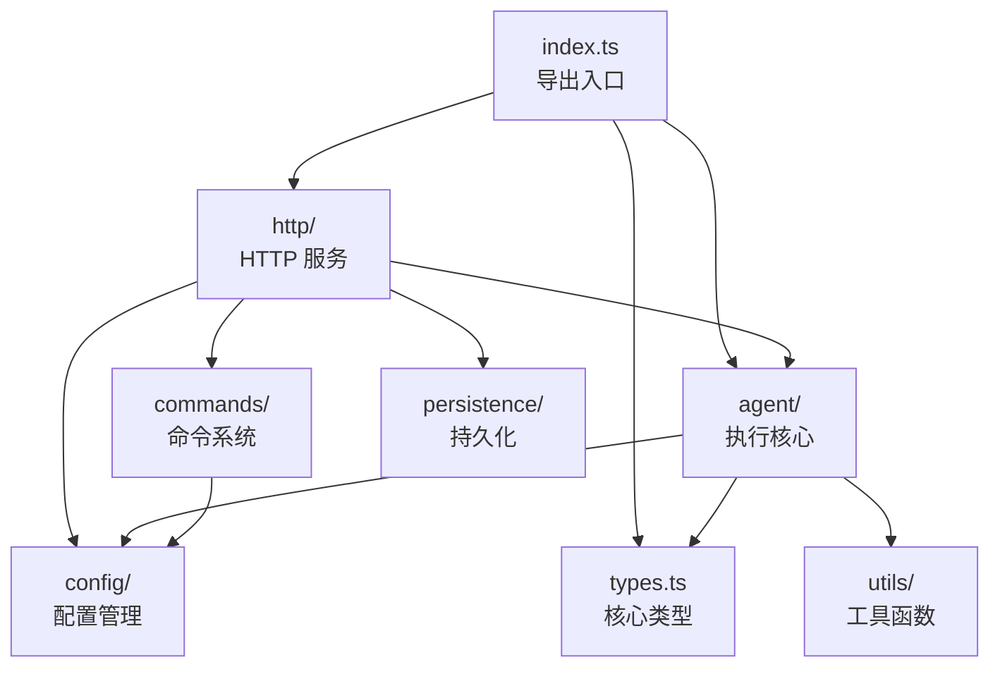

# packages/a2a-server/src

## 概述

A2A 服务器的核心源码目录，包含 Agent 执行层、命令系统、配置管理、HTTP 服务层、持久化层和工具函数。

## 目录结构

```
src/
├── index.ts         # 模块导出入口（executor, app, types）
├── types.ts         # 核心类型定义（CoderAgentEvent, AgentSettings 等）
├── agent/           # Agent 执行核心（Executor + Task）
├── commands/        # 服务端命令系统（extensions, init, memory, restore）
├── config/          # 配置管理（config, settings, extension）
├── http/            # HTTP 服务层（Express 应用 + 路由）
├── persistence/     # 持久化层（GCS 任务存储）
└── utils/           # 工具函数（日志、执行器辅助、测试工具）
```

## 架构图



## 核心组件

### types.ts

| 类型/枚举 | 说明 |
|-----------|------|
| `CoderAgentEvent` | 事件类型枚举（ToolCallConfirmation, TextContent, StateChange 等） |
| `AgentSettings` | Agent 设置（workspacePath, autoExecute） |
| `TaskMetadata` | 任务元数据（id, contextId, taskState, model, mcpServers, availableTools） |
| `PersistedStateMetadata` | 持久化状态元数据（_agentSettings, _taskState） |
| `CoderAgentMessage` | 联合类型，所有可能的 Agent 消息类型 |

辅助函数：
- `getPersistedState()` - 从任务元数据中提取持久化状态
- `getAgentSettingsFromMetadata()` - 从元数据中提取 Agent 设置
- `setPersistedState()` - 设置持久化状态到元数据

## 依赖关系

### 内部依赖
- `@google/gemini-cli-core` - 核心库

### 外部依赖
- `@a2a-js/sdk` - A2A 协议 SDK
- `express` - HTTP 框架
- `winston` - 日志
- `uuid` - UUID 生成

## 数据流

请求处理顺序：HTTP 服务层 -> A2A Handler -> CoderAgentExecutor -> Task -> GeminiClient / Scheduler
