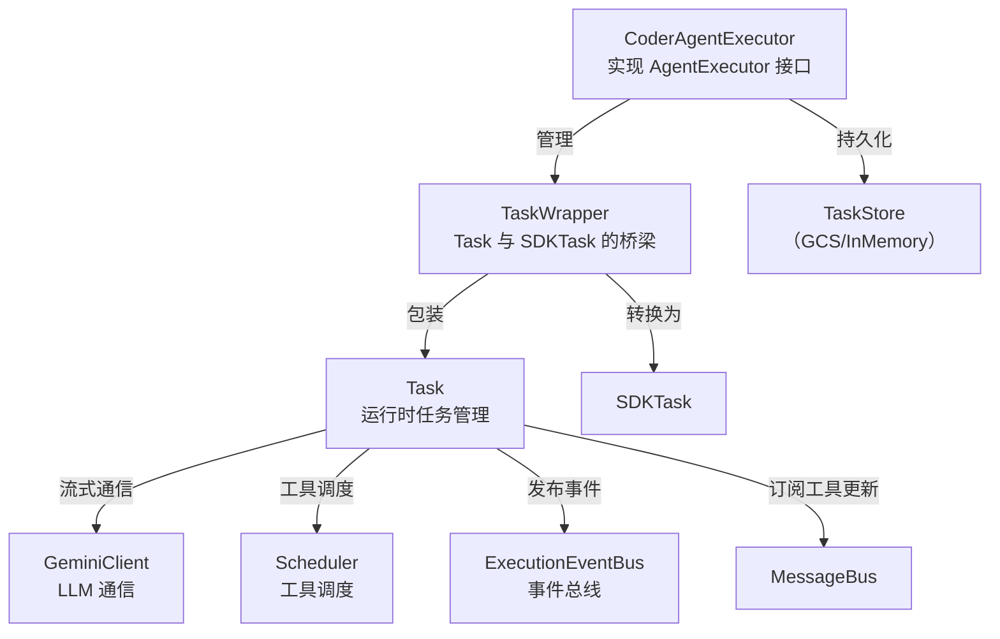

# packages/a2a-server/src/agent

## 概述

Agent 执行核心目录，包含 A2A 服务器的任务执行器和运行时任务管理器。`CoderAgentExecutor` 负责任务生命周期管理，`Task` 封装了与 Gemini LLM 交互和工具调度的完整逻辑。

## 目录结构

```
agent/
├── executor.ts                  # CoderAgentExecutor - Agent 执行器
├── task.ts                      # Task - 运行时任务管理
├── executor.test.ts             # 执行器测试
├── task.test.ts                 # 任务测试
└── task-event-driven.test.ts    # 事件驱动任务测试
```

## 架构图



## 核心组件

### CoderAgentExecutor

- 维护内存中的任务映射 (`tasks: Map<string, TaskWrapper>`)
- 跟踪正在执行的任务 (`executingTasks: Set<string>`)
- 支持主执行循环和辅助消息循环（处理并发请求）
- 支持 Socket 断开时自动中止执行
- 在 finally 块中保存任务状态并清理已完成任务

### Task

- 事件驱动的工具状态管理（通过 `MessageBus` 的 `TOOL_CALLS_UPDATE` 消息）
- 工具确认处理（ProceedOnce / Cancel / ProceedAlways 等）
- 检查点（Checkpointing）支持，用于文件修改操作的恢复
- 支持 YOLO 模式（自动执行所有工具）
- 内置 `dispose()` 方法清理消息总线订阅，防止内存泄漏

## 依赖关系

### 内部依赖
- `@google/gemini-cli-core` - GeminiClient, Scheduler, Config, ToolRegistry 等
- `../types.ts` - CoderAgentEvent, AgentSettings 等
- `../config/config.ts` - 配置加载

### 外部依赖
- `@a2a-js/sdk` - A2A 协议类型（Task, Message, TaskState 等）
- `@a2a-js/sdk/server` - 服务端接口（AgentExecutor, TaskStore, ExecutionEventBus）
- `uuid` - UUID 生成

## 数据流

Task 的工具调用生命周期：

1. LLM 返回 ToolCallRequest 事件 -> 收集到 toolCallRequests 列表
2. `scheduleToolCalls()` 预注册所有工具调用为 "scheduled" 状态
3. Scheduler 异步执行工具，通过 MessageBus 发布状态更新
4. `handleEventDrivenToolCallsUpdate()` 处理状态变化（executing / awaiting_approval / success / error / cancelled）
5. 工具完成后 `_resolveToolCall()` 解除等待
6. `getAndClearCompletedTools()` 收集结果
7. `sendCompletedToolsToLlm()` 将结果回传给 LLM
