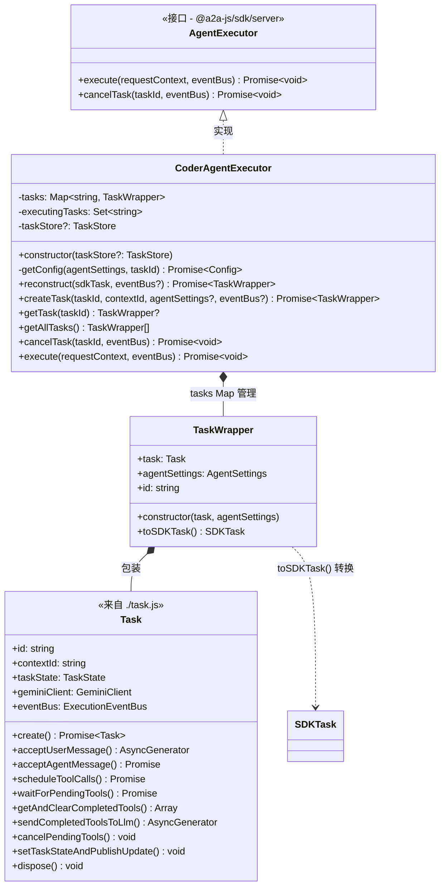
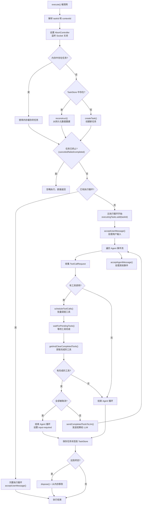

# executor.ts

## 概述

`executor.ts` 是 A2A Server 的核心执行引擎，包含两个类：

- **`TaskWrapper`**（内部类）：包装 `Task` 实例，负责在内部 `Task` 对象与 A2A SDK 的 `SDKTask` 之间进行数据桥接和状态序列化。
- **`CoderAgentExecutor`**（导出类）：实现 `AgentExecutor` 接口，是 Agent 代码生成的核心逻辑控制器。它管理任务的完整生命周期，包括创建、重建、执行、取消和销毁。内部维护了一个 Agent 执行循环（Agent Turn Loop），协调 LLM 流式响应处理、工具调用调度、用户确认等多阶段交互。

该文件是整个 A2A Server 的"大脑"，将 Gemini CLI Core 的能力与 A2A 协议的 SDK 框架连接起来。

## 架构图

### 类关系图



### 执行流程图



## 核心组件

### `TaskWrapper`（内部类，未导出）

`Task` 的轻量级包装器，充当内部运行时 `Task` 与 A2A SDK `SDKTask` 之间的桥梁。

#### 属性

| 属性 | 类型 | 说明 |
|---|---|---|
| `task` | `Task` | 内部运行时任务实例 |
| `agentSettings` | `AgentSettings` | Agent 配置信息 |

#### 方法

| 方法 | 签名 | 说明 |
|---|---|---|
| `id` (getter) | `get id(): string` | 代理返回内部 task 的 ID |
| `toSDKTask()` | `(): SDKTask` | 将内部状态序列化为 A2A SDK 的 Task 格式，包含持久化状态元数据、上下文 ID 等 |

### `CoderAgentExecutor`（导出类）

实现 `AgentExecutor` 接口的核心类，管理所有任务的生命周期和执行。

#### 私有属性

| 属性 | 类型 | 说明 |
|---|---|---|
| `tasks` | `Map<string, TaskWrapper>` | 内存中的活跃任务映射表 |
| `executingTasks` | `Set<string>` | 当前正在执行的任务 ID 集合，防止并发执行 |
| `taskStore` | `TaskStore` (可选) | 外部任务持久化存储 |

#### 构造函数

```typescript
constructor(private taskStore?: TaskStore)
```

接受可选的 `TaskStore` 实例，用于任务状态的持久化和恢复。

#### 私有方法

##### `getConfig(agentSettings: AgentSettings, taskId: string): Promise<Config>`

根据 Agent 设置加载完整的运行配置。流程：
1. 通过 `setTargetDir` 设置工作区根目录
2. 通过 `loadEnvironment` 加载环境变量（工作区级别覆盖全局）
3. 通过 `loadSettings` 加载工作区设置
4. 通过 `loadExtensions` 加载扩展
5. 通过 `loadConfig` 组装最终配置

#### 公开方法

##### `reconstruct(sdkTask: SDKTask, eventBus?: ExecutionEventBus): Promise<TaskWrapper>`

从 SDK 任务对象重建 `TaskWrapper`。用于从持久化存储中恢复任务。流程：
1. 从 `sdkTask.metadata` 中提取持久化状态
2. 使用提取的 `agentSettings` 加载配置
3. 通过 `Task.create()` 创建运行时任务
4. 恢复任务状态和初始化 Gemini 客户端
5. 将新 wrapper 存入内存缓存

如果元数据中缺少持久化状态，抛出异常。

##### `createTask(taskId: string, contextId: string, agentSettingsInput?: AgentSettings, eventBus?: ExecutionEventBus): Promise<TaskWrapper>`

创建全新的任务。如果未提供 `agentSettingsInput`，使用默认设置（当前工作目录）。流程：
1. 加载配置
2. 创建 `Task` 实例并初始化 Gemini 客户端
3. 包装为 `TaskWrapper` 并存入内存缓存

##### `getTask(taskId: string): TaskWrapper | undefined`

根据任务 ID 从内存缓存中获取 TaskWrapper。

##### `getAllTasks(): TaskWrapper[]`

获取所有内存中的活跃 TaskWrapper 列表。

##### `cancelTask(taskId: string, eventBus: ExecutionEventBus): Promise<void>`

取消指定任务。处理逻辑：
1. 检查任务是否存在（不存在则发布 `failed` 状态）
2. 检查任务是否已处于终态（`canceled`/`failed`，是则直接返回）
3. 取消挂起的工具调用
4. 将任务状态设为 `canceled`
5. 保存状态到 TaskStore
6. 调用 `dispose()` 清理资源并从内存中移除

##### `execute(requestContext: RequestContext, eventBus: ExecutionEventBus): Promise<void>`

**核心执行方法**。这是整个文件最复杂、最重要的方法，实现了 Agent 的完整执行循环。

执行流程分为以下阶段：

**阶段 1 - 初始化**：
- 从 `requestContext` 解析 `taskId` 和 `contextId`
- 设置事件总线监听
- 配置 `AbortController` 并绑定 Socket 关闭事件以支持客户端断连自动中断

**阶段 2 - 任务获取/创建**：
- 优先从内存缓存获取
- 其次从 TaskStore 重建
- 最后创建新任务

**阶段 3 - 并发控制**：
- 检查任务是否已处于终态，是则忽略
- 检查是否已有执行循环在运行（通过 `executingTasks` 集合），是则进入次要执行循环处理用户消息后返回

**阶段 4 - 主执行循环（Agent Turn Loop）**：
- 调用 `acceptUserMessage()` 获取事件流
- 遍历事件流，收集 `ToolCallRequest` 类型事件，其他事件交给 `acceptAgentMessage()` 处理
- 如果有工具调用请求，批量调度并等待完成
- 检查完成的工具调用结果：
  - 全部取消 -> 结束循环，设为 `input-required`
  - 有完成的 -> 将结果发回 LLM，继续循环
  - 没有工具调用 -> 结束循环

**阶段 5 - 清理**：
- 从 `executingTasks` 集合中移除
- 保存最终状态到 TaskStore
- 如果任务达到终态，调用 `dispose()` 并从内存移除

**错误处理**：
- `AbortSignal` 中断：取消挂起的工具，设为 `input-required`
- 其他错误：取消挂起的工具，设为 `failed`

## 依赖关系

### 内部依赖

| 依赖模块 | 路径 | 导入内容 | 说明 |
|---|---|---|---|
| 日志工具 | `../utils/logger.js` | `logger` | 日志记录 |
| 类型定义 | `../types.js` | `CoderAgentEvent`, `getPersistedState`, `setPersistedState`, `StateChange`, `AgentSettings`, `PersistedStateMetadata`, `getContextIdFromMetadata`, `getAgentSettingsFromMetadata` | 协议类型和持久化工具函数 |
| 配置加载 | `../config/config.js` | `loadConfig`, `loadEnvironment`, `setTargetDir` | 配置加载和环境设置 |
| 设置加载 | `../config/settings.js` | `loadSettings` | 工作区设置加载 |
| 扩展加载 | `../config/extension.js` | `loadExtensions` | 扩展加载 |
| 任务 | `./task.js` | `Task` | 运行时任务类 |
| 请求存储 | `../http/requestStorage.js` | `requestStorage` | 异步本地存储（AsyncLocalStorage） |
| 执行器工具 | `../utils/executor_utils.js` | `pushTaskStateFailed` | 错误状态推送工具 |

### 外部依赖

| 依赖模块 | 导入内容 | 说明 |
|---|---|---|
| `@a2a-js/sdk` | `Message`, `Task as SDKTask` | A2A SDK 核心类型 |
| `@a2a-js/sdk/server` | `TaskStore`, `AgentExecutor`, `AgentExecutionEvent`, `RequestContext`, `ExecutionEventBus` | A2A SDK 服务端接口 |
| `@google/gemini-cli-core` | `GeminiEventType`, `SimpleExtensionLoader`, `ToolCallRequestInfo`, `Config` | Gemini CLI 核心库 |
| `uuid` | `v4 as uuidv4` | UUID 生成 |

## 关键实现细节

1. **双层缓存策略**：任务首先从内存 `Map` 中查找（热缓存），如果不存在则从 `TaskStore`（冷存储）重建。这种策略在保证快速访问的同时支持跨进程的状态恢复。

2. **并发执行控制**：通过 `executingTasks` 的 `Set` 实现了单任务单主循环的约束。当同一任务有新的用户消息到达时，不会启动第二个主循环，而是进入次要循环（仅处理用户消息），由主循环统一协调 LLM 交互。

3. **Socket 生命周期绑定**：通过 `requestStorage`（`AsyncLocalStorage`）获取当前 HTTP 请求的原始 socket，并在 socket `end` 事件上绑定 `AbortController.abort()`，实现了客户端断连时自动中止 Agent 执行的功能，避免资源浪费。

4. **Agent Turn Loop（Agent 回合循环）**：核心的 `while(agentTurnActive)` 循环实现了 LLM 与工具调用之间的多轮交互。每一轮都是：LLM 生成响应 -> 收集工具调用 -> 执行工具 -> 将结果发回 LLM -> 继续下一轮。这个循环会一直持续，直到 LLM 不再请求工具调用为止。

5. **批量工具调用**：工具调用请求在一轮 LLM 流式响应中被收集到数组中，然后通过 `scheduleToolCalls()` 以批次方式调度。这允许并行执行多个工具调用，提高效率。

6. **全取消检测**：当一轮中所有工具调用都被用户取消时，执行器不会将取消的结果发回 LLM，而是直接终止循环并将任务状态设为 `input-required`，避免让 LLM 处理无意义的取消响应。

7. **不可变 SDK 转换**：`TaskWrapper.toSDKTask()` 每次调用都创建一个新的 `SDKTask` 对象，确保状态快照的一致性，避免引用共享导致的数据竞争问题。

8. **资源清理**：在终态（`canceled`/`failed`/`completed`）时调用 `wrapper.task.dispose()` 清理事件监听器等资源，并从内存映射中删除，防止内存泄漏。
