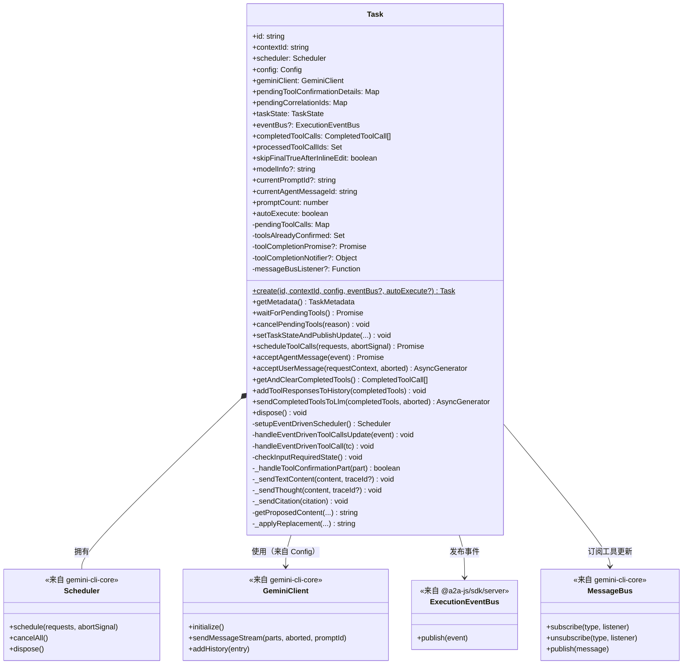
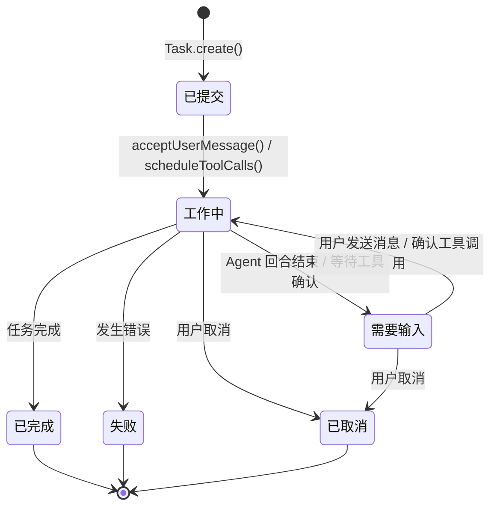
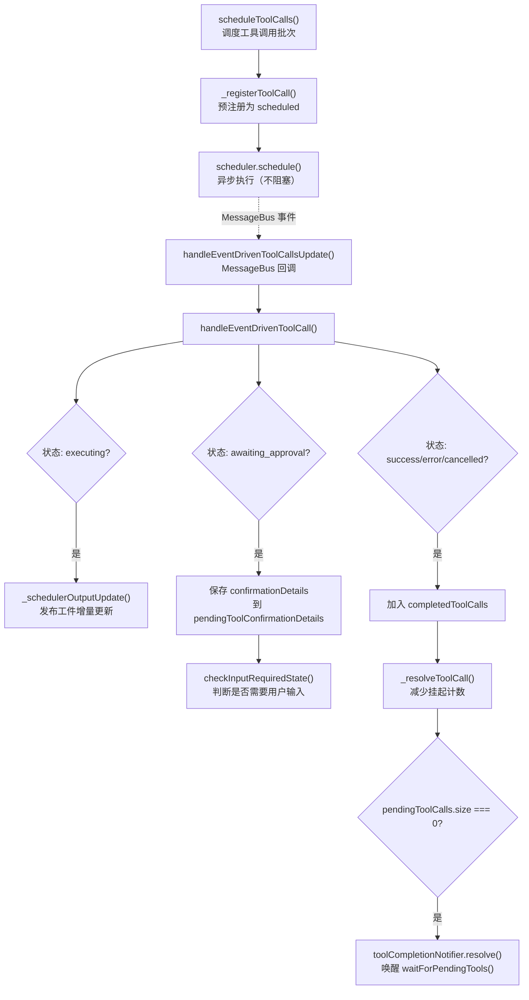
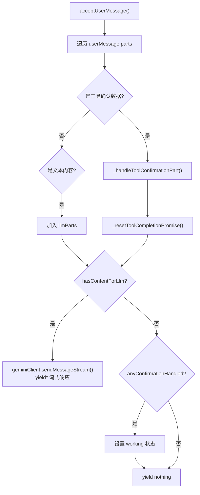

# task.ts

## 概述

`task.ts` 定义了 `Task` 类，是 A2A Server 中单个任务的完整运行时表示。它是连接 **Gemini LLM 客户端**、**工具调度器（Scheduler）**、**A2A 事件总线** 三大系统的核心枢纽。

`Task` 类的主要职责包括：

- **LLM 交互**：通过 `GeminiClient` 发送用户消息到 LLM 并接收流式响应
- **工具调用管理**：调度工具调用、跟踪执行状态、处理用户确认、收集执行结果
- **状态管理**：维护任务状态机（submitted -> working -> input-required -> completed/failed/canceled）
- **事件发布**：将所有状态变更、文本内容、工具调用更新等通过 A2A 事件总线推送给客户端
- **文件编辑预览**：为 `replace` 工具调用预计算文件替换后的内容
- **检查点管理**：在文件修改前创建检查点，支持回滚

该类采用私有构造函数 + 静态工厂方法 (`Task.create()`) 模式创建实例。

## 架构图

### 类结构图



### 任务状态机



### 工具调用生命周期



### 用户消息处理流程



## 核心组件

### `Task` 类（导出）

#### 公开属性

| 属性 | 类型 | 说明 |
|---|---|---|
| `id` | `string` | 任务唯一标识 |
| `contextId` | `string` | 上下文 ID，用于关联同一对话 |
| `scheduler` | `Scheduler` | 工具调用调度器 |
| `config` | `Config` | 运行配置 |
| `geminiClient` | `GeminiClient` | Gemini LLM 客户端 |
| `pendingToolConfirmationDetails` | `Map<string, ToolCallConfirmationDetails>` | 等待用户确认的工具调用详情 |
| `pendingCorrelationIds` | `Map<string, string>` | 工具调用 ID 到关联 ID 的映射 |
| `taskState` | `TaskState` | 当前任务状态 |
| `eventBus` | `ExecutionEventBus?` | A2A 事件总线（可替换） |
| `completedToolCalls` | `CompletedToolCall[]` | 已完成的工具调用列表 |
| `processedToolCallIds` | `Set<string>` | 已处理过的工具调用 ID 集合，防止重复处理 |
| `skipFinalTrueAfterInlineEdit` | `boolean` | 行内编辑后跳过 final:true 标记 |
| `modelInfo` | `string?` | 模型信息（运行时获取） |
| `currentPromptId` | `string?` | 当前提示 ID |
| `currentAgentMessageId` | `string` | 当前 Agent 消息 ID |
| `promptCount` | `number` | 提示计数器 |
| `autoExecute` | `boolean` | 是否自动执行工具调用 |

#### 私有属性

| 属性 | 类型 | 说明 |
|---|---|---|
| `pendingToolCalls` | `Map<string, string>` | 挂起的工具调用（callId -> status） |
| `toolsAlreadyConfirmed` | `Set<string>` | 已被用户确认的工具 ID 集合 |
| `toolCompletionPromise` | `Promise<void>?` | 等待所有工具完成的 Promise |
| `toolCompletionNotifier` | `{ resolve, reject }?` | 工具完成 Promise 的控制器 |
| `messageBusListener` | `Function?` | MessageBus 监听器引用（用于清理） |
| `isYoloMatch` (getter) | `boolean` | 是否处于 YOLO 模式（自动执行或配置为 YOLO 审批模式） |

#### 静态方法

##### `Task.create(id, contextId, config, eventBus?, autoExecute?): Promise<Task>`

工厂方法，创建 Task 实例。内部调用私有构造函数。

```typescript
static async create(
  id: string,
  contextId: string,
  config: Config,
  eventBus?: ExecutionEventBus,
  autoExecute?: boolean,
): Promise<Task>
```

#### 公开方法

##### `getMetadata(): Promise<TaskMetadata>`

获取任务的完整元数据，包括 ID、上下文、状态、模型名称、MCP 服务器列表及其工具、所有可用工具等。

##### `waitForPendingTools(): Promise<void>`

等待所有挂起的工具调用完成。如果当前没有挂起的工具调用则立即返回。底层通过 `toolCompletionPromise` 实现异步等待。

##### `cancelPendingTools(reason: string): void`

取消所有挂起的工具调用。流程：
1. 以 Error(reason) 拒绝 `toolCompletionPromise`
2. 清空 `pendingToolCalls` 和 `pendingCorrelationIds`
3. 调用 `scheduler.cancelAll()` 取消调度器中的所有任务
4. 重置工具完成 Promise

##### `setTaskStateAndPublishUpdate(newState, coderAgentMessage, messageText?, messageParts?, final?, metadataError?, traceId?): void`

设置新的任务状态并通过事件总线发布状态更新事件。支持通过文本字符串或结构化 Parts 创建消息。

```typescript
setTaskStateAndPublishUpdate(
  newState: TaskState,
  coderAgentMessage: CoderAgentMessage,
  messageText?: string,
  messageParts?: Part[],
  final?: boolean,
  metadataError?: string,
  traceId?: string,
): void
```

##### `scheduleToolCalls(requests: ToolCallRequestInfo[], abortSignal: AbortSignal): Promise<void>`

批量调度工具调用。这是工具调用的入口方法，流程如下：
1. 筛选出文件编辑类工具调用（`EDIT_TOOL_NAMES`），如果启用了检查点功能，创建检查点文件
2. 对 `replace` 工具调用预计算替换后的文件内容（`newContent`）
3. 将任务状态设为 `working`
4. 预注册所有工具调用为 `scheduled` 状态
5. 异步调用 `scheduler.schedule()` 启动执行（fire and forget，不阻塞）

##### `acceptAgentMessage(event: ServerGeminiStreamEvent): Promise<void>`

处理来自 LLM 流式响应的各类事件。根据事件类型分发处理：

| 事件类型 | 处理逻辑 |
|---|---|
| `Content` | 调用 `_sendTextContent()` 发布文本内容 |
| `ToolCallRequest` | 忽略（由 executor 批量收集处理） |
| `ToolCallResponse` | 记录日志（LLM 生成的工具响应部分） |
| `ToolCallConfirmation` | 保存确认详情到 `pendingToolConfirmationDetails` |
| `UserCancelled` | 取消挂起工具并设为 `input-required` |
| `Thought` | 调用 `_sendThought()` 发布思考内容 |
| `Citation` | 调用 `_sendCitation()` 发布引用信息 |
| `ChatCompressed` | 忽略 |
| `Finished` | 记录日志 |
| `ModelInfo` | 保存模型信息 |
| `Retry` / `InvalidStream` | 忽略（自动重试） |
| `Error` / 其他 | 解析错误、取消工具、发布错误状态 |

##### `acceptUserMessage(requestContext: RequestContext, aborted: AbortSignal): AsyncGenerator<ServerGeminiStreamEvent>`

处理用户消息的异步生成器。遍历消息的所有 parts：
- 如果是工具确认数据（`data` 类型，包含 `callId` 和 `outcome`），调用 `_handleToolConfirmationPart()` 处理
- 如果是文本内容，收集到 `llmParts` 并发送给 LLM

返回 LLM 的流式响应事件。

##### `getAndClearCompletedTools(): CompletedToolCall[]`

获取并清空已完成的工具调用列表。将已取出的工具 ID 记入 `processedToolCallIds` 防止重复处理。

##### `addToolResponsesToHistory(completedTools: CompletedToolCall[]): void`

将已完成工具的响应添加到 LLM 历史记录中，但不触发新的 LLM 响应生成。用于全部取消的场景。

##### `sendCompletedToolsToLlm(completedToolCalls: CompletedToolCall[], aborted: AbortSignal): AsyncGenerator<ServerGeminiStreamEvent>`

将已完成工具的响应发送给 LLM 并返回 LLM 的流式响应。设置状态为 `working`，生成新的 `currentAgentMessageId`。

##### `dispose(): void`

释放资源。取消 MessageBus 上的订阅，调用 scheduler 的 dispose 方法。

#### 关键私有方法

##### `setupEventDrivenScheduler(): Scheduler`

创建并配置事件驱动的 Scheduler 实例。订阅 MessageBus 的 `TOOL_CALLS_UPDATE` 事件，当工具状态变化时触发 `handleEventDrivenToolCallsUpdate`。

##### `handleEventDrivenToolCallsUpdate(event: ToolCallsUpdateMessage): void`

MessageBus 回调入口。遍历事件中的所有工具调用，逐个调用 `handleEventDrivenToolCall` 处理，最后调用 `checkInputRequiredState` 检查是否需要用户输入。

##### `handleEventDrivenToolCall(tc: ToolCall): void`

处理单个工具调用状态更新的核心逻辑：
1. 跳过已处理的工具（防重复）
2. 如果正在执行且有实时输出，发布工件增量更新
3. 如果到达终态（success/error/cancelled），加入完成列表并解析挂起计数
4. 如果等待审批，保存确认详情
5. 发布状态更新到 A2A 事件总线

##### `checkInputRequiredState(): void`

检查是否需要将任务状态设为 `input-required`。条件：
- 非 YOLO 模式
- 有等待审批的工具且无正在执行/调度的工具
- 不在行内编辑跳过标记中

当满足条件时，发布 `input-required` 状态（final: true），并解析 `toolCompletionNotifier` 以释放 HTTP 响应流。

##### `_handleToolConfirmationPart(part: Part): Promise<boolean>`

处理用户发送的工具确认消息。解析确认结果（`proceed_once`/`cancel`/`proceed_always` 等），通过 MessageBus 发布确认响应或调用旧的回调接口。支持行内编辑修改（`modify_with_editor`）。

临时清除 GCP 环境变量以防止泄漏到工具调用进程中。

##### `_schedulerOutputUpdate(toolCallId: string, outputChunk: ToolLiveOutput): void`

将工具的实时输出转换为 A2A Artifact 增量更新事件并发布。支持字符串、子代理进度、ANSI 输出等多种输出格式。

##### `getProposedContent(file_path, old_string, new_string): Promise<string>`

为 `replace` 工具预计算文件替换后的内容。包含路径遍历攻击防护。

##### `_applyReplacement(currentContent, oldString, newString, isNewFile): string`

执行实际的字符串替换逻辑，使用 `safeLiteralReplace` 安全处理 `$` 等特殊字符。

##### `_sendTextContent(content: string, traceId?: string): void`

发布文本内容事件到事件总线。

##### `_sendThought(content: ThoughtSummary, traceId?: string): void`

发布思考事件到事件总线，以 `data` Part 格式携带 ThoughtSummary。

##### `_sendCitation(citation: string): void`

发布引用事件到事件总线。

## 依赖关系

### 内部依赖

| 依赖模块 | 路径 | 导入内容 | 说明 |
|---|---|---|---|
| 日志工具 | `../utils/logger.js` | `logger` | 日志记录 |
| 类型定义 | `../types.js` | `CoderAgentEvent`, `CoderAgentMessage`, `StateChange`, `ToolCallUpdate`, `TextContent`, `TaskMetadata`, `Thought`, `ThoughtSummary`, `Citation` | 协议事件类型和接口 |

### 外部依赖

| 依赖模块 | 导入内容 | 说明 |
|---|---|---|
| `@google/gemini-cli-core` | `Scheduler`, `GeminiEventType`, `ToolConfirmationOutcome`, `ApprovalMode`, `getAllMCPServerStatuses`, `MCPServerStatus`, `isNodeError`, `getErrorMessage`, `parseAndFormatApiError`, `safeLiteralReplace`, `DEFAULT_GUI_EDITOR`, `EDIT_TOOL_NAMES`, `processRestorableToolCalls`, `MessageBusType` 及大量类型 | Gemini CLI 核心能力：调度器、事件、工具调用、错误处理等 |
| `@a2a-js/sdk/server` | `ExecutionEventBus`, `RequestContext` | A2A SDK 服务端事件总线和请求上下文 |
| `@a2a-js/sdk` | `TaskStatusUpdateEvent`, `TaskArtifactUpdateEvent`, `TaskState`, `Message`, `Part`, `Artifact` | A2A SDK 核心类型 |
| `@google/genai` | `PartUnion`, `Part` (as genAiPart) | Google GenAI SDK 类型 |
| `uuid` | `v4 as uuidv4` | UUID 生成 |
| `node:fs/promises` | `fs` | 文件系统操作（读取文件、创建检查点目录和文件） |
| `node:path` | `path` | 路径操作 |

## 关键实现细节

1. **事件驱动的工具状态管理**：`Task` 不采用轮询方式跟踪工具状态，而是通过 `MessageBus` 订阅 `TOOL_CALLS_UPDATE` 事件。当 `Scheduler` 内部的工具状态发生变化时，会通过 MessageBus 推送更新，Task 的 `handleEventDrivenToolCallsUpdate` 回调实时处理这些更新。

2. **Promise 通知器模式**：`toolCompletionPromise` + `toolCompletionNotifier` 实现了一个可外部控制的 Promise。当所有挂起的工具调用完成时，`toolCompletionNotifier.resolve()` 被调用，唤醒 `waitForPendingTools()` 的等待者（即 executor 的主循环）。取消时则调用 `reject()`。

3. **防重复处理**：通过 `processedToolCallIds` 集合和 `completedToolCalls` 数组的双重检查，确保同一个工具调用不会被重复处理。这是因为 MessageBus 可能会推送包含已完成工具的快照事件。

4. **GCP 环境变量隔离**：在处理工具确认时，临时删除 `GOOGLE_CLOUD_PROJECT` 和 `GOOGLE_APPLICATION_CREDENTIALS` 环境变量，防止 A2A Server 自身的 GCP 凭据泄漏到子进程中。处理完成后在 `finally` 块中恢复。

5. **检查点机制**：在调度文件编辑类工具前，如果启用了检查点功能，会通过 `processRestorableToolCalls` 和 `gitService` 创建文件快照。这些检查点存储在项目临时目录中，用于在文件修改失败时回滚。

6. **replace 工具的 newContent 预计算**：对于 `replace` 工具调用，Task 会预先读取目标文件的当前内容，应用替换操作，并将结果作为 `newContent` 附加到请求参数中。这使得客户端可以在确认前预览替换结果（diff 预览）。

7. **行内编辑跳过机制**：`skipFinalTrueAfterInlineEdit` 标志用于处理行内编辑场景。当用户选择 `modify_with_editor` 修改工具调用的参数后，会再次发送确认请求，此时需要避免在中间步骤发送 `final: true` 以保持 HTTP 流的连续性。

8. **input-required 状态的 HTTP 流释放**：当任务从其他状态转换到 `input-required` 时（首次进入），除了发布事件外还会解析 `toolCompletionNotifier`，这会释放 `waitForPendingTools()` 的等待，从而使 executor 结束当前 HTTP 响应流。客户端随后需要开启新的 HTTP 流来发送确认。

9. **YOLO 模式**：当 `autoExecute` 为 true 或配置的审批模式为 `YOLO` 时，`checkInputRequiredState()` 直接返回，不会将任务设为 `input-required`，实现工具调用的自动批准。

10. **回退模型处理**：构造函数中设置了 `setFallbackModelHandler`，当主模型不可用时返回 `'stop'` 意图，表示自动切换到回退模型但不重试当前请求。这是 A2A Server 与 CLI 交互模式的区别 -- CLI 会提示用户选择，而 A2A Server 需要自动处理。
