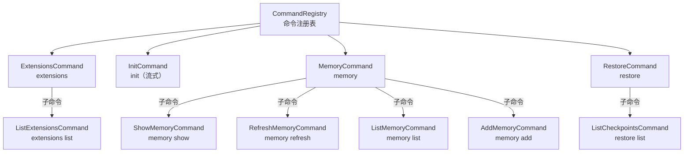

# packages/a2a-server/src/commands

## 概述

服务端命令系统，提供通过 HTTP API (`/executeCommand`) 调用的命令功能。包含扩展管理、项目初始化、内存管理和检查点恢复等命令。

## 目录结构

```
commands/
├── types.ts               # Command/CommandContext 接口定义
├── command-registry.ts    # CommandRegistry - 命令注册表
├── extensions.ts          # 扩展管理命令
├── init.ts                # 项目初始化命令
├── memory.ts              # 内存管理命令（show/refresh/list/add）
├── restore.ts             # 检查点恢复命令（restore/list）
├── command-registry.test.ts
├── extensions.test.ts
├── init.test.ts
├── memory.test.ts
└── restore.test.ts
```

## 架构图



## 核心组件

### Command 接口 (`types.ts`)

```typescript
interface Command {
    name: string;
    description: string;
    arguments?: CommandArgument[];
    subCommands?: Command[];
    topLevel?: boolean;
    requiresWorkspace?: boolean;
    streaming?: boolean;
    execute(config: CommandContext, args: string[]): Promise<CommandExecutionResponse>;
}
```

### CommandRegistry (`command-registry.ts`)

单例命令注册表，启动时注册所有内置命令（包括子命令）。支持通过名称查找命令。

### 命令列表

| 命令 | 说明 | 需要工作区 | 流式 |
|------|------|-----------|------|
| `extensions` / `extensions list` | 列出已安装扩展 | 否 | 否 |
| `init` | 分析项目并生成 GEMINI.md | 是 | 是 |
| `memory show` | 显示当前内存内容 | 是 | 否 |
| `memory refresh` | 刷新内存 | 是 | 否 |
| `memory list` | 列出 GEMINI.md 文件路径 | 是 | 否 |
| `memory add` | 添加内存内容 | 是 | 否 |
| `restore` | 恢复到检查点 | 是 | 否 |
| `restore list` | 列出可用检查点 | 是 | 否 |

## 依赖关系

### 内部依赖
- `@google/gemini-cli-core` - listExtensions, performInit, addMemory, refreshMemory 等
- `../types.ts` - CoderAgentEvent
- `../agent/executor.ts` - CoderAgentExecutor（Init 命令使用）
