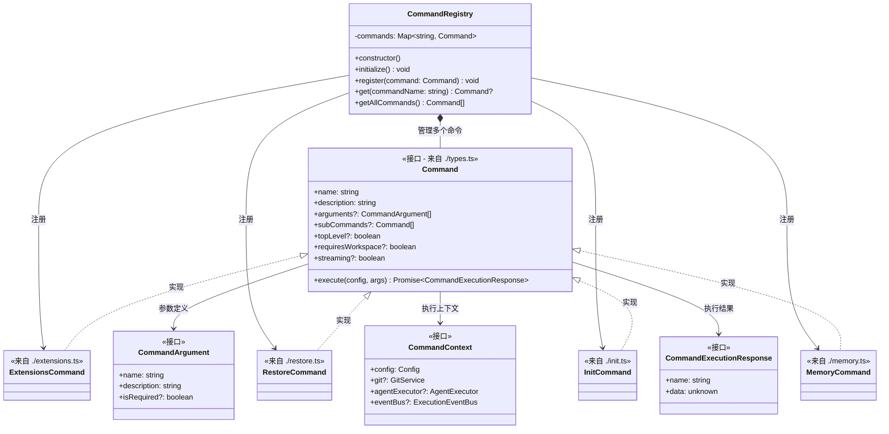
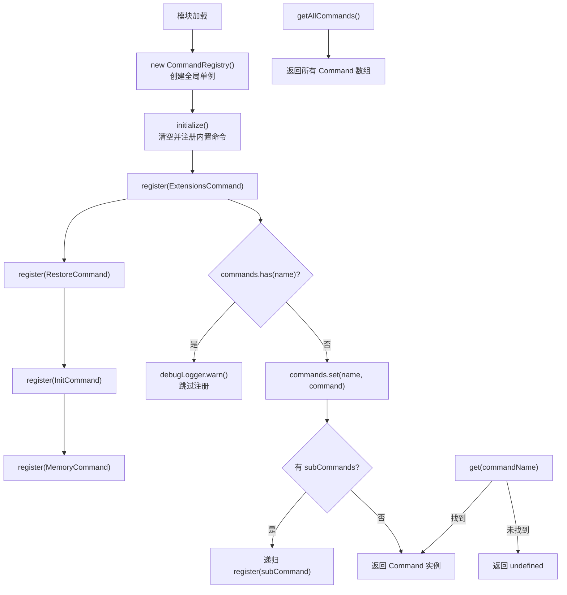

# command-registry.ts

## 概述

`command-registry.ts` 实现了 A2A Server 的**命令注册表**系统。该文件包含：

- **`CommandRegistry` 类**（导出）：一个命令管理器，负责注册、存储和检索所有可用的斜杠命令（slash commands）。采用 `Map` 数据结构以命令名称为键进行管理，支持子命令的递归注册。
- **`commandRegistry` 单例**（导出）：全局唯一的 `CommandRegistry` 实例，模块加载时自动创建并初始化，预注册了四个内置命令。

该模块是 A2A Server 命令系统的入口和核心。当 A2A 协议中收到命令类型的用户消息时，可通过此注册表查找并执行对应的命令处理器。

## 架构图

### 类与命令关系图



### 注册与查找流程图



## 核心组件

### `CommandRegistry` 类（导出）

命令注册表，管理所有可用的 A2A 命令。

#### 私有属性

| 属性 | 类型 | 说明 |
|---|---|---|
| `commands` | `Map<string, Command>` | 命令存储映射表，以命令名称为键，`readonly` 防止外部替换 |

#### 构造函数

```typescript
constructor()
```

创建注册表实例并立即调用 `initialize()` 注册所有内置命令。

#### 方法

##### `initialize(): void`

初始化注册表。先清空已有命令，然后按顺序注册四个内置命令：
1. `ExtensionsCommand` - 扩展管理命令
2. `RestoreCommand` - 恢复命令（用于检查点回滚）
3. `InitCommand` - 初始化命令
4. `MemoryCommand` - 记忆管理命令

由于先调用 `commands.clear()`，可以安全地重复调用以重置注册表。

##### `register(command: Command): void`

注册一个命令到注册表中。

```typescript
register(command: Command): void
```

行为：
- 如果同名命令已存在，打印警告日志并跳过注册（不覆盖）
- 将命令以其 `name` 为键存入 `commands` Map
- **递归注册子命令**：如果命令定义了 `subCommands` 数组，遍历并递归调用 `register()` 注册每个子命令

这意味着子命令和父命令在注册表中是扁平存储的，可以直接通过子命令名称查找。

##### `get(commandName: string): Command | undefined`

根据命令名称查找并返回对应的 Command 实例。未找到则返回 `undefined`。

```typescript
get(commandName: string): Command | undefined
```

##### `getAllCommands(): Command[]`

返回所有已注册命令的数组（包括子命令）。

```typescript
getAllCommands(): Command[]
```

### `commandRegistry` 常量（导出）

```typescript
export const commandRegistry = new CommandRegistry();
```

模块级别的全局单例，在模块首次被导入时自动创建并初始化。整个 A2A Server 共享此实例。

### 相关接口（来自 `./types.ts`）

#### `Command` 接口

命令的统一接口定义。

| 属性/方法 | 类型 | 说明 |
|---|---|---|
| `name` | `string` (只读) | 命令名称（作为注册表的键） |
| `description` | `string` (只读) | 命令描述 |
| `arguments` | `CommandArgument[]?` (只读) | 命令参数定义列表 |
| `subCommands` | `Command[]?` (只读) | 子命令列表 |
| `topLevel` | `boolean?` (只读) | 是否为顶级命令 |
| `requiresWorkspace` | `boolean?` (只读) | 是否需要工作区上下文 |
| `streaming` | `boolean?` (只读) | 是否支持流式输出 |
| `execute(config, args)` | `Promise<CommandExecutionResponse>` | 执行命令，接受上下文和参数列表 |

#### `CommandContext` 接口

命令执行上下文，提供命令执行所需的依赖注入。

| 属性 | 类型 | 说明 |
|---|---|---|
| `config` | `Config` | 运行配置 |
| `git` | `GitService?` | Git 服务（可选） |
| `agentExecutor` | `AgentExecutor?` | Agent 执行器（可选） |
| `eventBus` | `ExecutionEventBus?` | 事件总线（可选） |

#### `CommandArgument` 接口

命令参数定义。

| 属性 | 类型 | 说明 |
|---|---|---|
| `name` | `string` (只读) | 参数名称 |
| `description` | `string` (只读) | 参数描述 |
| `isRequired` | `boolean?` (只读) | 是否必需 |

#### `CommandExecutionResponse` 接口

命令执行结果。

| 属性 | 类型 | 说明 |
|---|---|---|
| `name` | `string` (只读) | 命令名称 |
| `data` | `unknown` (只读) | 返回数据（类型由具体命令决定） |

## 依赖关系

### 内部依赖

| 依赖模块 | 路径 | 导入内容 | 说明 |
|---|---|---|---|
| 记忆命令 | `./memory.js` | `MemoryCommand` | 记忆管理命令实现 |
| 扩展命令 | `./extensions.js` | `ExtensionsCommand` | 扩展管理命令实现 |
| 初始化命令 | `./init.js` | `InitCommand` | 初始化命令实现 |
| 恢复命令 | `./restore.js` | `RestoreCommand` | 恢复/回滚命令实现 |
| 命令类型 | `./types.js` | `Command` (type) | 命令接口定义 |

### 外部依赖

| 依赖模块 | 导入内容 | 说明 |
|---|---|---|
| `@google/gemini-cli-core` | `debugLogger` | 调试日志工具，用于输出重复注册警告 |

## 关键实现细节

1. **模块级单例模式**：`commandRegistry` 在模块作用域中以 `const` 声明并实例化，利用 ES 模块的单次执行特性保证全局唯一。所有需要访问命令注册表的模块导入同一个 `commandRegistry` 实例即可。

2. **子命令扁平化注册**：`register()` 方法递归注册子命令，但所有命令（无论层级）都存储在同一个扁平的 `Map` 中。这意味着：
   - 子命令可以直接通过 `get(subCommandName)` 查找
   - 子命令名称不能与父命令或其他命令重名
   - `getAllCommands()` 返回的列表包含所有层级的命令

3. **防重复注册**：`register()` 方法在注册前检查同名命令是否已存在，如果存在则打印警告并跳过。这是一种"先到先得"的策略，避免后注册的命令覆盖先注册的命令，保证命令行为的确定性。

4. **可重置设计**：`initialize()` 方法先 `clear()` 再注册，这使得注册表可以在运行时重置为初始状态，便于测试或热重载场景。

5. **四个内置命令**：
   - **ExtensionsCommand**：管理扩展（插件），可能包含列出、启用、禁用扩展等子功能
   - **RestoreCommand**：恢复文件到检查点状态，与 Task 中的检查点机制配合使用
   - **InitCommand**：初始化工作区配置
   - **MemoryCommand**：管理 Agent 的记忆/上下文持久化

6. **命令执行的上下文注入**：`Command.execute()` 接受 `CommandContext` 参数，其中包含 `Config`、`GitService`、`AgentExecutor`、`ExecutionEventBus` 等可选依赖。这种设计允许命令按需使用所需的服务，而不需要每个命令都依赖所有服务。
