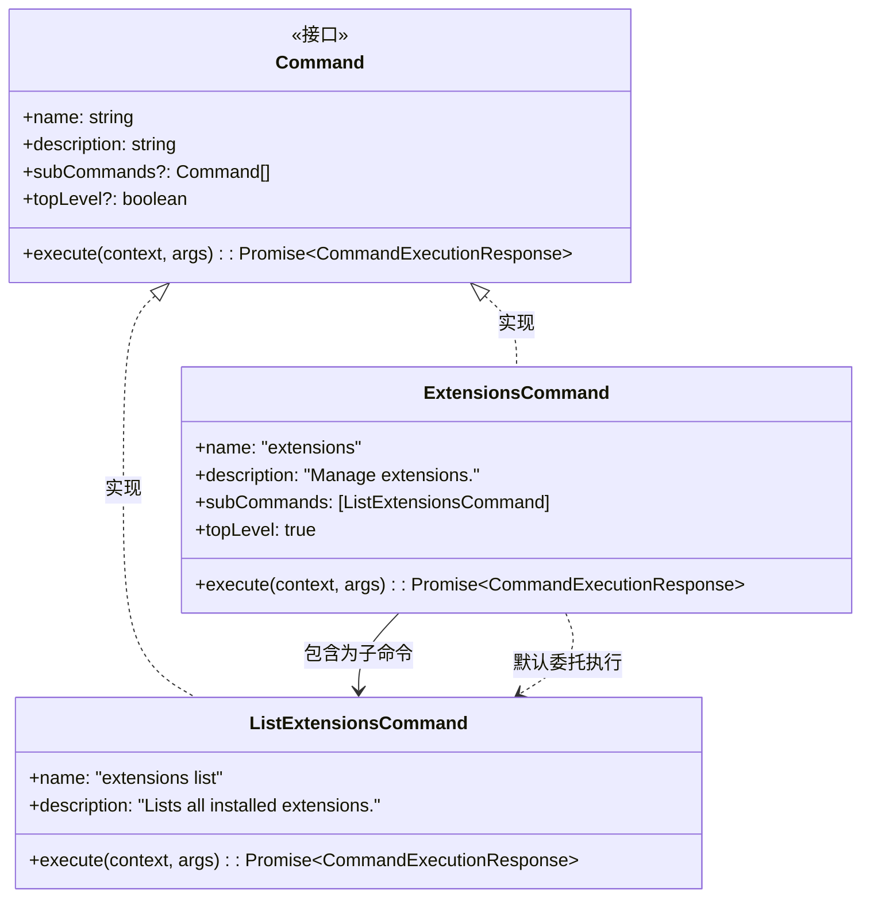
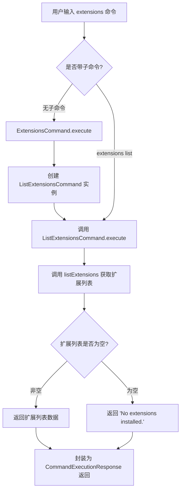

# extensions.ts

## 概述

`extensions.ts` 是 A2A Server 中负责**扩展管理**的命令模块。该文件定义了两个命令类：`ExtensionsCommand`（顶层扩展命令）和 `ListExtensionsCommand`（列出已安装扩展的子命令）。`ExtensionsCommand` 作为入口命令，默认委托给 `ListExtensionsCommand` 执行，实现了"输入 `extensions` 等同于 `extensions list`"的便捷行为。

该模块遵循 `Command` 接口约定，通过 `execute` 方法接收 `CommandContext` 上下文并返回 `CommandExecutionResponse`，是 A2A Server 命令体系的一部分。

## 架构图

## 核心组件

### `ExtensionsCommand` 类

| 属性/方法 | 类型 | 说明 |
|-----------|------|------|
| `name` | `readonly string` | 值为 `"extensions"`，命令名称 |
| `description` | `readonly string` | 值为 `"Manage extensions."`，命令描述 |
| `subCommands` | `readonly Command[]` | 包含一个 `ListExtensionsCommand` 实例 |
| `topLevel` | `readonly boolean` | 值为 `true`，标记为顶层命令 |
| `execute(context, args)` | `async (CommandContext, string[]) => Promise<CommandExecutionResponse>` | 委托给 `ListExtensionsCommand.execute` 执行 |

**职责**：作为扩展管理的顶层入口命令。当用户仅输入 `extensions` 而不指定子命令时，自动执行 `extensions list` 的逻辑。

### `ListExtensionsCommand` 类

| 属性/方法 | 类型 | 说明 |
|-----------|------|------|
| `name` | `readonly string` | 值为 `"extensions list"`，命令名称 |
| `description` | `readonly string` | 值为 `"Lists all installed extensions."`，命令描述 |
| `execute(context, args)` | `async (CommandContext, string[]) => Promise<CommandExecutionResponse>` | 调用 `listExtensions` 获取并返回已安装扩展列表 |

**职责**：实际执行扩展列表查询的命令。通过调用核心库 `listExtensions` 函数，读取配置中的扩展信息并返回结果。

## 依赖关系

### 内部依赖

| 依赖模块 | 导入内容 | 用途 |
|----------|----------|------|
| `./types.js` | `Command`, `CommandContext`, `CommandExecutionResponse` | 命令接口和类型定义，确保命令类符合统一的命令协议 |

### 外部依赖

| 依赖模块 | 导入内容 | 用途 |
|----------|----------|------|
| `@google/gemini-cli-core` | `listExtensions` | 核心库函数，用于从配置中获取已安装扩展的列表 |

## 关键实现细节

1. **默认委托模式**：`ExtensionsCommand.execute` 内部创建了一个新的 `ListExtensionsCommand` 实例并调用其 `execute` 方法。这意味着当用户仅输入 `extensions` 时，行为等同于 `extensions list`。值得注意的是，这里每次执行都会创建新的 `ListExtensionsCommand` 实例，而非复用 `subCommands` 中已有的实例。

2. **空列表处理**：`ListExtensionsCommand.execute` 中，如果 `listExtensions` 返回空数组，`data` 字段会被设置为字符串 `"No extensions installed."`，而非空数组。这提供了更友好的用户提示信息。

3. **参数忽略**：两个命令的 `execute` 方法中，`args` 参数（`_: string[]`）均被忽略（以 `_` 命名），表明当前实现不需要额外的命令行参数。

4. **`topLevel` 标记**：`ExtensionsCommand` 设置了 `topLevel = true`，这使得该命令可以在命令注册体系中被识别为顶层命令（即可以直接被用户调用，而非作为其他命令的子命令）。`ListExtensionsCommand` 没有设置此标记，说明它仅通过 `ExtensionsCommand` 的子命令机制或内部委托来访问。

5. **配置依赖**：扩展列表的获取依赖于 `context.config`，即运行时的配置对象。实际的扩展发现和解析逻辑封装在 `@google/gemini-cli-core` 的 `listExtensions` 函数中。
