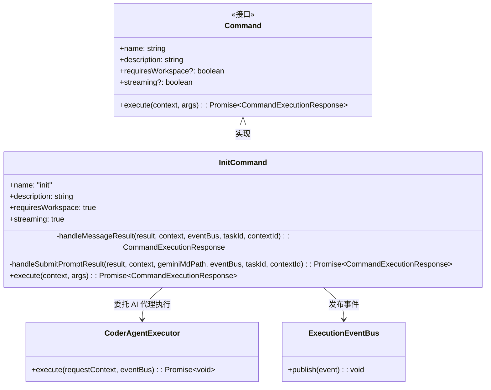
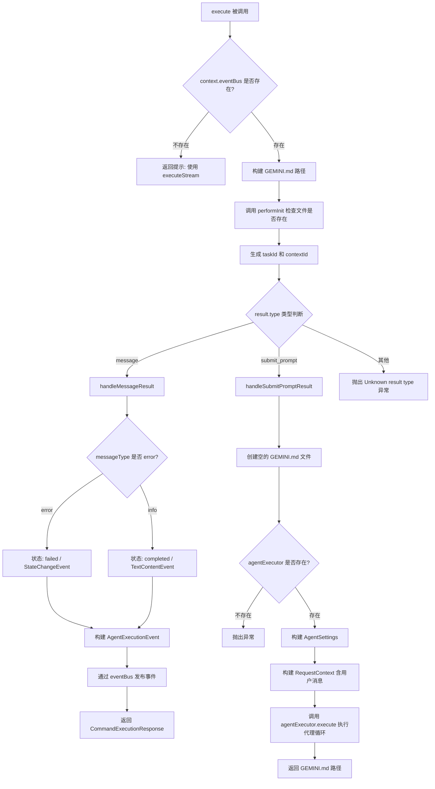

# init.ts

## 概述

`init.ts` 是 A2A Server 中负责**项目初始化**的命令模块。该文件定义了 `InitCommand` 类，其核心职责是分析当前项目并创建（或更新）一个定制化的 `GEMINI.md` 文件。`GEMINI.md` 是 Gemini CLI 使用的项目级配置/说明文件，用于帮助 AI 代理理解项目上下文。

该命令支持流式执行（`streaming = true`），需要工作空间环境（`requiresWorkspace = true`），并通过事件总线（`EventBus`）与客户端通信。根据 `performInit` 的结果，命令会走两条不同的处理路径：直接返回消息提示，或者通过代理执行器（`AgentExecutor`）触发一个完整的 AI 代理循环来生成 `GEMINI.md` 内容。

## 架构图





## 核心组件

### `InitCommand` 类

| 属性/方法 | 类型 | 说明 |
|-----------|------|------|
| `name` | `string` | 值为 `"init"`，命令名称 |
| `description` | `string` | `"Analyzes the project and creates a tailored GEMINI.md file"`，命令描述 |
| `requiresWorkspace` | `boolean` | 值为 `true`，表明此命令需要工作空间环境 |
| `streaming` | `boolean` | 值为 `true`，表明此命令支持流式执行 |
| `execute(context, args)` | `async (CommandContext, string[]) => Promise<CommandExecutionResponse>` | 主入口方法，根据初始化检查结果分发到不同处理路径 |

#### 私有方法

##### `handleMessageResult`

```typescript
private handleMessageResult(
    result: { content: string; messageType: 'info' | 'error' },
    context: CommandContext,
    eventBus: ExecutionEventBus,
    taskId: string,
    contextId: string,
): CommandExecutionResponse
```

**职责**：处理 `performInit` 返回的消息类型结果。根据 `messageType` 构建相应的 `AgentExecutionEvent` 事件（失败或完成），通过事件总线发布并返回响应。

- 当 `messageType === 'error'` 时，状态为 `failed`，事件类型为 `CoderAgentEvent.StateChangeEvent`
- 当 `messageType === 'info'` 时，状态为 `completed`，事件类型为 `CoderAgentEvent.TextContentEvent`

##### `handleSubmitPromptResult`

```typescript
private async handleSubmitPromptResult(
    result: { content: unknown },
    context: CommandContext,
    geminiMdPath: string,
    eventBus: ExecutionEventBus,
    taskId: string,
    contextId: string,
): Promise<CommandExecutionResponse>
```

**职责**：处理 `performInit` 返回的提交提示类型结果。该方法是命令的核心路径，完成以下步骤：
1. 创建一个空的 `GEMINI.md` 文件
2. 获取并验证 `agentExecutor`
3. 构建 `AgentSettings`（包含工作空间路径、自动执行标志）
4. 构建 `RequestContext`（包含用户消息、任务和上下文 ID）
5. 调用 `agentExecutor.execute` 触发完整的 AI 代理循环

## 依赖关系

### 内部依赖

| 依赖模块 | 导入内容 | 用途 |
|----------|----------|------|
| `../types.js` | `CoderAgentEvent`, `AgentSettings` | 代理事件类型枚举和代理设置类型定义 |
| `./types.js` | `Command`, `CommandContext`, `CommandExecutionResponse` | 命令接口和类型定义 |
| `../agent/executor.js` | `CoderAgentExecutor` | 代理执行器类型，用于触发 AI 代理循环 |
| `../utils/logger.js` | `logger` | 日志工具，用于记录事件发布信息 |

### 外部依赖

| 依赖模块 | 导入内容 | 用途 |
|----------|----------|------|
| `node:fs` | `fs` (整体导入) | 文件系统操作：`existsSync` 检查文件是否存在、`writeFileSync` 创建空文件 |
| `node:path` | `path` (整体导入) | 路径拼接：构建 `GEMINI.md` 的完整路径 |
| `@google/gemini-cli-core` | `performInit` | 核心库函数，执行初始化检查逻辑并返回结果 |
| `@a2a-js/sdk/server` | `ExecutionEventBus`, `RequestContext`, `AgentExecutionEvent` | A2A SDK 服务端类型：事件总线、请求上下文、代理执行事件 |
| `uuid` | `v4 as uuidv4` | 生成 UUID v4，用于 taskId、contextId 和 messageId |

## 关键实现细节

1. **环境变量依赖**：命令强依赖环境变量 `CODER_AGENT_WORKSPACE_PATH` 来确定工作空间路径。代码中使用非空断言 (`!`) 访问该变量，如果未设置将导致运行时错误。

2. **事件总线必要性检查**：`execute` 方法首先检查 `context.eventBus` 是否存在。如果不存在（非流式调用），直接返回提示消息 `"Use executeStream to get streaming results."`，不执行任何实际操作。这说明该命令**只支持流式模式**。

3. **`performInit` 的双重返回类型**：
   - `type: 'message'`：直接返回消息（如 GEMINI.md 已存在的提示或错误信息）
   - `type: 'submit_prompt'`：返回一个提示文本，需要通过 AI 代理执行器来生成 GEMINI.md 内容

4. **文件清空策略**：在 `handleSubmitPromptResult` 中，无论 GEMINI.md 是否已存在，都会先用 `fs.writeFileSync(geminiMdPath, '', 'utf8')` 将其内容清空为空文件，然后由 AI 代理执行器在后续流程中填充内容。

5. **代理设置传递**：通过 `RequestContext` 的 `metadata.coderAgent` 字段传递 `AgentSettings`，其中 `autoExecute: true` 表示代理可以自动执行工具调用而无需用户确认。

6. **类型断言**：代码中对 `context.agentExecutor` 使用了类型断言 `as CoderAgentExecutor`，并附带了 ESLint 禁用注释，说明 `CommandContext` 中的 `agentExecutor` 类型可能是更宽泛的基础类型。

7. **事件结构**：`handleMessageResult` 构建的事件包含 `final: true` 标记，表示这是一个终结事件，客户端收到后应认为该任务已完成。事件的 `metadata` 中包含模型信息（`context.config.getModel()`）。
