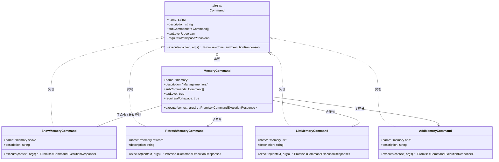
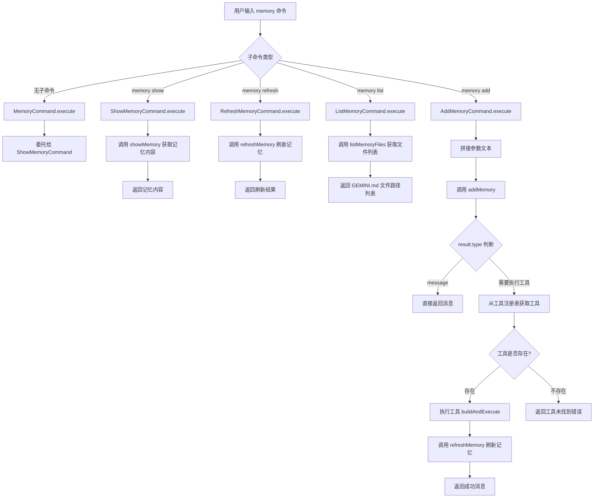

# memory.ts

## 概述

`memory.ts` 是 A2A Server 中负责**记忆管理**的命令模块。该文件定义了一组与 Gemini CLI "记忆"系统交互的命令类，允许用户查看、刷新、列出和添加记忆内容。记忆系统基于 `GEMINI.md` 文件，是 Gemini CLI 持久化项目上下文和用户偏好的核心机制。

模块包含一个顶层命令 `MemoryCommand` 和四个子命令：`ShowMemoryCommand`（显示记忆内容）、`RefreshMemoryCommand`（刷新记忆）、`ListMemoryCommand`（列出记忆文件路径）和 `AddMemoryCommand`（添加记忆内容）。其中 `AddMemoryCommand` 是最复杂的子命令，涉及工具注册表查找和工具执行。

## 架构图





## 核心组件

### 常量

#### `DEFAULT_SANITIZATION_CONFIG`

```typescript
const DEFAULT_SANITIZATION_CONFIG = {
  allowedEnvironmentVariables: [],
  blockedEnvironmentVariables: [],
  enableEnvironmentVariableRedaction: false,
};
```

默认的环境变量清理配置。用于 `AddMemoryCommand` 在执行工具时的 shell 执行配置。该配置不允许任何环境变量、不阻止任何环境变量、不启用环境变量脱敏——即采用完全开放的策略。

### `MemoryCommand` 类（顶层命令）

| 属性/方法 | 类型 | 说明 |
|-----------|------|------|
| `name` | `readonly string` | 值为 `"memory"`，命令名称 |
| `description` | `readonly string` | 值为 `"Manage memory."`，命令描述 |
| `subCommands` | `readonly Command[]` | 包含四个子命令实例：Show、Refresh、List、Add |
| `topLevel` | `readonly boolean` | 值为 `true`，标记为顶层命令 |
| `requiresWorkspace` | `readonly boolean` | 值为 `true`，需要工作空间环境 |
| `execute(context, args)` | `async => Promise<CommandExecutionResponse>` | 委托给 `ShowMemoryCommand.execute` 执行 |

### `ShowMemoryCommand` 类

| 属性/方法 | 类型 | 说明 |
|-----------|------|------|
| `name` | `readonly string` | `"memory show"` |
| `description` | `readonly string` | `"Shows the current memory contents."` |
| `execute(context, args)` | `async => Promise<CommandExecutionResponse>` | 调用 `showMemory(context.config)` 返回当前记忆内容 |

### `RefreshMemoryCommand` 类

| 属性/方法 | 类型 | 说明 |
|-----------|------|------|
| `name` | `readonly string` | `"memory refresh"` |
| `description` | `readonly string` | `"Refreshes the memory from the source."` |
| `execute(context, args)` | `async => Promise<CommandExecutionResponse>` | 调用 `refreshMemory(context.config)` 从源头刷新记忆（异步操作） |

### `ListMemoryCommand` 类

| 属性/方法 | 类型 | 说明 |
|-----------|------|------|
| `name` | `readonly string` | `"memory list"` |
| `description` | `readonly string` | `"Lists the paths of the GEMINI.md files in use."` |
| `execute(context, args)` | `async => Promise<CommandExecutionResponse>` | 调用 `listMemoryFiles(context.config)` 返回正在使用的 GEMINI.md 文件路径列表 |

### `AddMemoryCommand` 类

| 属性/方法 | 类型 | 说明 |
|-----------|------|------|
| `name` | `readonly string` | `"memory add"` |
| `description` | `readonly string` | `"Add content to the memory."` |
| `execute(context, args)` | `async => Promise<CommandExecutionResponse>` | 将用户输入的文本添加到记忆中，可能涉及工具执行 |

## 依赖关系

### 内部依赖

| 依赖模块 | 导入内容 | 用途 |
|----------|----------|------|
| `./types.js` | `Command`, `CommandContext`, `CommandExecutionResponse` | 命令接口和类型定义 |

### 外部依赖

| 依赖模块 | 导入内容 | 用途 |
|----------|----------|------|
| `@google/gemini-cli-core` | `addMemory` | 添加记忆内容的核心函数 |
| `@google/gemini-cli-core` | `listMemoryFiles` | 列出记忆文件路径的核心函数 |
| `@google/gemini-cli-core` | `refreshMemory` | 刷新记忆的核心函数 |
| `@google/gemini-cli-core` | `showMemory` | 显示记忆内容的核心函数 |
| `@google/gemini-cli-core` | `AgentLoopContext` (类型) | 代理循环上下文类型，用于访问工具注册表和沙箱管理器 |

## 关键实现细节

1. **默认委托模式**：与 `ExtensionsCommand` 相同，`MemoryCommand.execute` 在无子命令时委托给 `ShowMemoryCommand` 执行。即 `memory` 等同于 `memory show`。

2. **`AddMemoryCommand` 的双路径处理**：
   - `addMemory` 可能返回两种结果类型：
     - `type: 'message'`：直接返回消息（如输入为空时的提示）
     - 需要执行工具的结果：包含 `toolName` 和 `toolArgs`，需要通过工具注册表查找并执行对应工具
   - 当需要执行工具时，命令从 `context.config`（转型为 `AgentLoopContext`）中获取 `toolRegistry`，查找指定名称的工具，然后调用其 `buildAndExecute` 方法

3. **工具执行机制**：
   - 使用 `AbortController` 创建 `signal`，支持中断执行
   - 工具执行时传入 `shellExecutionConfig`，包含 `DEFAULT_SANITIZATION_CONFIG`（环境变量清理配置）和 `sandboxManager`（沙箱管理器）
   - 工具执行完成后，自动调用 `refreshMemory` 刷新记忆，确保新添加的内容被加载

4. **`context.config` 的双重类型**：`AddMemoryCommand` 中将 `context.config` 赋值给 `AgentLoopContext` 类型的变量 `loopContext`。这暗示 `context.config` 实际上同时实现了命令配置和代理循环上下文两个接口（或者 `AgentLoopContext` 是其超集类型），从而可以访问 `toolRegistry` 和 `sandboxManager` 等属性。

5. **参数处理**：`AddMemoryCommand` 是唯一使用 `args` 参数的命令。它通过 `args.join(' ').trim()` 将所有参数拼接为单个文本字符串，作为要添加的记忆内容。

6. **同步与异步混合**：`showMemory` 和 `listMemoryFiles` 是同步函数，而 `refreshMemory` 是异步函数（返回 Promise）。`addMemory` 本身是同步的，但如果需要执行工具，则后续的工具执行和记忆刷新都是异步的。
