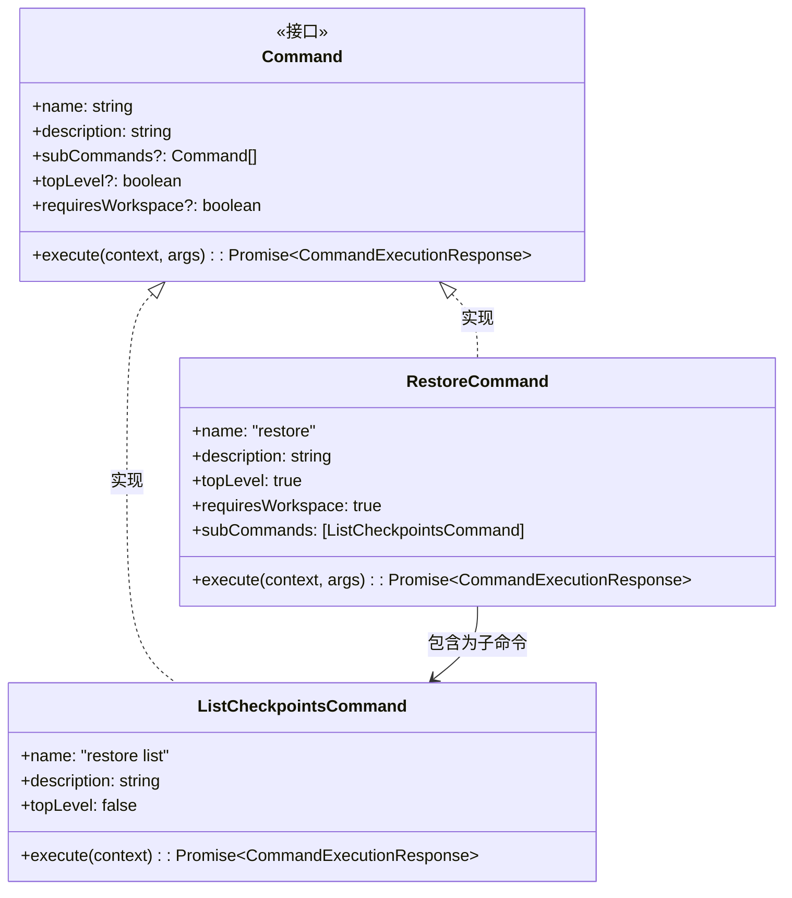

# restore.ts

## 概述

`restore.ts` 是 A2A Server 中负责**检查点恢复**的命令模块。该文件定义了两个命令类：`RestoreCommand`（恢复到指定检查点）和 `ListCheckpointsCommand`（列出所有可用检查点）。检查点机制允许用户将对话和文件历史回退到某个之前保存的状态。

`RestoreCommand` 是一个顶层命令，需要工作空间环境。它负责读取检查点 JSON 文件、验证数据格式、通过 Git 服务执行恢复操作。`ListCheckpointsCommand` 作为子命令，负责扫描检查点目录并返回格式化的检查点信息列表。

## 架构图

```mermaid
flowchart TD
    subgraph RestoreCommand执行流程
        A[execute 被调用] --> B{args 是否为空?}
        B -- 为空 --> C[返回错误: 请提供检查点名称]
        B -- 非空 --> D[拼接参数为文件名]
        D --> E{是否以 .json 结尾?}
        E -- 是 --> F[使用原始文件名]
        E -- 否 --> G[追加 .json 后缀]
        F --> H[从检查点目录读取文件]
        G --> H
        H --> I{文件是否存在?}
        I -- 不存在 ENOENT --> J[返回错误: 文件未找到]
        I -- 存在 --> K[JSON.parse 解析数据]
        I -- 其他错误 --> L[抛出异常]
        K --> M[使用 ToolCallDataSchema 验证数据]
        M --> N{验证是否通过?}
        N -- 失败 --> O[返回错误: 文件无效或损坏]
        N -- 通过 --> P[调用 performRestore 执行恢复]
        P --> Q[遍历异步生成器收集结果]
        Q --> R[返回恢复结果数组]
        L --> S[捕获异常 返回意外错误]
    end

    subgraph ListCheckpointsCommand执行流程
        LA[execute 被调用] --> LB[获取检查点目录路径]
        LB --> LC[确保目录存在 mkdir recursive]
        LC --> LD[读取目录下所有文件]
        LD --> LE[过滤 .json 文件]
        LE --> LF[逐个读取 JSON 文件内容]
        LF --> LG[构建 Map 文件名到内容]
        LG --> LH[调用 getCheckpointInfoList 解析]
        LH --> LI[JSON.stringify 后返回]
    end
```

## 核心组件

### `RestoreCommand` 类

| 属性/方法 | 类型 | 说明 |
|-----------|------|------|
| `name` | `readonly string` | 值为 `"restore"`，命令名称 |
| `description` | `readonly string` | 详细描述恢复功能：恢复到先前的检查点，重置对话和文件历史 |
| `topLevel` | `readonly boolean` | 值为 `true`，顶层命令 |
| `requiresWorkspace` | `readonly boolean` | 值为 `true`，需要工作空间环境 |
| `subCommands` | `readonly Command[]` | 包含 `ListCheckpointsCommand` |
| `execute(context, args)` | `async (CommandContext, string[]) => Promise<CommandExecutionResponse>` | 执行检查点恢复 |

**`execute` 方法详细流程**：
1. 从 `context` 解构出 `config` 和 `git`（Git 服务）
2. 将参数拼接为字符串，作为检查点文件名
3. 若参数为空，返回错误提示
4. 自动补齐 `.json` 后缀
5. 从 `config.storage.getProjectTempCheckpointsDir()` 获取检查点目录
6. 读取检查点文件，处理文件不存在的情况
7. 解析 JSON 数据并通过 `ToolCallDataSchema` 进行 Zod 模式验证
8. 调用 `performRestore` 执行恢复（返回异步生成器）
9. 遍历生成器收集所有结果并返回

### `ListCheckpointsCommand` 类

| 属性/方法 | 类型 | 说明 |
|-----------|------|------|
| `name` | `readonly string` | 值为 `"restore list"` |
| `description` | `readonly string` | `"Lists all available checkpoints."` |
| `topLevel` | `readonly boolean` | 值为 `false`，仅作为子命令 |
| `execute(context)` | `async (CommandContext) => Promise<CommandExecutionResponse>` | 列出所有可用检查点 |

**`execute` 方法详细流程**：
1. 从上下文获取检查点目录路径
2. 使用 `fs.mkdir` 确保目录存在（`recursive: true`）
3. 读取目录内容，过滤出 `.json` 文件
4. 逐个读取每个 JSON 文件的内容，构建 `Map<string, string>`（文件名到文件内容）
5. 调用 `getCheckpointInfoList` 解析检查点信息
6. 将结果序列化为 JSON 字符串返回

## 依赖关系

### 内部依赖

| 依赖模块 | 导入内容 | 用途 |
|----------|----------|------|
| `./types.js` | `Command`, `CommandContext`, `CommandExecutionResponse` | 命令接口和类型定义 |

### 外部依赖

| 依赖模块 | 导入内容 | 用途 |
|----------|----------|------|
| `@google/gemini-cli-core` | `getCheckpointInfoList` | 从检查点文件 Map 中提取和格式化检查点信息列表 |
| `@google/gemini-cli-core` | `getToolCallDataSchema` | 获取工具调用数据的 Zod 验证模式，用于验证检查点文件格式 |
| `@google/gemini-cli-core` | `isNodeError` | Node.js 错误类型守卫函数，用于安全地检查错误码 |
| `@google/gemini-cli-core` | `performRestore` | 执行实际恢复操作的核心函数，返回异步生成器 |
| `node:fs/promises` | `fs` (整体导入) | 异步文件系统操作：`readFile`、`readdir`、`mkdir` |
| `node:path` | `path` (整体导入) | 路径拼接：构建检查点文件的完整路径 |

## 关键实现细节

1. **异步文件操作**：与 `init.ts` 使用同步 `fs` 不同，`restore.ts` 使用 `node:fs/promises` 的异步文件 API，包括 `readFile`、`readdir` 和 `mkdir`。这是因为恢复操作可能涉及多个文件的读取，异步操作可以避免阻塞事件循环。

2. **文件名自动补齐**：`RestoreCommand` 在处理用户输入时，如果检查点名称不以 `.json` 结尾，会自动追加该后缀。这提供了用户友好性——用户可以输入 `restore checkpoint-1` 而无需输入 `restore checkpoint-1.json`。

3. **Zod 模式验证**：检查点文件的 JSON 数据通过 `getToolCallDataSchema()` 返回的 Zod 模式进行 `safeParse` 验证。使用 `safeParse`（而非 `parse`）可以优雅地处理验证失败，返回友好的错误消息而非抛出异常。

4. **异步生成器消费**：`performRestore` 返回异步生成器 (`AsyncGenerator`)，`RestoreCommand` 通过 `for await...of` 循环遍历并收集所有恢复结果到数组中。这种设计允许恢复操作逐步产生结果（如逐个文件恢复的进度），但当前实现将所有结果收集后一次性返回。

5. **Git 服务依赖**：`RestoreCommand` 从 `context.git` 获取 Git 服务对象，并传递给 `performRestore`。检查点恢复依赖 Git 来回退文件变更，这也是 `requiresWorkspace = true` 的原因之一。

6. **错误处理策略**：
   - 参数为空：返回明确的错误提示
   - 文件不存在（`ENOENT`）：返回特定的文件未找到错误
   - 其他文件读取错误：重新抛出，由外层 `try-catch` 捕获
   - JSON 验证失败：返回文件无效/损坏的提示
   - 任何未预期的异常：返回通用的意外错误消息
   整体采用"尽量不崩溃"的防御性编程策略。

7. **`ListCheckpointsCommand` 的目录创建**：在列出检查点之前，先用 `fs.mkdir(checkpointDir, { recursive: true })` 确保目录存在。这避免了在首次使用（检查点目录尚未创建）时出现错误。

8. **`RestoreCommand` 无默认委托**：与 `ExtensionsCommand` 和 `MemoryCommand` 不同，`RestoreCommand` 在参数为空时返回错误而非委托给子命令。用户必须明确提供检查点名称或使用 `restore list` 子命令。
