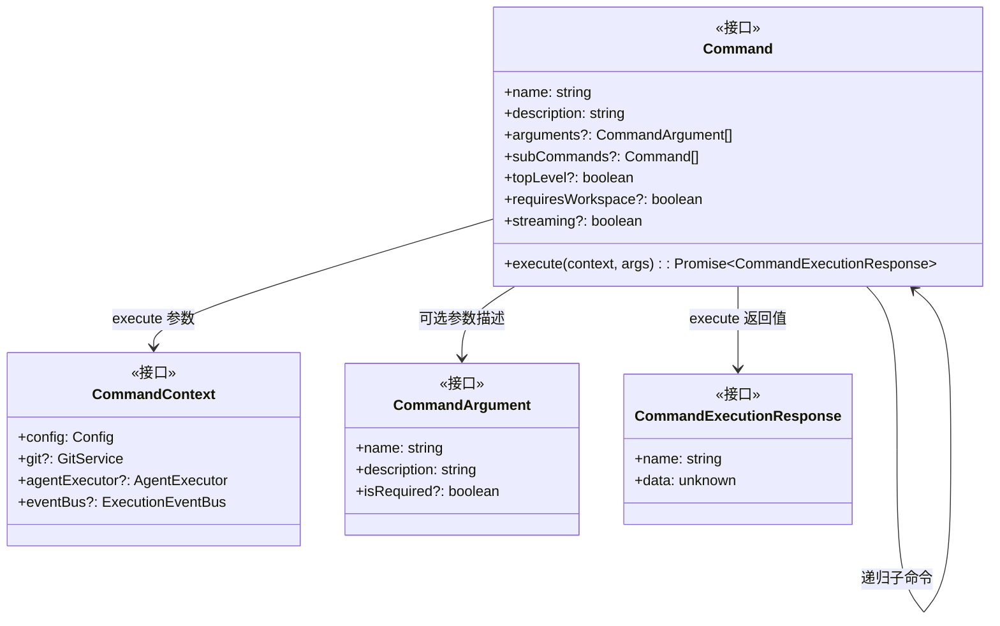
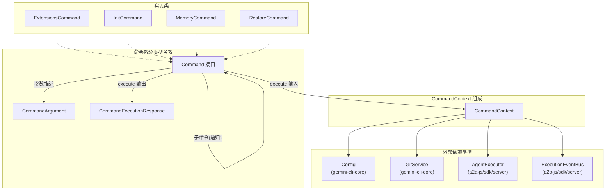

# types.ts

## 概述

`types.ts` 是 A2A Server 命令系统的**核心类型定义文件**。该文件定义了整个命令体系所依赖的基础接口：`CommandContext`（命令执行上下文）、`CommandArgument`（命令参数描述）、`Command`（命令接口）和 `CommandExecutionResponse`（命令执行响应）。

该文件不包含任何运行时逻辑，仅导出 TypeScript 接口类型。所有命令类（如 `ExtensionsCommand`、`InitCommand`、`MemoryCommand`、`RestoreCommand` 等）都实现 `Command` 接口，并使用 `CommandContext` 和 `CommandExecutionResponse` 来统一命令的输入输出协议。

## 架构图





## 核心组件

### `CommandContext` 接口

命令执行时的上下文对象，封装了命令所需的所有运行时依赖。

```typescript
export interface CommandContext {
  config: Config;
  git?: GitService;
  agentExecutor?: AgentExecutor;
  eventBus?: ExecutionEventBus;
}
```

| 字段 | 类型 | 是否必需 | 说明 |
|------|------|----------|------|
| `config` | `Config` | **必需** | Gemini CLI 核心配置对象，提供模型信息、存储路径、工具注册表等。是所有命令都依赖的基础配置 |
| `git` | `GitService` | 可选 | Git 服务接口，提供 Git 操作能力。仅在需要 Git 操作的命令中使用（如 `RestoreCommand`） |
| `agentExecutor` | `AgentExecutor` | 可选 | 代理执行器，用于触发 AI 代理循环。仅在需要代理执行的命令中使用（如 `InitCommand`） |
| `eventBus` | `ExecutionEventBus` | 可选 | 事件总线，用于流式通信。仅在支持流式执行的命令中使用（如 `InitCommand`） |

### `CommandArgument` 接口

命令参数的元数据描述，用于命令自文档化和参数验证。

```typescript
export interface CommandArgument {
  readonly name: string;
  readonly description: string;
  readonly isRequired?: boolean;
}
```

| 字段 | 类型 | 是否必需 | 说明 |
|------|------|----------|------|
| `name` | `string` | **必需** | 参数名称 |
| `description` | `string` | **必需** | 参数描述 |
| `isRequired` | `boolean` | 可选 | 是否为必需参数，默认为可选 |

### `Command` 接口

命令系统的核心接口，定义了所有命令类必须实现的契约。

```typescript
export interface Command {
  readonly name: string;
  readonly description: string;
  readonly arguments?: CommandArgument[];
  readonly subCommands?: Command[];
  readonly topLevel?: boolean;
  readonly requiresWorkspace?: boolean;
  readonly streaming?: boolean;

  execute(
    config: CommandContext,
    args: string[],
  ): Promise<CommandExecutionResponse>;
}
```

| 字段/方法 | 类型 | 是否必需 | 说明 |
|-----------|------|----------|------|
| `name` | `string` | **必需** | 命令名称，用于命令路由和标识。子命令通常使用 `"父命令 子命令"` 格式（如 `"memory show"`） |
| `description` | `string` | **必需** | 命令功能描述，用于帮助信息展示 |
| `arguments` | `CommandArgument[]` | 可选 | 命令接受的参数列表描述 |
| `subCommands` | `Command[]` | 可选 | 子命令列表。支持递归定义（`Command` 引用自身类型），实现命令树结构 |
| `topLevel` | `boolean` | 可选 | 是否为顶层命令。顶层命令可直接被用户调用，非顶层命令通常仅作为子命令存在 |
| `requiresWorkspace` | `boolean` | 可选 | 是否需要工作空间环境。设为 `true` 时，命令需要在有效的工作空间目录中执行 |
| `streaming` | `boolean` | 可选 | 是否支持流式执行。设为 `true` 时，命令可通过事件总线流式返回结果 |
| `execute(context, args)` | 方法 | **必需** | 命令执行方法。接收 `CommandContext` 上下文和字符串参数数组，返回 `Promise<CommandExecutionResponse>` |

**注意**：`execute` 方法的第一个参数名为 `config`，但其类型实际上是 `CommandContext`（包含 config 在内的完整上下文），这可能是早期命名遗留。

### `CommandExecutionResponse` 接口

命令执行结果的统一响应格式。

```typescript
export interface CommandExecutionResponse {
  readonly name: string;
  readonly data: unknown;
}
```

| 字段 | 类型 | 是否必需 | 说明 |
|------|------|----------|------|
| `name` | `string` | **必需** | 命令名称，与执行该命令的 `Command.name` 对应 |
| `data` | `unknown` | **必需** | 命令执行结果数据。类型为 `unknown`，具体结构由各命令自行定义 |

## 依赖关系

### 内部依赖

无。此文件是类型定义文件，不依赖项目内其他模块。

### 外部依赖

| 依赖模块 | 导入内容 | 用途 |
|----------|----------|------|
| `@a2a-js/sdk/server` | `ExecutionEventBus` (类型) | A2A SDK 事件总线类型，用于 `CommandContext.eventBus` |
| `@a2a-js/sdk/server` | `AgentExecutor` (类型) | A2A SDK 代理执行器类型，用于 `CommandContext.agentExecutor` |
| `@google/gemini-cli-core` | `Config` (类型) | Gemini CLI 核心配置类型，用于 `CommandContext.config` |
| `@google/gemini-cli-core` | `GitService` (类型) | Gemini CLI Git 服务类型，用于 `CommandContext.git` |

## 关键实现细节

1. **纯类型文件**：该文件仅包含 `interface` 定义和 `import type` 导入，不包含任何运行时代码。编译后不会产生 JavaScript 输出（在 `isolatedModules` 模式下通过 `export type` 或接口导出确保此行为）。

2. **`Command` 接口的递归设计**：`subCommands` 字段的类型为 `Command[]`，形成递归类型结构。这允许构建任意深度的命令树，虽然当前实现中仅使用了一级子命令（如 `memory show`、`restore list`）。

3. **`CommandExecutionResponse.data` 的 `unknown` 类型**：响应中的 `data` 字段使用了 `unknown` 类型而非 `any`，这是一种更安全的类型选择。`unknown` 强制调用者在使用 `data` 之前进行类型检查或断言，但也意味着不同命令可以返回完全不同结构的数据：
   - `ExtensionsCommand`：返回扩展列表数组或字符串
   - `InitCommand`：返回 `{ content, messageType }` 对象或文件路径字符串
   - `MemoryCommand`：返回字符串内容
   - `RestoreCommand`：返回恢复结果数组或 `{ type, messageType, content }` 对象

4. **`CommandContext` 的可选字段设计**：除 `config` 外，`git`、`agentExecutor`、`eventBus` 都是可选字段。这种设计允许不同命令根据需求获取不同的依赖：
   - 所有命令都需要 `config`
   - 只有涉及 Git 操作的命令需要 `git`（如 `RestoreCommand`）
   - 只有需要代理执行的命令需要 `agentExecutor`（如 `InitCommand`）
   - 只有支持流式的命令需要 `eventBus`（如 `InitCommand`）

5. **`execute` 参数命名不一致**：接口定义中 `execute` 的第一个参数命名为 `config`，但类型为 `CommandContext`。各实现类中通常将其命名为 `context`（更准确地反映其含义）。这是接口定义层面的命名瑕疵，不影响类型安全性。

6. **所有属性为 `readonly`**：`CommandArgument`、`Command` 和 `CommandExecutionResponse` 的所有字段都标记为 `readonly`，确保命令系统的元数据和响应数据不可变。`CommandContext` 的字段没有 `readonly` 标记，允许运行时修改上下文（如在命令执行过程中添加 `eventBus`）。
