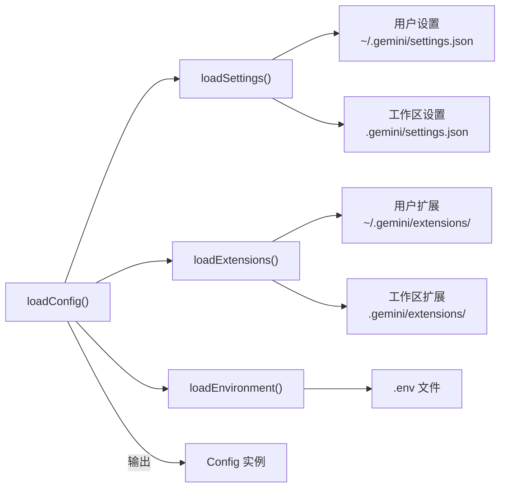

# packages/a2a-server/src/config

## 概述

服务端配置管理模块，负责加载 Config 配置、用户/工作区设置、扩展以及环境变量。处理认证流程（CCPA / Gemini API Key）和管理控制台设置。

## 目录结构

```
config/
├── config.ts        # 核心配置加载（loadConfig、setTargetDir、loadEnvironment）
├── settings.ts      # 设置文件加载与合并（loadSettings）
├── extension.ts     # 扩展加载（loadExtensions）
├── config.test.ts
└── settings.test.ts
```

## 架构图



## 核心组件

### loadConfig() (`config.ts`)

完整的配置加载流程：
1. 设置工作目录 -> 加载环境变量 -> 加载设置 -> 加载扩展
2. 创建 Config 实例并初始化
3. 获取 CodeAssist 服务器，检查管理控制台设置
4. 等待 MCP 初始化完成
5. 执行认证（支持 CCPA / Gemini API Key / Compute ADC）

### loadSettings() (`settings.ts`)

- 从用户主目录 (`~/.gemini/settings.json`) 和工作区目录加载设置
- 工作区设置覆盖用户设置
- 支持环境变量替换（`$VAR_NAME` 或 `${VAR_NAME}`）
- 支持 JSON 注释（使用 `strip-json-comments`）

### loadExtensions() (`extension.ts`)

- 从工作区和用户主目录的 `.gemini/extensions/` 加载扩展
- 读取 `gemini-extension.json` 配置文件
- 去重处理：工作区扩展优先于用户扩展

## 依赖关系

### 内部依赖
- `@google/gemini-cli-core` - Config, AuthType, FileDiscoveryService 等

### 外部依赖
- `dotenv` - .env 文件加载
- `strip-json-comments` - JSON 注释处理
