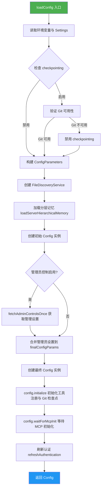
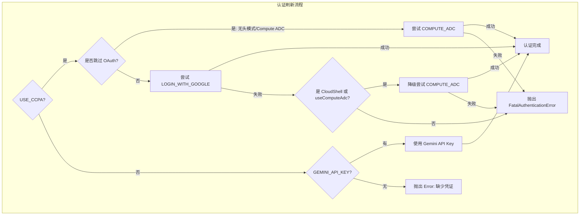
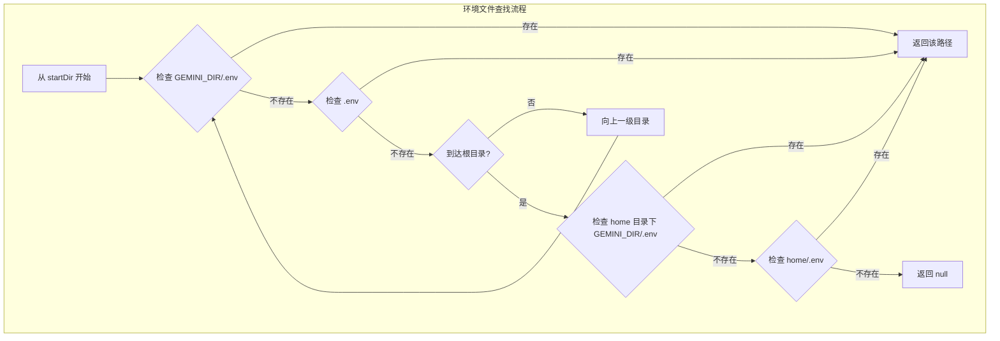

# config.ts

## 概述

`config.ts` 是 A2A Server 的核心配置加载模块，负责构建和初始化 `Config` 对象。它整合了来自环境变量、用户设置（`Settings`）、管理员控制（Admin Controls）、文件发现服务、分层记忆系统等多方面的配置信息，最终生成一个完整的 `Config` 实例供整个 A2A Server 使用。

该文件还负责：
- 工作目录（workspace）的设置与切换
- `.env` 环境文件的层级查找与加载
- 认证方式的刷新与降级策略（CCPA / Gemini API Key / COMPUTE_ADC）

## 架构图

## 核心组件

### `loadConfig(settings, extensionLoader, taskId): Promise<Config>`

**导出：是（async 函数）**

主配置加载函数，负责构建完整的 `Config` 实例。

| 参数 | 类型 | 说明 |
|------|------|------|
| `settings` | `Settings` | 用户/服务器配置设置 |
| `extensionLoader` | `ExtensionLoader` | 扩展加载器 |
| `taskId` | `string` | 当前任务/会话 ID |

**返回值：** `Promise<Config>` - 完整初始化的配置对象

**关键步骤：**

1. **读取基础配置**：从 `process.cwd()`、环境变量和 `Settings` 中读取工作目录、文件夹信任、checkpointing、审批模式等
2. **构建 ConfigParameters**：组装包含模型、工具、MCP 服务器、遥测、文件过滤等完整参数对象
3. **文件发现与记忆加载**：通过 `FileDiscoveryService` 和 `loadServerHierarchicalMemory` 加载工作区的记忆内容
4. **管理员控制**：若实验标志启用，则拉取管理员控制设置（YOLO 模式禁用、MCP 启用、扩展启用等）
5. **初始化配置**：调用 `config.initialize()` 初始化工具注册和 Git 检查点，并等待 MCP 初始化完成
6. **认证刷新**：根据认证方式（CCPA/Gemini API Key）刷新认证

**ConfigParameters 详细字段映射：**

| 字段 | 来源 | 说明 |
|------|------|------|
| `sessionId` | `taskId` 参数 | 会话唯一标识 |
| `clientName` | 硬编码 `'a2a-server'` | 客户端名称标识 |
| `model` | `PREVIEW_GEMINI_MODEL` | 使用的 Gemini 模型 |
| `embeddingModel` | `DEFAULT_GEMINI_EMBEDDING_MODEL` | 嵌入模型 |
| `sandbox` | `undefined` | 服务端不需要沙箱 |
| `targetDir` | `process.cwd()` | 工作目录 |
| `approvalMode` | 环境变量 `GEMINI_YOLO_MODE` | YOLO 或 DEFAULT 审批模式 |
| `coreTools` | `settings.coreTools` 或 `settings.tools?.core` | 核心工具列表 |
| `mcpServers` | `settings.mcpServers` | MCP 服务器配置 |
| `telemetry` | 环境变量 + `settings.telemetry` | 遥测配置 |
| `fileFiltering` | `settings.fileFiltering` + 环境变量 | 文件过滤配置 |
| `folderTrust` | `settings.folderTrust` 或环境变量 | 文件夹信任标志 |
| `checkpointing` | 环境变量或 `settings.checkpointing?.enabled` | 检查点功能 |
| `enableAgents` | `settings.experimental?.enableAgents` | 是否启用子代理，默认 `true` |

---

### `setTargetDir(agentSettings): string`

**导出：是（同步函数）**

设置并切换工作目录。优先使用环境变量 `CODER_AGENT_WORKSPACE_PATH`，其次使用 `agentSettings.workspacePath`。

| 参数 | 类型 | 说明 |
|------|------|------|
| `agentSettings` | `AgentSettings \| undefined` | 代理设置，可选 |

**返回值：** `string` - 最终的工作目录路径

**逻辑：**
- 如果没有覆盖路径，返回原始 `process.cwd()`
- 如果有目标路径，调用 `process.chdir()` 切换并返回解析后的绝对路径
- 切换失败时打印错误日志并返回原始 CWD

---

### `loadEnvironment(): void`

**导出：是（同步函数）**

加载 `.env` 环境文件。从当前工作目录开始向上层目录查找 `.env` 文件，找到后使用 `dotenv.config()` 加载并允许覆盖已有环境变量。

**查找优先级：**
1. 当前目录下的 `GEMINI_DIR/.env`
2. 当前目录下的 `.env`
3. 向上遍历父目录重复 1-2
4. home 目录下的 `GEMINI_DIR/.env`（回退）
5. home 目录下的 `.env`（最终回退）

---

### `findEnvFile(startDir): string | null`（私有）

从 `startDir` 开始向上遍历目录树，查找第一个存在的 `.env` 文件。优先查找 Gemini 专属的 `.env`（在 `GEMINI_DIR` 子目录下），回退到通用 `.env`。

---

### `refreshAuthentication(config, adcFilePath, logPrefix): Promise<void>`（私有）

认证刷新核心函数，支持三种认证方式的尝试与降级：

| 认证环境 | 流程 |
|----------|------|
| `USE_CCPA` + 可交互终端 | 尝试 `LOGIN_WITH_GOOGLE`，失败后在 CloudShell 中降级到 `COMPUTE_ADC` |
| `USE_CCPA` + 无头模式 | 直接尝试 `COMPUTE_ADC` |
| `GEMINI_API_KEY` | 使用 `AuthType.USE_GEMINI` |
| 均未设置 | 抛出错误 |

## 依赖关系

### 内部依赖

| 模块 | 导入内容 | 说明 |
|------|----------|------|
| `../utils/logger.js` | `logger` | 日志工具 |
| `./settings.js` | `Settings`（类型） | 服务器设置接口定义 |
| `../types.js` | `AgentSettings`, `CoderAgentEvent` | 代理设置类型与事件枚举 |

### 外部依赖

| 模块 | 导入内容 | 说明 |
|------|----------|------|
| `node:fs` | `fs` | 文件系统操作（检查 `.env` 是否存在） |
| `node:path` | `path` | 路径处理 |
| `dotenv` | `dotenv` | 环境变量文件加载 |
| `@google/gemini-cli-core` | 多个 | 核心库，提供 Config 类、认证类型、文件发现、记忆加载、Git 服务、管理控制等 |

**从 `@google/gemini-cli-core` 导入的详细清单：**

| 导入项 | 类别 | 用途 |
|--------|------|------|
| `AuthType` | 枚举 | 认证类型：LOGIN_WITH_GOOGLE / COMPUTE_ADC / USE_GEMINI |
| `Config` | 类 | 核心配置类 |
| `FileDiscoveryService` | 类 | 文件发现服务，支持 gitignore 过滤 |
| `ApprovalMode` | 枚举 | 审批模式：DEFAULT / YOLO |
| `loadServerHierarchicalMemory` | 函数 | 加载服务器端分层记忆 |
| `GEMINI_DIR` | 常量 | Gemini 配置目录名 |
| `DEFAULT_GEMINI_EMBEDDING_MODEL` | 常量 | 默认嵌入模型名 |
| `startupProfiler` | 对象 | 启动性能分析器 |
| `PREVIEW_GEMINI_MODEL` | 常量 | 预览 Gemini 模型名 |
| `homedir` | 函数 | 获取用户主目录 |
| `GitService` | 类 | Git 操作服务 |
| `fetchAdminControlsOnce` | 函数 | 一次性获取管理员控制设置 |
| `getCodeAssistServer` | 函数 | 获取 Code Assist 服务器实例 |
| `ExperimentFlags` | 枚举 | 实验功能标志 |
| `isHeadlessMode` | 函数 | 判断是否无头模式 |
| `FatalAuthenticationError` | 类 | 致命认证错误 |
| `isCloudShell` | 函数 | 判断是否 Cloud Shell 环境 |
| `PolicyDecision` | 枚举 | 策略决策类型 |
| `PRIORITY_YOLO_ALLOW_ALL` | 常量 | YOLO 模式策略优先级 |
| `TelemetryTarget` | 类型 | 遥测目标类型 |
| `ConfigParameters` | 类型 | 配置参数接口 |
| `ExtensionLoader` | 类型 | 扩展加载器接口 |

## 关键实现细节

1. **双阶段 Config 构建**：先创建初始 `Config` 用于获取实验标志和 Code Assist 服务器，再根据管理员控制设置创建最终 `Config`。这种两阶段设计是因为管理员控制的获取需要依赖初始配置中的认证和实验标志信息。

2. **Checkpointing 前置校验**：在启用 checkpointing 前会通过 `GitService.verifyGitAvailability()` 验证 Git 是否可用，不可用时自动降级禁用而不是抛出错误。

3. **YOLO 模式策略引擎规则**：当 `GEMINI_YOLO_MODE` 为 `true` 时，会注入一条全局允许规则（`toolName: '*'`），使所有工具调用无需审批。该规则具有 `PRIORITY_YOLO_ALLOW_ALL` 优先级且允许重定向。

4. **环境文件查找策略**：`findEnvFile` 实现了从工作目录到根目录的冒泡查找，每层优先查找 Gemini 专属目录下的 `.env`。到达文件系统根后还会回退检查 home 目录。

5. **认证降级策略**：`refreshAuthentication` 实现了完善的认证降级链——CCPA 模式下先尝试 OAuth 登录，失败后在支持的环境（CloudShell / 配置了 Compute ADC）中降级为应用默认凭据，确保在不同部署环境中都能完成认证。

6. **文件过滤配置合并**：`customIgnoreFilePaths` 同时从 `settings` 和环境变量 `CUSTOM_IGNORE_FILE_PATHS` 中收集，使用 `path.delimiter` 分隔环境变量中的多个路径，实现配置的灵活叠加。

7. **管理员控制的全有或全无语义**：如果 `adminSettings` 对象有任何键，所有未设置的管理员设置默认视为 `false`（即限制性默认）；如果完全为空对象，则完全忽略管理员控制。
