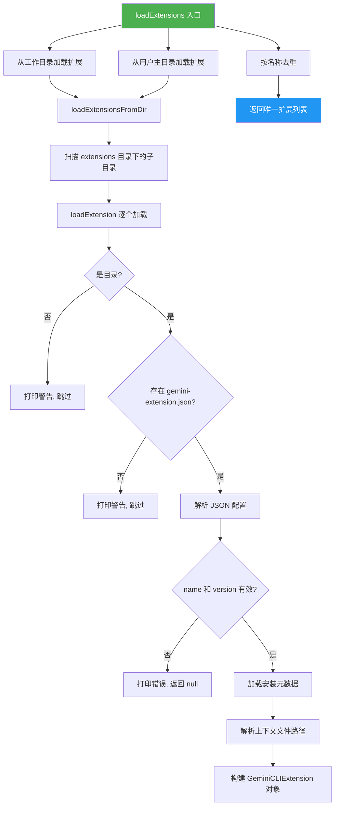
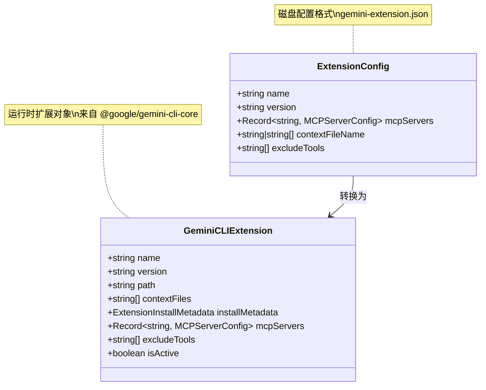
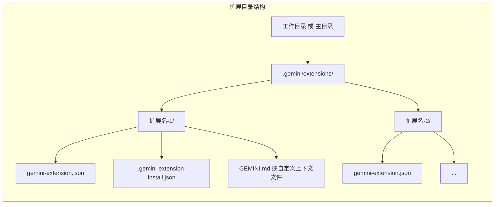

# extension.ts

## 概述

`extension.ts` 是 A2A Server 的扩展（Extension）加载模块，负责从磁盘上发现、解析和加载 Gemini CLI 扩展。扩展是一种插件机制，可以为 Gemini CLI 提供额外的 MCP 服务器、上下文文件和工具排除规则。

该文件从 `packages/cli/src/config/extension.ts` 复制而来（最后同步于 PR #1026），为 A2A Server 提供与 CLI 一致的扩展加载能力。

核心职责：
- 从工作目录和用户主目录两个位置扫描扩展
- 解析 `gemini-extension.json` 配置文件
- 加载扩展安装元数据（`.gemini-extension-install.json`）
- 去重处理（工作目录优先于主目录）

## 架构图

## 核心组件

### 常量

| 常量名 | 值 | 说明 |
|--------|------|------|
| `EXTENSIONS_DIRECTORY_NAME` | `path.join(GEMINI_DIR, 'extensions')` | 扩展存放目录名（如 `.gemini/extensions`） |
| `EXTENSIONS_CONFIG_FILENAME` | `'gemini-extension.json'` | 扩展配置文件名 |
| `INSTALL_METADATA_FILENAME` | `'.gemini-extension-install.json'` | 安装元数据文件名 |

---

### 接口 `ExtensionConfig`（私有）

磁盘上 `gemini-extension.json` 文件的结构定义。该接口仅在文件读取逻辑中使用，不应在外部引用。

| 字段 | 类型 | 必需 | 说明 |
|------|------|------|------|
| `name` | `string` | 是 | 扩展名称 |
| `version` | `string` | 是 | 扩展版本 |
| `mcpServers` | `Record<string, MCPServerConfig>` | 否 | 扩展提供的 MCP 服务器配置 |
| `contextFileName` | `string \| string[]` | 否 | 上下文文件名，默认 `GEMINI.md` |
| `excludeTools` | `string[]` | 否 | 需排除的工具列表 |

---

### `loadExtensions(workspaceDir): GeminiCLIExtension[]`

**导出：是**

扩展加载的主入口函数。从工作目录和用户主目录两处加载扩展，并按名称去重（先出现的优先保留，即工作目录的扩展覆盖主目录的同名扩展）。

| 参数 | 类型 | 说明 |
|------|------|------|
| `workspaceDir` | `string` | 工作空间目录路径 |

**返回值：** `GeminiCLIExtension[]` - 去重后的扩展列表

**加载顺序与优先级：**
1. 工作目录下的扩展（优先）
2. 用户主目录下的扩展（次之）
3. 同名扩展只保留第一个（工作目录优先）

---

### `loadExtensionsFromDir(dir): GeminiCLIExtension[]`（私有）

从指定目录的 `EXTENSIONS_DIRECTORY_NAME` 子目录中扫描并加载所有扩展。

| 参数 | 类型 | 说明 |
|------|------|------|
| `dir` | `string` | 基础目录（工作目录或主目录） |

**逻辑：**
- 检查扩展目录是否存在，不存在则返回空数组
- 遍历扩展目录下的每个子目录，逐个调用 `loadExtension`

---

### `loadExtension(extensionDir): GeminiCLIExtension | null`（私有）

加载单个扩展。解析配置文件并构建 `GeminiCLIExtension` 对象。

| 参数 | 类型 | 说明 |
|------|------|------|
| `extensionDir` | `string` | 扩展目录的绝对路径 |

**返回值：** `GeminiCLIExtension | null` - 成功返回扩展对象，失败返回 `null`

**校验规则：**
1. 必须是目录（非文件）
2. 必须包含 `gemini-extension.json` 配置文件
3. 配置中必须有 `name` 和 `version` 字段
4. JSON 解析不能出错

**构建的 `GeminiCLIExtension` 对象字段：**
- `name`、`version`：来自配置文件
- `path`：扩展目录路径
- `contextFiles`：上下文文件的绝对路径列表（只保留实际存在的文件）
- `installMetadata`：安装元数据（可能为 `undefined`）
- `mcpServers`：MCP 服务器配置
- `excludeTools`：排除的工具列表
- `isActive`：默认为 `true`

---

### `getContextFileNames(config): string[]`（私有）

从扩展配置中提取上下文文件名列表。

| 输入 `contextFileName` | 返回值 |
|------------------------|--------|
| `undefined` / 未设置 | `['GEMINI.md']` |
| 单个字符串 | `[contextFileName]` |
| 字符串数组 | 原数组 |

---

### `loadInstallMetadata(extensionDir): ExtensionInstallMetadata | undefined`

**导出：是**

加载扩展的安装元数据文件（`.gemini-extension-install.json`）。

| 参数 | 类型 | 说明 |
|------|------|------|
| `extensionDir` | `string` | 扩展目录的绝对路径 |

**返回值：** `ExtensionInstallMetadata | undefined` - 成功返回元数据对象，失败返回 `undefined`

**容错处理：** 文件不存在或 JSON 解析失败时仅打印警告日志，不抛出异常。

## 依赖关系

### 内部依赖

| 模块 | 导入内容 | 说明 |
|------|----------|------|
| `../utils/logger.js` | `logger` | 日志工具，用于打印加载过程中的信息、警告和错误 |

### 外部依赖

| 模块 | 导入内容 | 说明 |
|------|----------|------|
| `node:fs` | `fs` | 文件系统操作（目录遍历、文件读取、存在性检查） |
| `node:path` | `path` | 路径拼接与处理 |
| `@google/gemini-cli-core` | `GEMINI_DIR` | Gemini 配置目录常量（如 `.gemini`） |
| `@google/gemini-cli-core` | `MCPServerConfig`（类型） | MCP 服务器配置接口 |
| `@google/gemini-cli-core` | `ExtensionInstallMetadata`（类型） | 扩展安装元数据接口 |
| `@google/gemini-cli-core` | `GeminiCLIExtension`（类型） | Gemini CLI 扩展运行时接口 |
| `@google/gemini-cli-core` | `homedir` | 获取用户主目录的函数 |

## 关键实现细节

1. **双目录扫描策略**：扩展同时从工作目录（项目级）和用户主目录（全局级）加载，实现了项目级扩展覆盖全局扩展的机制。工作目录的扩展先被加入列表，通过 `Set` 去重确保同名扩展中工作目录版本优先。

2. **宽容的错误处理**：整个加载流程对错误高度容忍——非目录文件、缺失配置文件、无效 JSON、缺少必要字段等情况都只打印日志而不抛出异常，确保一个有问题的扩展不会影响其他扩展的加载。

3. **上下文文件的灵活配置**：`contextFileName` 支持三种形态——未设置（默认 `GEMINI.md`）、单个字符串、字符串数组。且只保留磁盘上实际存在的文件路径，避免传递无效路径。

4. **安装元数据的可选性**：`loadInstallMetadata` 独立于主配置加载，元数据文件缺失不影响扩展的正常加载。这使得手动安装（无元数据）的扩展也能正常工作。

5. **代码来源注释**：文件开头注释了 "Copied exactly from packages/cli/src/config/extension.ts, last PR #1026"，说明这是从 CLI 包复制过来的代码，需要注意与源文件保持同步。

6. **`isActive` 默认值**：所有成功加载的扩展默认标记为 `isActive: true`，除非有其他信号（如管理员控制或用户设置）覆盖。
