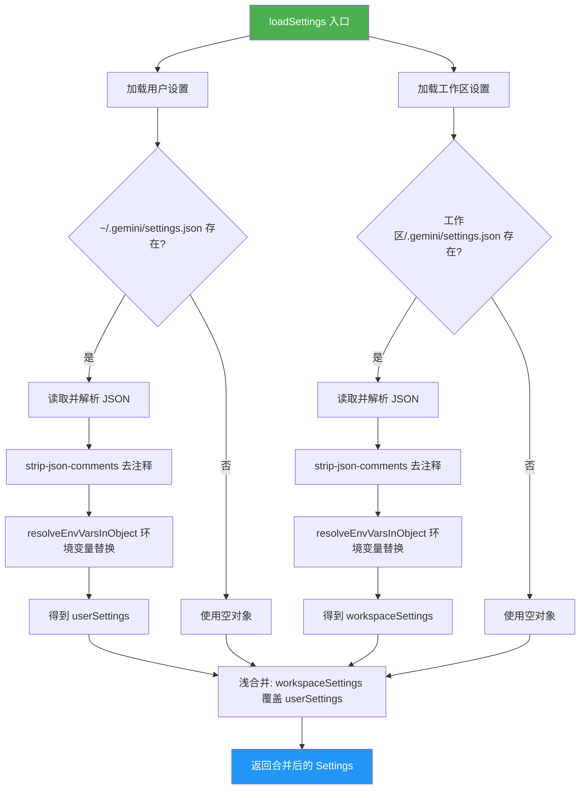
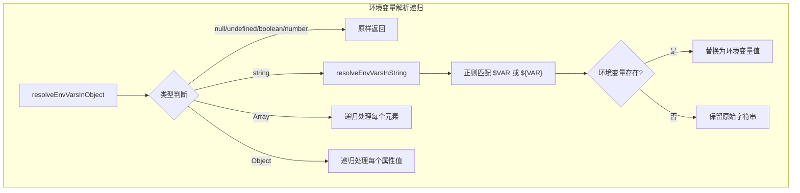
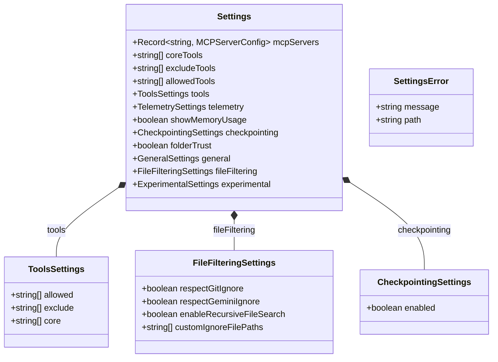

# settings.ts

## 概述

`settings.ts` 是 A2A Server 的用户设置加载模块，负责从磁盘读取、解析和合并用户级与工作区级的 `settings.json` 配置文件。该模块实现了分层配置机制——工作区设置覆盖用户全局设置，并支持在配置值中使用环境变量插值（`$VAR_NAME` 或 `${VAR_NAME}` 语法）。

与 CLI 版本的区别：本模块直接返回已合并的 `Settings` 对象，而非 CLI 中的 `LoadedSettings` 结构，因为 A2A Server 不需要修改用户的 `settings.json` 文件。

**注意：** 代码中的 TODO 注释指出，当前尚未完全兼容 V2 嵌套设置结构（`settings.schema.json`），需要更新接口并实现 V1 扁平设置到 V2 嵌套设置的迁移逻辑。

## 架构图

## 核心组件

### 常量

| 常量名 | 值 | 说明 |
|--------|------|------|
| `USER_SETTINGS_DIR` | `path.join(homedir(), GEMINI_DIR)` | 用户设置目录（如 `~/.gemini`） |
| `USER_SETTINGS_PATH` | `path.join(USER_SETTINGS_DIR, 'settings.json')` | 用户设置文件路径（如 `~/.gemini/settings.json`） |

---

### 接口 `Settings`

**导出：是**

A2A Server 设置的完整接口定义。包含工具配置、遥测、文件过滤、实验功能等各方面设置。

| 字段 | 类型 | 说明 |
|------|------|------|
| `mcpServers` | `Record<string, MCPServerConfig>` | MCP 服务器配置映射 |
| `coreTools` | `string[]` | 核心工具列表（V1 扁平格式） |
| `excludeTools` | `string[]` | 排除工具列表（V1 扁平格式） |
| `allowedTools` | `string[]` | 允许工具列表（V1 扁平格式） |
| `tools` | `{ allowed?, exclude?, core? }` | V2 嵌套工具配置 |
| `telemetry` | `TelemetrySettings` | 遥测设置 |
| `showMemoryUsage` | `boolean` | 是否显示内存使用 |
| `checkpointing` | `CheckpointingSettings` | 检查点设置 |
| `folderTrust` | `boolean` | 文件夹信任标志 |
| `general` | `{ previewFeatures? }` | 通用设置 |
| `fileFiltering` | `FileFilteringSettings` | 文件过滤设置 |
| `experimental` | `{ enableAgents? }` | 实验功能设置 |

**V1 与 V2 工具配置的兼容：** 同时支持扁平的 `coreTools`/`excludeTools`/`allowedTools` 和嵌套的 `tools.core`/`tools.exclude`/`tools.allowed`。在 `config.ts` 的 `loadConfig` 中通过 `||` 运算符实现兼容读取。

---

### 接口 `SettingsError`

**导出：是**

设置加载错误的描述结构。

| 字段 | 类型 | 说明 |
|------|------|------|
| `message` | `string` | 错误信息 |
| `path` | `string` | 出错的设置文件路径 |

---

### 接口 `CheckpointingSettings`

**导出：是**

检查点功能设置。

| 字段 | 类型 | 说明 |
|------|------|------|
| `enabled` | `boolean` | 是否启用检查点 |

---

### `loadSettings(workspaceDir): Settings`

**导出：是**

设置加载的主入口函数。从用户目录和工作区目录分别加载 `settings.json`，合并后返回。

| 参数 | 类型 | 说明 |
|------|------|------|
| `workspaceDir` | `string` | 工作空间目录路径 |

**返回值：** `Settings` - 合并后的设置对象

**加载路径：**
1. 用户设置：`~/.gemini/settings.json`
2. 工作区设置：`{workspaceDir}/.gemini/settings.json`

**合并策略：** 使用展开运算符（`...`）进行浅合并，工作区设置的顶层键覆盖用户设置的同名键。注意这是浅合并，嵌套对象会被整体替换而非深度合并。

**处理流程：**
1. 读取文件内容
2. 使用 `strip-json-comments` 去除 JSON 注释（支持 `//` 和 `/* */` 注释）
3. 解析 JSON
4. 递归解析环境变量引用
5. 合并两个设置对象

---

### `resolveEnvVarsInString(value): string`（私有）

在字符串中解析环境变量引用。

| 参数 | 类型 | 说明 |
|------|------|------|
| `value` | `string` | 包含环境变量引用的字符串 |

**支持的语法：**
- `$VAR_NAME` - 不带花括号
- `${VAR_NAME}` - 带花括号

**行为：** 如果环境变量存在，替换为其值；不存在则保留原始字符串（如 `$UNDEFINED_VAR` 保持不变）。

**正则表达式：** `/\$(?:(\w+)|{([^}]+)})/g`
- `(\w+)` - 匹配 `$VAR_NAME` 形式
- `{([^}]+)}` - 匹配 `${VAR_NAME}` 形式

---

### `resolveEnvVarsInObject<T>(obj): T`（私有）

递归地在任意对象结构中解析所有字符串值中的环境变量引用。

| 参数 | 类型 | 说明 |
|------|------|------|
| `obj` | `T` | 任意类型的值 |

**返回值：** `T` - 环境变量解析后的新对象（不修改原对象）

**类型处理规则：**

| 类型 | 处理方式 |
|------|----------|
| `null` / `undefined` / `boolean` / `number` | 原样返回 |
| `string` | 调用 `resolveEnvVarsInString` |
| `Array` | 递归处理每个元素，返回新数组 |
| `Object` | 浅拷贝后递归处理每个属性值 |
| 其他类型 | 原样返回 |

## 依赖关系

### 内部依赖

无直接内部依赖。该模块是纯粹的设置加载工具，不依赖其他 A2A Server 内部模块。

### 外部依赖

| 模块 | 导入内容 | 说明 |
|------|----------|------|
| `node:fs` | `fs` | 文件系统操作（存在性检查、文件读取） |
| `node:path` | `path` | 路径拼接 |
| `@google/gemini-cli-core` | `MCPServerConfig`（类型） | MCP 服务器配置接口 |
| `@google/gemini-cli-core` | `debugLogger` | 调试日志工具 |
| `@google/gemini-cli-core` | `GEMINI_DIR` | Gemini 配置目录常量 |
| `@google/gemini-cli-core` | `getErrorMessage` | 安全获取错误消息的工具函数 |
| `@google/gemini-cli-core` | `TelemetrySettings`（类型） | 遥测设置接口 |
| `@google/gemini-cli-core` | `homedir` | 获取用户主目录 |
| `strip-json-comments` | 默认导出 | 去除 JSON 中的注释（支持 `//` 和 `/* */`） |

## 关键实现细节

1. **浅合并策略**：设置合并使用 `{ ...userSettings, ...workspaceSettings }` 实现浅合并。这意味着如果工作区设置定义了 `mcpServers`，它会完全替换（而非合并）用户设置中的 `mcpServers`。这对于数组类型（如 `coreTools`）和嵌套对象（如 `fileFiltering`）尤为重要——工作区的设置会整体覆盖用户的同名设置。

2. **JSON 注释支持**：通过 `strip-json-comments` 库，`settings.json` 支持 JavaScript 风格的注释（`//` 单行注释和 `/* */` 块注释），提升了配置文件的可读性和可维护性。

3. **环境变量递归解析**：`resolveEnvVarsInObject` 对整个配置对象进行深度递归处理，确保配置中任意层级的字符串值都能引用环境变量。这使得敏感信息（如 API Key、端点地址）可以通过环境变量注入而不是硬编码在配置文件中。

4. **不可变性**：`resolveEnvVarsInObject` 对对象使用展开运算符创建浅拷贝后再递归处理，不会修改原始的解析结果对象。

5. **错误累积而非中断**：用户设置和工作区设置的加载错误被收集到 `settingsErrors` 数组中，所有错误最后统一打印。一个文件的加载失败不会阻止另一个文件的加载，确保最大程度的配置可用性。

6. **V1/V2 设置结构兼容性 TODO**：当前 `Settings` 接口同时包含 V1 的扁平字段（`coreTools`/`excludeTools`/`allowedTools`）和 V2 的嵌套 `tools` 字段。完整的 V2 迁移逻辑（参考 CLI 包的实现）尚待实现。

7. **日志工具差异**：注意该模块使用的是 `debugLogger`（来自 `@google/gemini-cli-core`）而非其他模块使用的 `logger`（来自 `../utils/logger.js`），可能因为该模块在日志系统完全初始化之前就需要工作。
