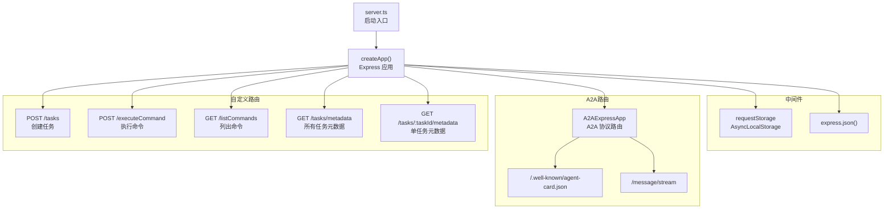

# packages/a2a-server/src/http

## 概述

HTTP 服务层，基于 Express 框架构建 A2A 协议的 HTTP API。提供任务管理、命令执行和 A2A 消息流式传输端点。

## 目录结构

```
http/
├── app.ts              # Express 应用创建与路由配置
├── server.ts           # 服务器启动入口
├── requestStorage.ts   # AsyncLocalStorage 请求上下文存储
└── endpoints.test.ts   # 端点测试
```

## 架构图



## 核心组件

### createApp() (`app.ts`)

初始化流程：
1. 加载服务端配置（loadConfig）
2. 初始化 Git 服务（如果启用检查点）
3. 创建任务存储（GCSTaskStore 或 InMemoryTaskStore）
4. 创建 CoderAgentExecutor
5. 配置 A2A 路由和自定义路由
6. 返回 Express 应用实例

### Agent Card

定义了符合 A2A 协议的 Agent 卡片信息：
- 名称：Gemini SDLC Agent
- 能力：流式传输、状态转换历史
- 技能：code_generation（代码生成）
- 认证：Bearer Token / Basic Auth

### requestStorage (`requestStorage.ts`)

使用 Node.js `AsyncLocalStorage` 在异步操作中传递请求上下文，使 `CoderAgentExecutor` 能够访问原始请求对象（用于检测 Socket 断开）。

## 依赖关系

### 内部依赖
- `../agent/executor.ts` - CoderAgentExecutor
- `../config/` - 配置加载模块
- `../commands/command-registry.ts` - 命令注册表
- `../persistence/gcs.ts` - 持久化层

### 外部依赖
- `express` (^5.1.0) - HTTP 框架
- `@a2a-js/sdk/server/express` - A2A Express 集成
- `uuid` - UUID 生成
