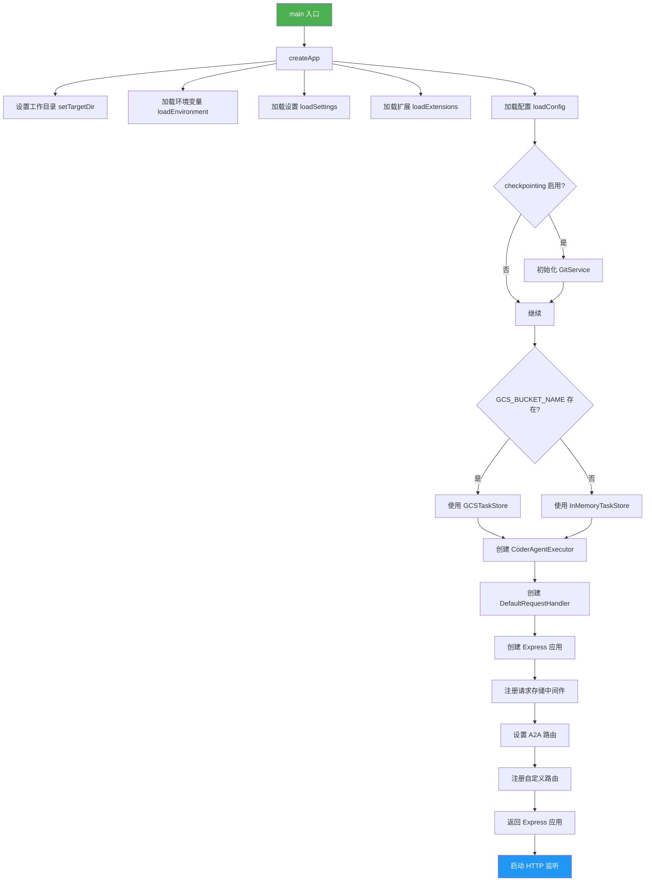
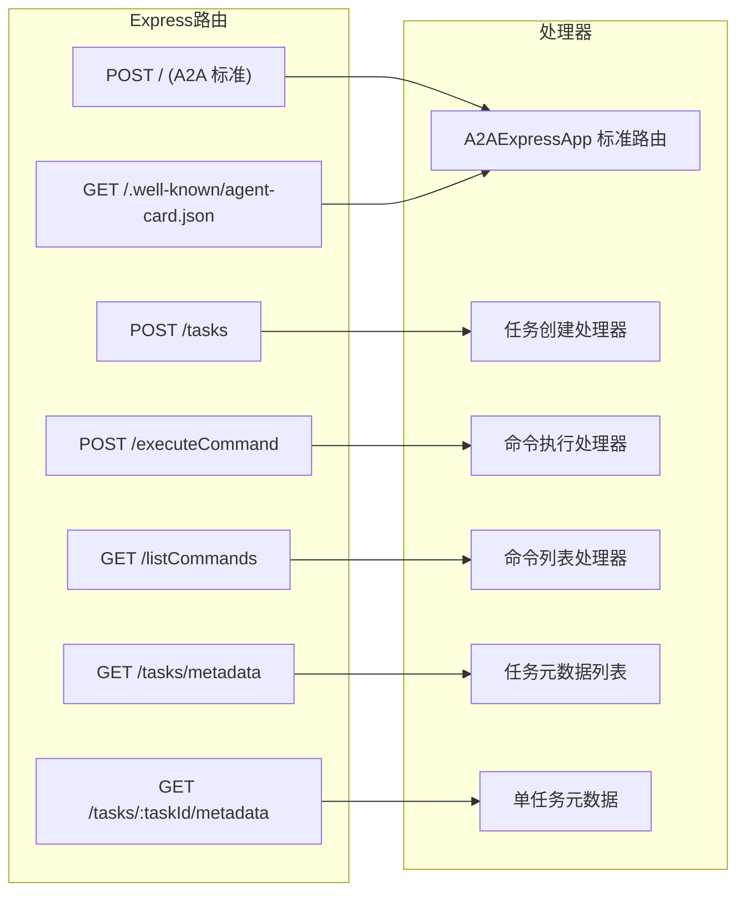
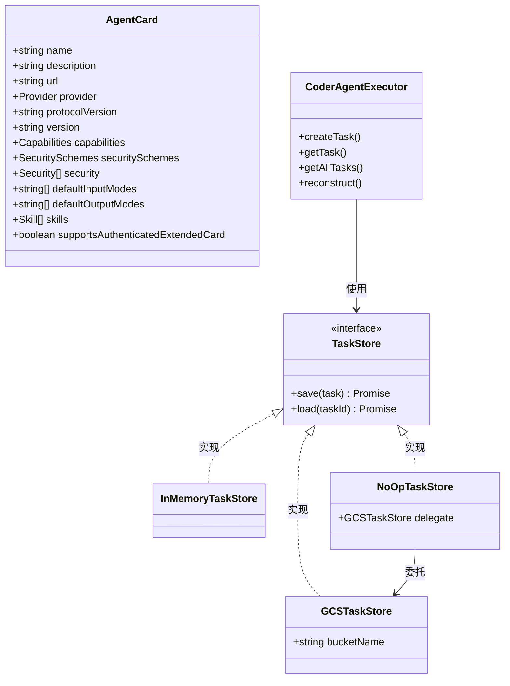
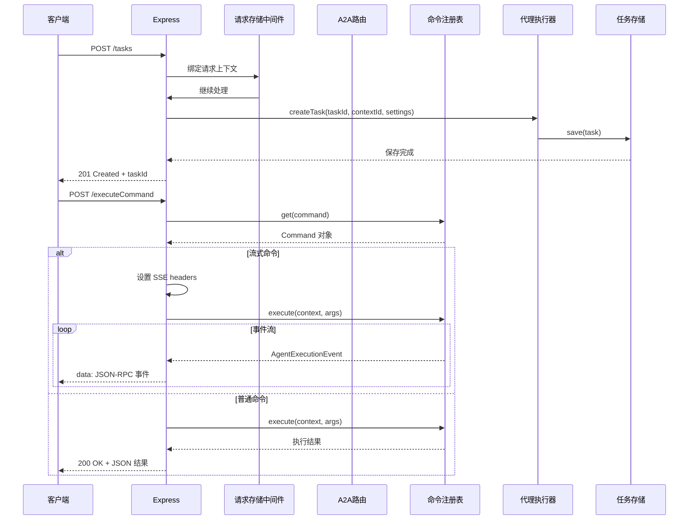

# app.ts

## 概述

`app.ts` 是 A2A Server 的 HTTP 应用入口模块，负责创建和配置整个 Express 应用。它是服务器启动的核心枢纽，整合了配置加载、任务存储、代理执行器、A2A 协议路由、自定义命令路由等所有关键组件。

核心职责：
- 定义 A2A 协议的 Agent Card（代理名片）
- 创建和配置 Express 应用及其中间件
- 注册 A2A 标准路由和自定义业务路由（`/tasks`、`/executeCommand`、`/listCommands` 等）
- 管理任务存储策略（GCS 持久化 vs 内存存储）
- 提供服务器启动入口（`main` 函数）
- 实现自定义认证逻辑（Bearer / Basic Auth）

## 架构图









## 核心组件

### 类型 `CommandResponse`（私有）

命令列表 API 的响应结构。

| 字段 | 类型 | 说明 |
|------|------|------|
| `name` | `string` | 命令名称 |
| `description` | `string` | 命令描述 |
| `arguments` | `CommandArgument[]` | 命令参数列表 |
| `subCommands` | `CommandResponse[]` | 子命令列表（递归） |

---

### 常量 `coderAgentCard: AgentCard`（模块级）

A2A 协议的 Agent Card 定义，描述该代理的身份和能力。

| 字段 | 值 | 说明 |
|------|------|------|
| `name` | `'Gemini SDLC Agent'` | 代理名称 |
| `description` | 代码生成与文件输出 Agent | 代理描述 |
| `url` | `'http://localhost:41242/'` | 默认 URL（启动后动态更新） |
| `protocolVersion` | `'0.3.0'` | A2A 协议版本 |
| `version` | `'0.0.2'` | 代理版本 |
| `capabilities.streaming` | `true` | 支持流式传输 |
| `capabilities.pushNotifications` | `false` | 不支持推送通知 |
| `capabilities.stateTransitionHistory` | `true` | 支持状态转换历史 |
| `securitySchemes` | Bearer + Basic Auth | 支持的认证方案 |
| `skills` | `[code_generation]` | 技能：代码生成 |

---

### `updateCoderAgentCardUrl(port): void`

**导出：是**

动态更新 Agent Card 的 URL 为实际监听端口。

| 参数 | 类型 | 说明 |
|------|------|------|
| `port` | `number` | 实际端口号 |

---

### `customUserBuilder: UserBuilder`（模块级）

自定义用户身份构建器，从 HTTP 请求头中提取认证信息。

**支持的认证方式：**

| 方式 | 条件 | 返回用户 |
|------|------|----------|
| Bearer Auth | `Authorization: Bearer valid-token` | `{ userName: 'bearer-user', isAuthenticated: true }` |
| Basic Auth | `Authorization: Basic <base64(admin:password)>` | `{ userName: 'basic-user', isAuthenticated: true }` |
| 无认证 / 无效凭证 | 其他情况 | `UnauthenticatedUser` |

**注意：** 当前实现使用硬编码的凭证（`valid-token`、`admin:password`），属于开发/演示用途。

---

### `handleExecuteCommand(req, res, context): Promise<void>`（私有）

命令执行的核心处理函数。

| 参数 | 类型 | 说明 |
|------|------|------|
| `req` | `express.Request` | HTTP 请求对象 |
| `res` | `express.Response` | HTTP 响应对象 |
| `context` | `{ config, git, agentExecutor }` | 执行上下文 |

**请求体：**
- `command: string` - 命令名称（必需）
- `args: any[]` - 命令参数（可选，默认 `[]`）

**处理流程：**
1. 校验 `command` 字段为字符串
2. 校验 `args` 字段为数组（如果提供）
3. 从 `commandRegistry` 查找命令
4. 如果命令要求工作区，检查 `CODER_AGENT_WORKSPACE_PATH` 环境变量
5. 根据命令是否流式分两种方式执行：
   - **流式命令**：设置 SSE 响应头，通过 `DefaultExecutionEventBus` 监听事件，实时写入 JSON-RPC 格式的 SSE 数据
   - **普通命令**：等待执行完成，返回 JSON 结果

**HTTP 响应码：**

| 状态码 | 场景 |
|--------|------|
| 200 | 非流式命令成功执行 |
| 400 | 请求参数无效 / 缺少工作区 |
| 404 | 命令未找到 |
| 500 | 执行异常 |

---

### `createApp(): Promise<express.Express>`

**导出：是**

应用创建的核心函数，组装整个 Express 应用。

**初始化流程：**

1. **设置工作目录**：调用 `setTargetDir(undefined)` 获取工作空间根目录
2. **加载环境变量**：调用 `loadEnvironment()` 加载 `.env` 文件
3. **加载设置**：调用 `loadSettings(workspaceRoot)` 加载合并的设置
4. **加载扩展**：调用 `loadExtensions(workspaceRoot)` 发现并加载扩展
5. **加载配置**：调用 `loadConfig(settings, extensionLoader, 'a2a-server')` 创建完整配置
6. **初始化 Git**：如果启用 checkpointing，创建并初始化 `GitService`
7. **配置任务存储**：
   - 有 `GCS_BUCKET_NAME` -> `GCSTaskStore` + `NoOpTaskStore`（读写分离）
   - 无 -> `InMemoryTaskStore`（内存存储）
8. **创建代理执行器**：`CoderAgentExecutor(taskStoreForExecutor)`
9. **创建请求处理器**：`DefaultRequestHandler(agentCard, taskStore, executor)`
10. **构建 Express 应用**：
    - 请求存储中间件（`requestStorage.run`）
    - A2A 标准路由（`A2AExpressApp.setupRoutes`）
    - JSON 解析中间件
    - 自定义路由（`/tasks`、`/executeCommand`、`/listCommands`、`/tasks/metadata`、`/tasks/:taskId/metadata`）

**任务存储策略：**

| 环境变量 | Executor 存储 | Handler 存储 | 说明 |
|----------|--------------|--------------|------|
| `GCS_BUCKET_NAME` 有值 | `GCSTaskStore` | `NoOpTaskStore(gcsTaskStore)` | Handler 使用 NoOp 避免重复写入 |
| `GCS_BUCKET_NAME` 无值 | `InMemoryTaskStore` | `InMemoryTaskStore`（同一实例） | 共享内存存储 |

---

### 路由 `POST /tasks`

创建新任务。

**请求体：**
- `agentSettings?: AgentSettings` - 代理设置
- `contextId?: string` - 上下文 ID（默认生成 UUID）

**响应：** `201 Created` + 任务 ID

---

### 路由 `POST /executeCommand`

执行注册的命令。详见 `handleExecuteCommand`。

---

### 路由 `GET /listCommands`

列出所有顶层命令及其子命令。

**响应结构：**
```json
{
  "commands": [
    {
      "name": "...",
      "description": "...",
      "arguments": [...],
      "subCommands": [...]
    }
  ]
}
```

**特殊处理：**
- 通过 `visited` 数组防止命令循环引用导致的无限递归
- 仅返回 `topLevel: true` 的命令

---

### 路由 `GET /tasks/metadata`

获取所有任务的元数据。仅在使用 `InMemoryTaskStore` 时可用。

**响应：**
- `200 OK` + 任务元数据数组
- `204 No Content` 无任务
- `501 Not Implemented` 非内存存储

---

### 路由 `GET /tasks/:taskId/metadata`

获取单个任务的元数据。

**查找策略：**
1. 先从 `agentExecutor` 的内存缓存中查找
2. 未找到则从 `taskStore` 加载并重建

---

### `main(): Promise<void>`

**导出：是**

服务器启动入口函数。

**流程：**
1. 调用 `createApp()` 创建应用
2. 从环境变量 `CODER_AGENT_PORT` 读取端口（默认 `0` 即随机端口）
3. 在 `localhost` 上监听
4. 启动后更新 Agent Card URL 为实际端口
5. 打印启动信息

## 依赖关系

### 内部依赖

| 模块 | 导入内容 | 说明 |
|------|----------|------|
| `../utils/logger.js` | `logger` | 日志工具 |
| `../types.js` | `AgentSettings`（类型） | 代理设置类型 |
| `../persistence/gcs.js` | `GCSTaskStore`, `NoOpTaskStore` | GCS 持久化任务存储和空操作存储 |
| `../agent/executor.js` | `CoderAgentExecutor` | 代理执行器 |
| `./requestStorage.js` | `requestStorage` | 请求级 AsyncLocalStorage |
| `../config/config.js` | `loadConfig`, `loadEnvironment`, `setTargetDir` | 配置加载相关函数 |
| `../config/settings.js` | `loadSettings` | 设置加载函数 |
| `../config/extension.js` | `loadExtensions` | 扩展加载函数 |
| `../commands/command-registry.js` | `commandRegistry` | 命令注册表 |
| `../commands/types.js` | `Command`, `CommandArgument`（类型） | 命令相关类型 |

### 外部依赖

| 模块 | 导入内容 | 说明 |
|------|----------|------|
| `express` | `express`, `Request`（类型） | Express Web 框架 |
| `@a2a-js/sdk` | `AgentCard`, `Message`（类型） | A2A 协议 SDK 类型 |
| `@a2a-js/sdk/server` | `TaskStore`, `DefaultRequestHandler`, `InMemoryTaskStore`, `DefaultExecutionEventBus`, `AgentExecutionEvent`, `UnauthenticatedUser` | A2A 服务端 SDK 组件 |
| `@a2a-js/sdk/server/express` | `A2AExpressApp`, `UserBuilder`（类型） | A2A Express 集成 |
| `uuid` | `v4 as uuidv4` | UUID v4 生成 |
| `@google/gemini-cli-core` | `debugLogger`, `SimpleExtensionLoader`, `GitService` | 核心库工具 |

## 关键实现细节

1. **请求上下文传播**：通过 Express 中间件将每个请求包装在 `requestStorage.run()` 中，使得在整个请求处理链中可以通过 `AsyncLocalStorage` 访问当前请求对象，无需逐层传递。

2. **任务存储双实例策略**：当使用 GCS 持久化时，Executor 使用 `GCSTaskStore` 直接读写，而 Handler 使用 `NoOpTaskStore(gcsTaskStore)` 包装。这种设计避免了 A2A SDK 的 `DefaultRequestHandler` 和 `CoderAgentExecutor` 之间的重复写入——Executor 负责实际持久化，Handler 仅读取。

3. **流式命令的 SSE 实现**：流式命令通过设置 `Content-Type: text/event-stream` 头，使用 `DefaultExecutionEventBus` 的事件机制，将 `AgentExecutionEvent` 转换为 JSON-RPC 格式的 SSE 事件逐条写入响应。事件处理完成后需手动调用 `eventBus.off()` 解绑和 `eventBus.finished()` 清理。

4. **Agent Card 动态 URL**：Agent Card 在模块加载时使用默认端口 `41242`，在服务器实际启动后通过 `updateCoderAgentCardUrl` 更新为实际监听端口。这支持端口为 `0`（系统随机分配）的场景。

5. **命令循环引用保护**：`/listCommands` 路由在递归转换命令树时维护 `visited` 数组，防止子命令中出现循环引用导致无限递归。

6. **启动失败即退出**：`createApp` 和 `main` 都在 catch 块中调用 `process.exit(1)`，确保启动阶段的任何错误都会导致进程立即退出，而不是进入不完整的运行状态。

7. **认证为演示级别**：`customUserBuilder` 使用硬编码的 `valid-token` 和 `admin:password` 凭证，这是开发/演示用途的简化实现，生产环境需要替换为真正的认证后端。

8. **中间件注册顺序**：`express.json()` 在 `A2AExpressApp.setupRoutes()` 之后注册，这意味着 A2A 标准路由由 SDK 自行处理请求体解析，而自定义路由（`/tasks`、`/executeCommand` 等）依赖这里注册的 JSON 解析中间件。

9. **任务重建机制**：`GET /tasks/:taskId/metadata` 路由实现了两级查找——先查内存中的活跃任务，再从持久化存储加载并通过 `agentExecutor.reconstruct()` 重建。这使得即使任务已从内存中清除，仍可通过持久化存储恢复其元数据。
