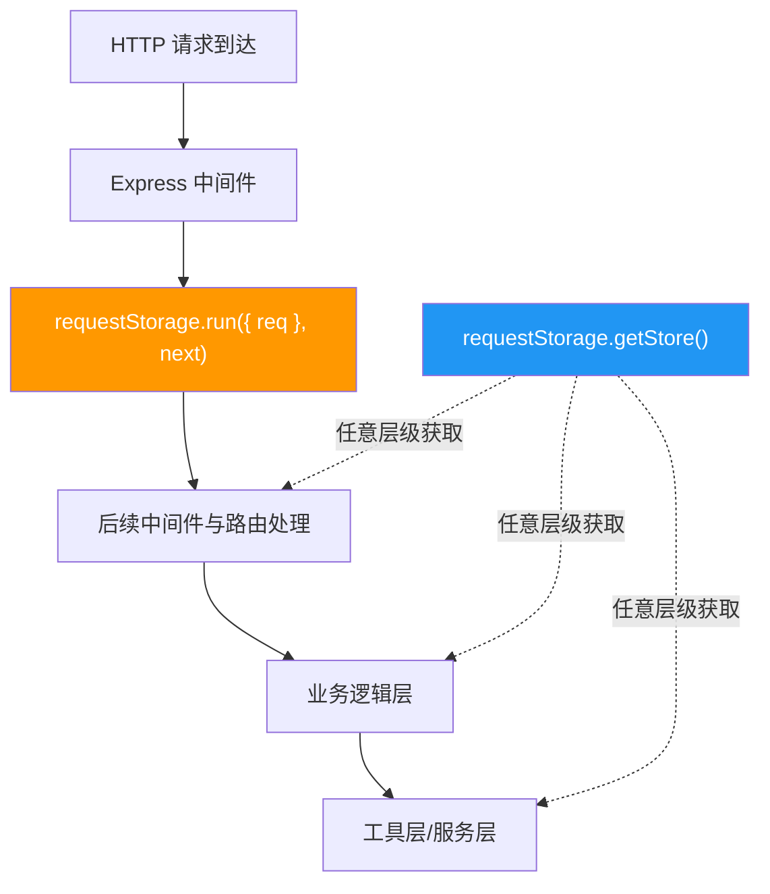
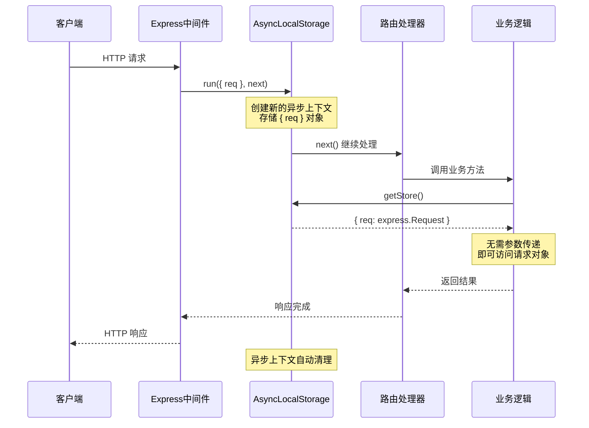
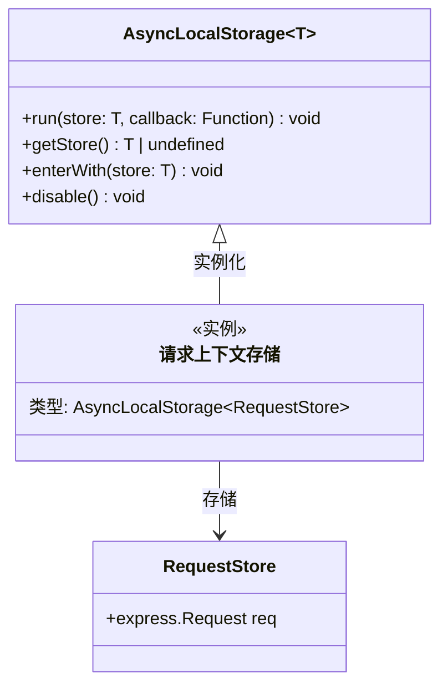

# requestStorage.ts

## 概述

`requestStorage.ts` 是 A2A Server 的请求上下文存储模块，利用 Node.js 的 `AsyncLocalStorage` 机制为每个 HTTP 请求创建隔离的上下文存储空间。这使得在整个请求处理链中（包括异步调用栈深处）都能无需参数传递地访问当前请求对象。

该模块极其精简，仅导出一个 `AsyncLocalStorage` 实例，但它在整个 A2A Server 架构中扮演着关键的横切关注点角色——实现了请求作用域的隐式上下文传播。

## 架构图







## 核心组件

### `requestStorage: AsyncLocalStorage<{ req: express.Request }>`

**导出：是（常量）**

`AsyncLocalStorage` 的单例实例，存储类型为 `{ req: express.Request }`。

**使用方式：**

| 操作 | 代码 | 说明 |
|------|------|------|
| 写入上下文 | `requestStorage.run({ req }, callback)` | 在 Express 中间件中调用，为回调及其所有异步子调用绑定请求上下文 |
| 读取上下文 | `requestStorage.getStore()` | 在请求处理链的任意位置获取当前请求的上下文 |
| 获取请求对象 | `requestStorage.getStore()?.req` | 获取当前 HTTP 请求对象 |

**在 `app.ts` 中的注册方式：**

```typescript
expressApp.use((req, res, next) => {
  requestStorage.run({ req }, next);
});
```

每个进入的 HTTP 请求都会通过此中间件创建一个新的异步上下文。在该上下文的整个生命周期内（包括所有同步和异步操作），调用 `requestStorage.getStore()` 都会返回对应请求的 `{ req }` 对象。

**存储结构：**

| 字段 | 类型 | 说明 |
|------|------|------|
| `req` | `express.Request` | 当前 HTTP 请求对象，包含 headers、body、params、query 等 |

## 依赖关系

### 内部依赖

无。

### 外部依赖

| 模块 | 导入内容 | 说明 |
|------|----------|------|
| `express` | `express`（类型） | Express 框架类型定义，用于类型约束 |
| `node:async_hooks` | `AsyncLocalStorage` | Node.js 内置的异步本地存储 API |

## 关键实现细节

1. **AsyncLocalStorage 原理**：`AsyncLocalStorage` 基于 Node.js 的 `async_hooks` 模块，能够跟踪异步资源的创建和传播关系。当调用 `run(store, callback)` 时，它会创建一个新的异步上下文，该上下文会自动传播到 `callback` 内部创建的所有异步操作（Promise、setTimeout、EventEmitter 回调等）。

2. **请求隔离**：每个 HTTP 请求在中间件中调用 `requestStorage.run()` 时都会创建独立的上下文，不同请求之间的上下文完全隔离。即使在高并发场景下，多个请求同时处理，每个请求链路中获取到的 `req` 都是正确对应的。

3. **零参数传递**：传统做法需要将 `req` 对象逐层传递给所有需要它的函数。通过 `AsyncLocalStorage`，任何深度的异步调用都能通过 `requestStorage.getStore()` 直接获取当前请求上下文，极大简化了函数签名。

4. **自动清理**：`AsyncLocalStorage` 的上下文生命周期与异步调用链绑定。当请求处理完成（所有相关的异步操作结束）后，上下文会自动被垃圾回收，无需手动清理。

5. **类型安全**：通过 TypeScript 泛型 `AsyncLocalStorage<{ req: express.Request }>`，确保存储和读取的类型一致性。`getStore()` 返回 `{ req: express.Request } | undefined`，调用者需要处理 `undefined` 的情况（当在 `run()` 上下文之外调用时）。

6. **模块级单例**：`requestStorage` 是模块级常量，Node.js 的模块缓存机制确保整个应用中只有一个实例，所有导入该模块的地方共享同一个 `AsyncLocalStorage` 实例。

7. **性能影响**：`AsyncLocalStorage` 在现代 Node.js 版本（v16+）中的性能开销极小，通常在请求处理的整体开销中可忽略不计。早期版本可能有更明显的性能影响，但在当前使用场景下完全可接受。
