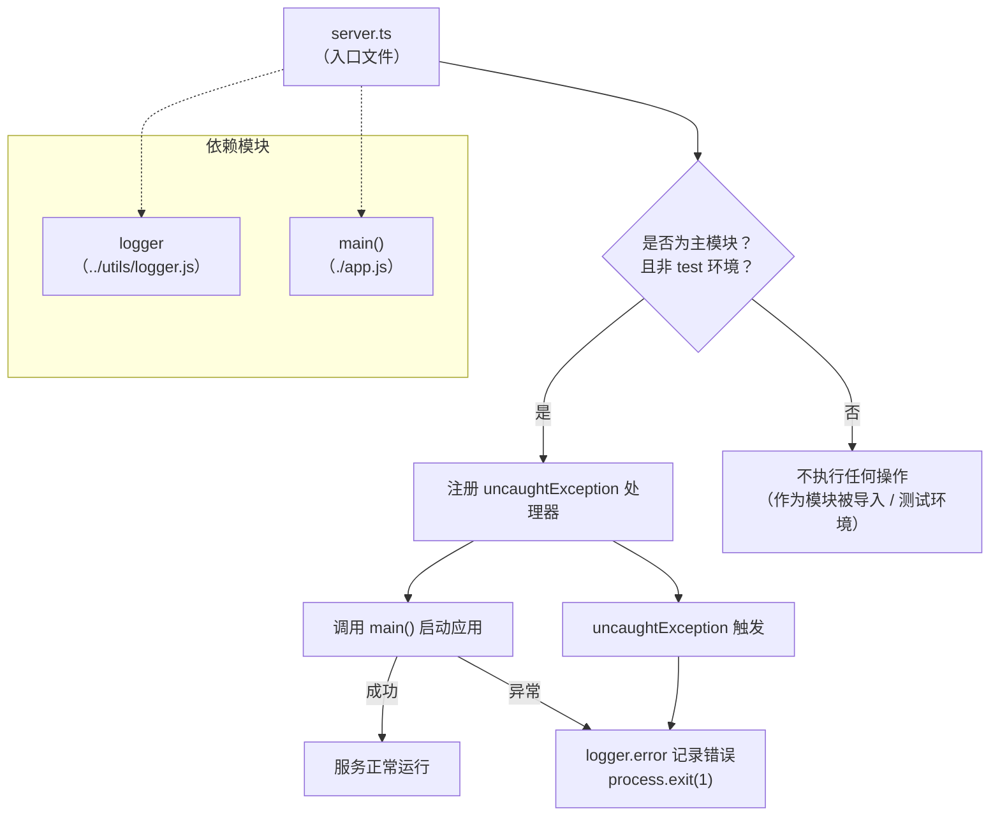

# server.ts

## 概述

`server.ts` 是 `a2a-server` 包的 HTTP 服务器**入口文件**（Entry Point）。它是整个 A2A（Agent-to-Agent）服务器的启动脚本，负责以下职责：

1. **判断是否作为主模块运行**：通过比较 `process.argv[1]` 与当前文件路径，确定本文件是否被直接执行（而非被其他模块导入）。
2. **全局异常兜底**：注册 `uncaughtException` 处理器，捕获未处理的异常并记录日志后安全退出。
3. **启动应用主流程**：调用从 `app.js` 导入的 `main()` 函数启动服务，并对 Promise 拒绝进行兜底处理。
4. **测试环境隔离**：当 `NODE_ENV` 为 `test` 时，跳过自动启动逻辑，避免在单元测试中意外启动服务。

文件头部的 shebang 行 `#!/usr/bin/env -S node --no-warnings=DEP0040` 表明它可作为可执行脚本直接运行，并抑制 Node.js DEP0040 弃用警告。

## 架构图



## 核心组件

### 常量：`isMainModule`

```typescript
const isMainModule: boolean
```

- **类型**：`boolean`
- **职责**：判断当前文件是否作为 Node.js 进程的主入口脚本运行。
- **实现逻辑**：比较 `process.argv[1]`（Node.js 执行的脚本路径）的 basename 与当前模块文件路径的 basename 是否一致。
- **注意**：该变量未导出，仅在模块内部使用。

### 启动逻辑（顶层条件执行块）

```typescript
if (
  import.meta.url.startsWith('file:') &&
  isMainModule &&
  process.env['NODE_ENV'] !== 'test'
) { ... }
```

- **三重守卫条件**：
  1. `import.meta.url.startsWith('file:')` — 确保是本地文件协议执行（非远程模块）。
  2. `isMainModule` — 确保是直接执行而非被 import 导入。
  3. `process.env['NODE_ENV'] !== 'test'` — 排除测试环境。

- **uncaughtException 处理器**：捕获所有未被 try/catch 捕获的同步异常，通过 `logger.error` 记录后以退出码 1 终止进程。
- **main() 调用**：调用 `app.js` 导出的 `main()` 异步函数。如果返回的 Promise 被拒绝（reject），同样记录错误并退出。

## 依赖关系

### 内部依赖

| 模块路径 | 导入内容 | 用途 |
|---|---|---|
| `../utils/logger.js` | `logger` | 日志记录器，用于输出错误日志 |
| `./app.js` | `main` | 应用主函数，包含服务器的实际启动逻辑 |

### 外部依赖

| 模块 | 导入内容 | 用途 |
|---|---|---|
| `node:url` | `* as url` | 使用 `url.fileURLToPath()` 将 `import.meta.url` 转换为文件系统路径 |
| `node:path` | `* as path` | 使用 `path.basename()` 提取文件名进行比较 |

## 关键实现细节

1. **Shebang 行**：`#!/usr/bin/env -S node --no-warnings=DEP0040`
   - `-S` 标志允许向解释器传递多个参数。
   - `--no-warnings=DEP0040` 抑制 Node.js 的 DEP0040 弃用警告（与 `punycode` 模块相关）。
   - 这使得该文件可以直接作为 CLI 可执行脚本运行：`./server.ts`。

2. **ESM 模块检测**：使用 `import.meta.url` 而非 CommonJS 的 `require.main === module`，表明项目采用 ES Modules 规范。

3. **双重错误捕获策略**：
   - `process.on('uncaughtException', ...)` 捕获同步未处理异常。
   - `main().catch(...)` 捕获异步未处理的 Promise 拒绝。
   - 两者都会调用 `process.exit(1)` 确保进程不会在异常状态下继续运行。

4. **测试友好设计**：通过 `NODE_ENV !== 'test'` 条件，确保在测试环境中导入此文件不会触发服务器启动，方便进行单元测试和集成测试。

5. **文件本身不导出任何内容**：它纯粹作为启动入口，所有实际的服务器逻辑委托给 `./app.js` 中的 `main()` 函数。
