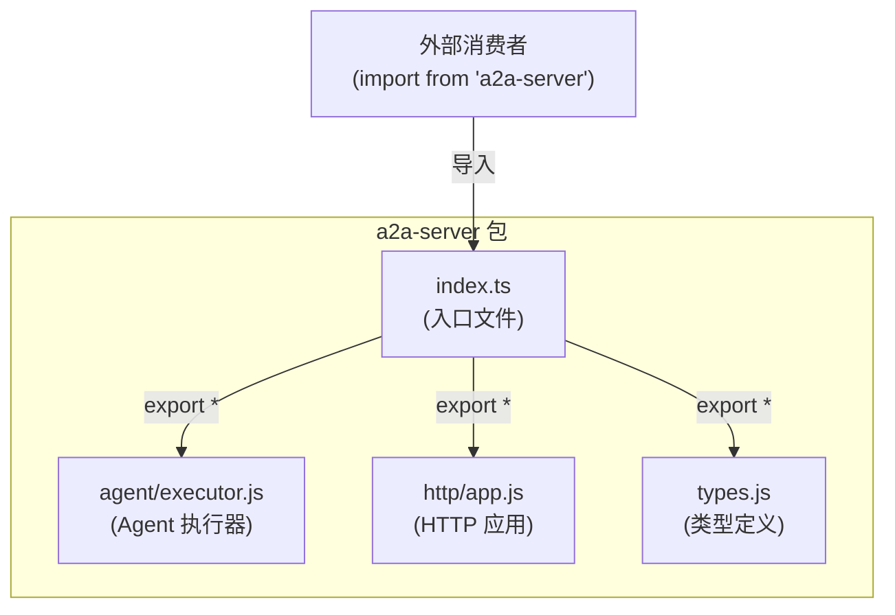

# index.ts

## 概述

`index.ts` 是 `@anthropic/a2a-server` 包的入口文件（barrel file），负责将包内各子模块的公共 API 统一重新导出。外部消费者只需从包根路径导入即可使用所有公开接口，无需了解内部目录结构。

该文件本身不包含任何业务逻辑，仅通过 `export *` 语法聚合并暴露以下三个子模块的全部导出：

| 重导出来源 | 模块职责 |
|---|---|
| `./agent/executor.js` | Agent 执行器，负责任务的实际执行 |
| `./http/app.js` | HTTP 应用层，提供 A2A 协议的 HTTP 服务端 |
| `./types.js` | 类型定义，包含 A2A 服务器相关的 TypeScript 类型 |

## 架构图

## 核心组件

本文件不定义任何自有组件，仅作为模块聚合层。其核心职责是通过三条 `export *` 语句将以下模块的所有命名导出透传给外部消费者：

### 重导出语句

1. **`export * from './agent/executor.js'`**
   - 导出 Agent 执行器相关的类、函数和类型
   - 包含任务执行、Agent 调度等核心功能

2. **`export * from './http/app.js'`**
   - 导出 HTTP 应用相关的类和工厂函数
   - 提供 A2A 协议 HTTP 端点的创建和配置能力

3. **`export * from './types.js'`**
   - 导出所有 TypeScript 类型定义和接口
   - 包含 A2A 协议所需的数据结构和配置类型

## 依赖关系

### 内部依赖

| 依赖模块 | 路径 | 说明 |
|---|---|---|
| executor | `./agent/executor.js` | Agent 执行器模块 |
| app | `./http/app.js` | HTTP 应用模块 |
| types | `./types.js` | 类型定义模块 |

### 外部依赖

无直接外部依赖。

## 关键实现细节

1. **Barrel 模式**：该文件采用经典的 barrel 模式（桶文件模式），是 TypeScript/JavaScript 项目中常见的模块组织策略。所有公共 API 通过单一入口点暴露，简化了外部导入路径。

2. **ESM 后缀**：导入路径使用 `.js` 后缀（如 `./agent/executor.js`），这表明项目采用 ESModule 模块系统，编译输出为 `.js` 文件。这是 Node.js ESM 规范要求的完整文件扩展名。

3. **许可证头**：文件顶部包含 Google LLC 的 Apache-2.0 许可证声明，表明这是 Google 开源项目的一部分。
