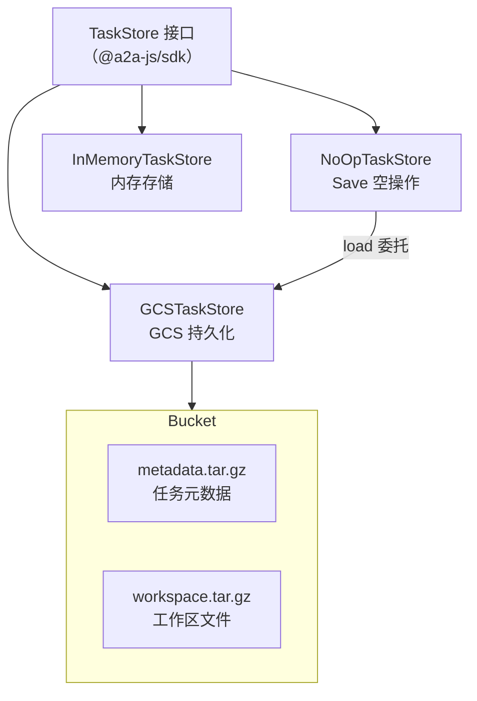

# packages/a2a-server/src/persistence

## 概述

任务持久化层，提供基于 Google Cloud Storage (GCS) 的任务存储实现，支持任务元数据和工作区文件的保存与恢复。

## 目录结构

```
persistence/
├── gcs.ts          # GCSTaskStore 和 NoOpTaskStore 实现
└── gcs.test.ts     # 测试
```

## 架构图



## 核心组件

### GCSTaskStore

- `save(task)` - 保存任务到 GCS
  - 元数据：JSON -> gzip 压缩 -> 上传到 `tasks/{taskId}/metadata.tar.gz`
  - 工作区：tar.gz 归档 -> 流式上传到 `tasks/{taskId}/workspace.tar.gz`
- `load(taskId)` - 从 GCS 恢复任务
  - 下载并解压元数据
  - 恢复工作区文件到目标目录
- 初始化时自动创建 Bucket（如不存在）
- taskId 验证：仅允许字母数字、连字符和下划线（防止路径遍历攻击）

### NoOpTaskStore

包装器模式：`save()` 操作为空（避免 DefaultRequestHandler 重复保存），`load()` 委托给真实存储。

## 依赖关系

### 内部依赖
- `../types.ts` - getPersistedState, PersistedTaskMetadata
- `../config/config.ts` - setTargetDir

### 外部依赖
- `@google-cloud/storage` - GCS 客户端
- `tar` - tar 归档操作
- `fs-extra` - 增强的文件操作
