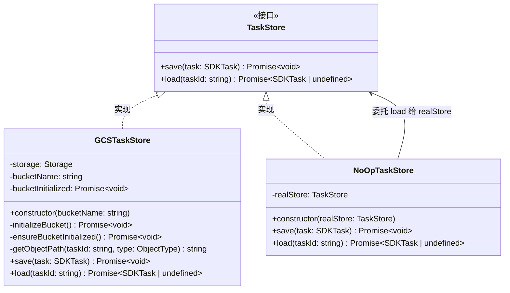

# gcs.ts

## 概述

`gcs.ts` 是 `a2a-server` 包中的**持久化存储层**，负责将 A2A 任务（Task）的元数据和工作区文件持久化到 **Google Cloud Storage (GCS)**。该文件提供了两个核心类：

1. **`GCSTaskStore`**：完整实现了 `TaskStore` 接口，支持将任务元数据（JSON gzip 压缩）和工作区目录（tar.gz 归档）保存到 GCS 桶中，以及从 GCS 加载恢复任务状态和工作区。
2. **`NoOpTaskStore`**：一个装饰器/代理模式的 TaskStore 实现，`save` 操作为空操作（忽略），`load` 操作委托给真实的底层 store。用于特定场景下（如只需读取不需写入的场景）屏蔽写入操作。

该文件还包含防路径遍历攻击的 taskId 校验逻辑，以及临时文件的生成与清理机制。

## 架构图

```mermaid
flowchart TD
    subgraph save 流程
        S1["调用 save(task)"] --> S2["等待桶初始化完成"]
        S2 --> S3["提取 persistedState 元数据"]
        S3 --> S4["JSON 序列化 + gzip 压缩元数据"]
        S4 --> S5["上传元数据到 GCS<br/>tasks/{taskId}/metadata.tar.gz"]
        S5 --> S6{"工作目录存在且非空？"}
        S6 -- 是 --> S7["tar.gz 打包工作目录到临时文件"]
        S7 --> S8["流式上传临时文件到 GCS<br/>tasks/{taskId}/workspace.tar.gz"]
        S8 --> S9["清理临时文件"]
        S6 -- 否 --> S10["跳过工作区保存"]
    end

    subgraph load 流程
        L1["调用 load(taskId)"] --> L2["等待桶初始化完成"]
        L2 --> L3{"GCS 元数据文件存在？"}
        L3 -- 否 --> L4["返回 undefined"]
        L3 -- 是 --> L5["下载并 gunzip 解压元数据"]
        L5 --> L6["JSON.parse 解析元数据"]
        L6 --> L7["从元数据提取 agentSettings"]
        L7 --> L8["setTargetDir 设置工作目录"]
        L8 --> L9{"GCS 工作区归档存在？"}
        L9 -- 是 --> L10["下载归档到临时文件"]
        L10 --> L11["tar 解压到工作目录"]
        L11 --> L12["清理临时文件"]
        L9 -- 否 --> L13["跳过工作区恢复"]
        L12 --> L14["构造并返回 SDKTask 对象"]
        L13 --> L14
    end
```





## 核心组件

### 类型别名：`ObjectType`

```typescript
type ObjectType = 'metadata' | 'workspace';
```

- **职责**：定义 GCS 对象的类型，用于构建对象存储路径。`metadata` 表示任务元数据，`workspace` 表示工作区文件归档。

### 辅助函数：`getTmpArchiveFilename`

```typescript
const getTmpArchiveFilename = (taskId: string): string
```

- **职责**：生成唯一的临时归档文件名。
- **格式**：`task-{taskId}-workspace-{uuid}.tar.gz`
- **使用 UUID**：确保并发操作时临时文件不会冲突。

### 辅助函数：`isTaskIdValid`

```typescript
const isTaskIdValid = (taskId: string): boolean
```

- **职责**：校验 taskId 格式，防止路径遍历攻击（Path Traversal）。
- **规则**：仅允许字母数字、连字符 `-`、下划线 `_`，且不为空。
- **正则**：`/^[a-zA-Z0-9_-]+$/`

### 类：`GCSTaskStore`

```typescript
export class GCSTaskStore implements TaskStore
```

实现 `@a2a-js/sdk/server` 的 `TaskStore` 接口，提供基于 Google Cloud Storage 的任务持久化能力。

#### 构造函数

```typescript
constructor(bucketName: string)
```

- **参数**：`bucketName` — GCS 桶名称，必填。
- **行为**：
  - 创建 `Storage` 客户端实例。
  - 触发异步桶初始化（检查桶是否存在，不存在则创建）。
  - 初始化 Promise 存储在 `this.bucketInitialized` 中，后续操作前需 await 该 Promise。

#### 私有方法

| 方法 | 签名 | 职责 |
|---|---|---|
| `initializeBucket` | `(): Promise<void>` | 检查 GCS 桶是否存在，不存在则创建。需要 Storage Admin IAM 角色。 |
| `ensureBucketInitialized` | `(): Promise<void>` | 等待桶初始化完成，是所有公共方法的前置守卫。 |
| `getObjectPath` | `(taskId: string, type: ObjectType): string` | 生成 GCS 对象路径：`tasks/{taskId}/{type}.tar.gz`。内部调用 `isTaskIdValid` 进行安全校验。 |

#### 公共方法：`save`

```typescript
async save(task: SDKTask): Promise<void>
```

- **职责**：将任务的元数据和工作区保存到 GCS。
- **元数据保存流程**：
  1. 从 `task.metadata` 提取持久化状态。
  2. JSON 序列化元数据。
  3. 使用 `gzipSync` 压缩。
  4. 上传到 `tasks/{taskId}/metadata.tar.gz`。
- **工作区保存流程**：
  1. 检查当前工作目录 `process.cwd()` 是否存在且非空。
  2. 使用 `tar.c` 将目录内容打包为 `.tar.gz` 临时文件。
  3. 通过流式传输（`createReadStream` + `createWriteStream`）上传到 GCS，支持断点续传（`resumable: true`）。
  4. `finally` 块中清理临时文件。

#### 公共方法：`load`

```typescript
async load(taskId: string): Promise<SDKTask | undefined>
```

- **职责**：从 GCS 加载任务的元数据和工作区。
- **返回值**：如果任务存在返回 `SDKTask` 对象，不存在返回 `undefined`。
- **元数据加载流程**：
  1. 检查元数据文件是否存在。
  2. 下载并 `gunzipSync` 解压。
  3. `JSON.parse` 解析为对象。
  4. 提取 `persistedState` 和 `agentSettings`。
- **工作区恢复流程**：
  1. 调用 `setTargetDir` 根据 agentSettings 设置工作目录。
  2. 确保目录存在（`fse.ensureDir`）。
  3. 如果工作区归档存在，下载到临时文件后 `tar.x` 解压到工作目录。
  4. `finally` 块中清理临时文件。
- **返回的 SDKTask 结构**：
  ```typescript
  {
    id: taskId,
    contextId: loadedMetadata._contextId || uuidv4(),
    kind: 'task',
    status: { state: persistedState._taskState, timestamp: new Date().toISOString() },
    metadata: loadedMetadata,
    history: [],
    artifacts: [],
  }
  ```

### 类：`NoOpTaskStore`

```typescript
export class NoOpTaskStore implements TaskStore
```

- **职责**：装饰器模式的 TaskStore，`save` 为空操作，`load` 委托给底层真实 store。
- **使用场景**：当需要在某些阶段禁止持久化写入但仍需读取已有数据时使用。

#### 构造函数

```typescript
constructor(private realStore: TaskStore)
```

- **参数**：`realStore` — 真实的 TaskStore 实现（如 `GCSTaskStore`），用于委托 `load` 操作。

#### 公共方法

| 方法 | 行为 |
|---|---|
| `save(task)` | 仅记录日志，不执行实际保存，返回 `Promise.resolve()` |
| `load(taskId)` | 委托给 `this.realStore.load(taskId)`，返回真实结果 |

## 依赖关系

### 内部依赖

| 模块路径 | 导入内容 | 用途 |
|---|---|---|
| `../utils/logger.js` | `logger` | 日志记录 |
| `../config/config.js` | `setTargetDir` | 根据 agentSettings 设置和返回工作目录路径 |
| `../types.js` | `getPersistedState`, `PersistedTaskMetadata` | 从元数据中提取持久化状态 |

### 外部依赖

| 模块 | 导入内容 | 用途 |
|---|---|---|
| `@google-cloud/storage` | `Storage` | Google Cloud Storage 客户端，用于桶和对象操作 |
| `node:zlib` | `gzipSync`, `gunzipSync` | 元数据的 gzip 压缩/解压 |
| `tar` | `* as tar` | 工作区目录的 tar 归档打包/解压 |
| `fs-extra` | `* as fse` | 增强的文件系统操作（`pathExists`, `ensureDir`, `remove`） |
| `node:fs` | `promises as fsPromises`, `createReadStream` | 原生文件系统操作（`readdir`, 创建可读流） |
| `@google/gemini-cli-core` | `tmpdir` | 获取临时目录路径 |
| `node:path` | `join` | 路径拼接 |
| `@a2a-js/sdk` | `Task as SDKTask`（类型） | A2A 任务类型定义 |
| `@a2a-js/sdk/server` | `TaskStore`（类型） | 任务存储接口定义 |
| `uuid` | `v4 as uuidv4` | 生成唯一标识符（临时文件名、默认 contextId） |

## 关键实现细节

1. **安全性 — 路径遍历防护**：`isTaskIdValid` 使用正则 `/^[a-zA-Z0-9_-]+$/` 严格校验 taskId，防止攻击者通过构造 `../` 等恶意 taskId 访问桶中的任意路径。该校验在 `getObjectPath` 中调用，是所有 GCS 路径生成的前置守卫。

2. **桶初始化的延迟等待模式**：构造函数中触发 `initializeBucket()` 异步操作并将 Promise 存储在 `this.bucketInitialized` 中。所有公共方法（`save`/`load`）在执行前先 `await this.bucketInitialized`，确保桶已就绪。这种模式避免了构造函数中使用 `await`，同时保证了桶的初始化只执行一次。

3. **元数据压缩策略**：元数据使用同步的 `gzipSync`/`gunzipSync` 进行压缩/解压。虽然是同步操作，但元数据通常较小（JSON 字符串），性能影响可忽略。压缩后以 `application/gzip` 类型存储。

4. **工作区的流式上传**：工作区归档可能较大，因此使用 `createReadStream` + `createWriteStream` 的流式传输方式上传到 GCS，并启用 `resumable: true` 支持断点续传。同时对源流和目标流的 `error` 事件都进行了监听处理。

5. **临时文件管理**：
   - 使用 `uuid` 确保临时文件名唯一，避免并发冲突。
   - 所有临时文件操作都在 `try/finally` 块中，确保即使出错也会清理临时文件。
   - `save` 方法中对清理失败也进行了错误处理（记录日志但不抛出）。

6. **GCS 对象路径结构**：所有对象存储在 `tasks/{taskId}/` 前缀下，包含两个文件：
   - `tasks/{taskId}/metadata.tar.gz` — 压缩的 JSON 元数据
   - `tasks/{taskId}/workspace.tar.gz` — 工作区目录的 tar.gz 归档

7. **NoOpTaskStore 的设计意图**：这是典型的装饰器模式，`save` 操作被"静默吞掉"，`load` 操作透传。这在任务恢复场景中特别有用——恢复过程中需要读取已保存的状态，但不希望恢复过程本身产生新的持久化写入。

8. **load 返回的 Task 对象**：`history` 和 `artifacts` 字段返回空数组 `[]`，说明这些数据不通过 GCS 持久化，可能由其他机制管理或在运行时重新生成。
