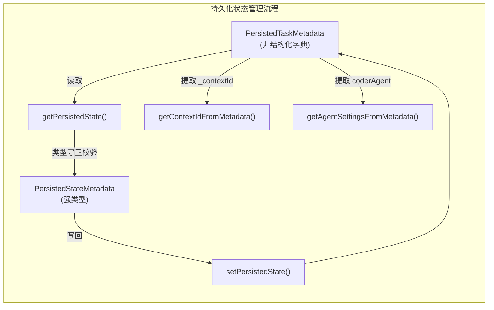

# types.ts

## 概述

`types.ts` 是 A2A Server 的核心类型定义文件，定义了 **CoderAgent 协议** 所需的全部接口、枚举、联合类型和辅助函数。该文件建立了客户端与服务端之间通信的数据契约，涵盖以下几个方面：

- **事件类型枚举** (`CoderAgentEvent`)：定义了 Agent 通信中所有可能的事件类型
- **消息接口**：每种事件类型对应一个结构化接口
- **联合消息类型** (`CoderAgentMessage`)：所有消息接口的联合类型
- **任务元数据** (`TaskMetadata`)：描述任务运行时状态及其可用工具
- **持久化状态** (`PersistedStateMetadata`)：任务状态的序列化/反序列化支持
- **类型守卫与工具函数**：用于安全地从非结构化数据中提取强类型信息

## 架构图

```mermaid
classDiagram
    class CoderAgentEvent {
        <<枚举>>
        ToolCallConfirmationEvent = "tool-call-confirmation"
        ToolCallUpdateEvent = "tool-call-update"
        TextContentEvent = "text-content"
        StateChangeEvent = "state-change"
        StateAgentSettingsEvent = "agent-settings"
        ThoughtEvent = "thought"
        CitationEvent = "citation"
    }

    class AgentSettings {
        <<接口>>
        +kind: CoderAgentEvent.StateAgentSettingsEvent
        +workspacePath: string
        +autoExecute?: boolean
    }

    class ToolCallConfirmation {
        <<接口>>
        +kind: CoderAgentEvent.ToolCallConfirmationEvent
    }

    class ToolCallUpdate {
        <<接口>>
        +kind: CoderAgentEvent.ToolCallUpdateEvent
    }

    class TextContent {
        <<接口>>
        +kind: CoderAgentEvent.TextContentEvent
    }

    class StateChange {
        <<接口>>
        +kind: CoderAgentEvent.StateChangeEvent
    }

    class Thought {
        <<接口>>
        +kind: CoderAgentEvent.ThoughtEvent
    }

    class Citation {
        <<接口>>
        +kind: CoderAgentEvent.CitationEvent
    }

    class CoderAgentMessage {
        <<联合类型>>
        AgentSettings | ToolCallConfirmation
        | ToolCallUpdate | TextContent
        | StateChange | Thought | Citation
    }

    class TaskMetadata {
        <<接口>>
        +id: string
        +contextId: string
        +taskState: TaskState
        +model: string
        +mcpServers: Array
        +availableTools: Array
    }

    class PersistedStateMetadata {
        <<接口>>
        +_agentSettings: AgentSettings
        +_taskState: TaskState
    }

    class ToolConfirmationResponse {
        <<接口>>
        +outcome: ToolConfirmationOutcome
        +callId: string
    }

    class ThoughtSummary {
        <<类型>>
        +subject: string
        +description: string
    }

    CoderAgentEvent <|-- AgentSettings : kind
    CoderAgentEvent <|-- ToolCallConfirmation : kind
    CoderAgentEvent <|-- ToolCallUpdate : kind
    CoderAgentEvent <|-- TextContent : kind
    CoderAgentEvent <|-- StateChange : kind
    CoderAgentEvent <|-- Thought : kind
    CoderAgentEvent <|-- Citation : kind

    CoderAgentMessage o-- AgentSettings
    CoderAgentMessage o-- ToolCallConfirmation
    CoderAgentMessage o-- ToolCallUpdate
    CoderAgentMessage o-- TextContent
    CoderAgentMessage o-- StateChange
    CoderAgentMessage o-- Thought
    CoderAgentMessage o-- Citation

    PersistedStateMetadata --> AgentSettings : _agentSettings
```





## 核心组件

### 枚举

#### `CoderAgentEvent`

CoderAgent 协议中所有事件类型的枚举，作为各消息接口 `kind` 字段的判别值（discriminant）。

| 枚举值 | 字符串值 | 说明 |
|---|---|---|
| `ToolCallConfirmationEvent` | `"tool-call-confirmation"` | 请求用户确认一个或多个工具调用 |
| `ToolCallUpdateEvent` | `"tool-call-update"` | 工具调用状态更新 |
| `TextContentEvent` | `"text-content"` | 文本内容更新 |
| `StateChangeEvent` | `"state-change"` | 任务执行状态变更 |
| `StateAgentSettingsEvent` | `"agent-settings"` | 用户发送的 Agent 初始化设置 |
| `ThoughtEvent` | `"thought"` | Agent 思考过程 |
| `CitationEvent` | `"citation"` | Agent 引用信息 |

### 接口

#### `AgentSettings`

Agent 初始化配置接口，由用户端发送。

```typescript
interface AgentSettings {
  kind: CoderAgentEvent.StateAgentSettingsEvent;
  workspacePath: string;       // 工作区路径
  autoExecute?: boolean;       // 是否自动执行工具调用（可选）
}
```

#### `ToolCallConfirmation`

工具调用确认请求事件接口。

```typescript
interface ToolCallConfirmation {
  kind: CoderAgentEvent.ToolCallConfirmationEvent;
}
```

#### `ToolCallUpdate`

工具调用状态更新事件接口。

```typescript
interface ToolCallUpdate {
  kind: CoderAgentEvent.ToolCallUpdateEvent;
}
```

#### `TextContent`

文本内容事件接口。

```typescript
interface TextContent {
  kind: CoderAgentEvent.TextContentEvent;
}
```

#### `StateChange`

任务状态变更事件接口。

```typescript
interface StateChange {
  kind: CoderAgentEvent.StateChangeEvent;
}
```

#### `Thought`

Agent 思考过程事件接口。

```typescript
interface Thought {
  kind: CoderAgentEvent.ThoughtEvent;
}
```

#### `Citation`

Agent 引用信息事件接口。

```typescript
interface Citation {
  kind: CoderAgentEvent.CitationEvent;
}
```

#### `ToolConfirmationResponse`

工具调用确认响应，包含用户对某个工具调用的决策结果。

```typescript
interface ToolConfirmationResponse {
  outcome: ToolConfirmationOutcome;  // 确认结果（来自 gemini-cli-core）
  callId: string;                    // 对应的工具调用 ID
}
```

#### `TaskMetadata`

任务运行时元数据，描述任务的完整状态信息。

```typescript
interface TaskMetadata {
  id: string;                  // 任务唯一标识
  contextId: string;           // 上下文 ID
  taskState: TaskState;        // 任务状态（来自 @a2a-js/sdk）
  model: string;               // 使用的模型名称
  mcpServers: Array<{          // MCP 服务器列表
    name: string;
    status: MCPServerStatus;
    tools: Array<{
      name: string;
      description: string;
      parameterSchema: unknown;
    }>;
  }>;
  availableTools: Array<{      // 可用工具列表
    name: string;
    description: string;
    parameterSchema: unknown;
  }>;
}
```

#### `PersistedStateMetadata`

持久化状态元数据，用于跨会话保存和恢复 Agent 状态。

```typescript
interface PersistedStateMetadata {
  _agentSettings: AgentSettings;  // Agent 设置
  _taskState: TaskState;          // 任务状态
}
```

### 类型别名

#### `ThoughtSummary`

思考摘要类型，包含主题和描述。

```typescript
type ThoughtSummary = {
  subject: string;       // 思考主题
  description: string;   // 思考描述
};
```

#### `CoderAgentMessage`

所有 CoderAgent 消息的联合类型，是一个判别联合（discriminated union），通过 `kind` 字段区分不同消息类型。

```typescript
type CoderAgentMessage =
  | AgentSettings
  | ToolCallConfirmation
  | ToolCallUpdate
  | TextContent
  | StateChange
  | Thought
  | Citation;
```

#### `PersistedTaskMetadata`

持久化任务元数据，本质上是一个开放的字典类型。

```typescript
type PersistedTaskMetadata = { [k: string]: unknown };
```

### 常量

#### `METADATA_KEY`

持久化状态在 `PersistedTaskMetadata` 字典中的存储键名。

```typescript
const METADATA_KEY = '__persistedState';
```

### 函数

#### `isAgentSettings(value: unknown): value is AgentSettings`

**（内部函数，未导出）** 类型守卫函数，判断一个未知值是否为合法的 `AgentSettings` 对象。校验逻辑：
- 值为非 null 对象
- 包含 `kind` 字段且值为 `CoderAgentEvent.StateAgentSettingsEvent`
- 包含 `workspacePath` 字段且为字符串类型

#### `isPersistedStateMetadata(value: unknown): value is PersistedStateMetadata`

**（内部函数，未导出）** 类型守卫函数，判断一个未知值是否为合法的 `PersistedStateMetadata` 对象。校验逻辑：
- 值为非 null 对象
- 包含 `_agentSettings` 和 `_taskState` 字段
- `_agentSettings` 通过 `isAgentSettings` 校验

#### `getPersistedState(metadata: PersistedTaskMetadata): PersistedStateMetadata | undefined`

从持久化任务元数据中安全提取持久化状态。通过 `METADATA_KEY` 键读取数据，并使用类型守卫验证其结构。

#### `getContextIdFromMetadata(metadata: PersistedTaskMetadata | undefined): string | undefined`

从持久化任务元数据中提取上下文 ID。读取 `_contextId` 键，仅在其值为字符串时返回。

#### `getAgentSettingsFromMetadata(metadata: PersistedTaskMetadata | undefined): AgentSettings | undefined`

从持久化任务元数据中提取 Agent 设置。读取 `coderAgent` 键，并使用 `isAgentSettings` 类型守卫校验。

#### `setPersistedState(metadata: PersistedTaskMetadata, state: PersistedStateMetadata): PersistedTaskMetadata`

将持久化状态写入任务元数据，返回新的元数据对象（不可变更新模式）。使用展开运算符保留原有字段，并在 `METADATA_KEY` 键下存储新的状态。

## 依赖关系

### 内部依赖

| 依赖模块 | 导入内容 | 说明 |
|---|---|---|
| `@google/gemini-cli-core` | `MCPServerStatus`, `ToolConfirmationOutcome` | MCP 服务器状态枚举和工具确认结果类型 |

### 外部依赖

| 依赖模块 | 导入内容 | 说明 |
|---|---|---|
| `@a2a-js/sdk` | `TaskState` | A2A 协议 SDK 中的任务状态类型 |

## 关键实现细节

1. **判别联合模式（Discriminated Union）**：所有消息接口都包含一个 `kind` 字段，其类型为 `CoderAgentEvent` 枚举的特定成员。这使得 `CoderAgentMessage` 联合类型可以通过 TypeScript 的窄化（narrowing）机制进行精确的类型推断，在 `switch(msg.kind)` 语句中自动推导出具体的消息类型。

2. **类型守卫的防御性编程**：`isAgentSettings` 和 `isPersistedStateMetadata` 两个类型守卫函数采用了严格的运行时检查策略，对每个关键字段进行存在性和类型验证，确保从非结构化数据（如 JSON 反序列化结果）中安全提取强类型信息。

3. **不可变状态更新**：`setPersistedState` 函数使用对象展开运算符（`...metadata`）创建新对象而非修改原对象，遵循函数式编程的不可变数据原则，避免副作用。

4. **松散元数据结构**：`PersistedTaskMetadata` 被定义为 `{ [k: string]: unknown }` 的开放字典类型，这允许不同模块在同一个元数据对象中存储各自的数据（如 `_contextId`、`coderAgent`、`__persistedState`），体现了一种灵活的元数据扩展策略。

5. **仅类型导入**：文件使用 `import type` 语法导入外部类型，确保这些导入在编译后的 JavaScript 中被完全擦除，不会引入运行时依赖。
