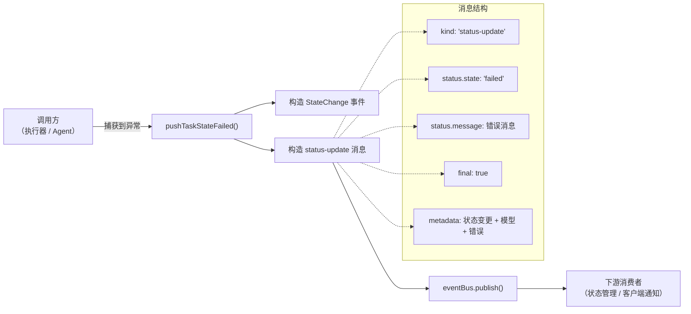
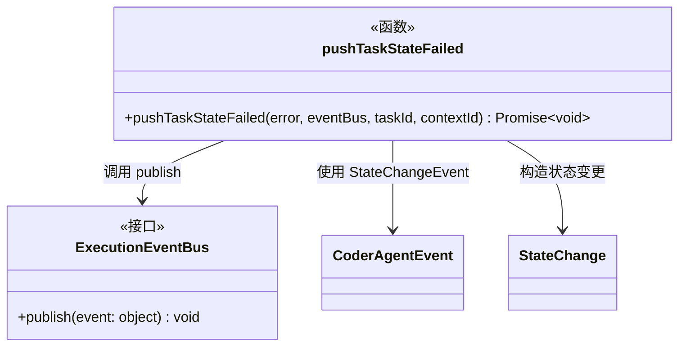

# executor_utils.ts

## 概述

`executor_utils.ts` 是 `a2a-server` 包中的**执行器工具函数集**，提供与任务执行状态相关的辅助函数。目前该文件仅包含一个导出函数 `pushTaskStateFailed`，用于在代理（Agent）执行失败时，通过事件总线（EventBus）发布标准化的失败状态更新事件。

该函数封装了构造 A2A 协议兼容的失败状态消息的复杂性，确保错误信息以统一格式传播到任务状态管理系统。

## 架构图





## 核心组件

### 函数：`pushTaskStateFailed`

```typescript
export async function pushTaskStateFailed(
  error: unknown,
  eventBus: ExecutionEventBus,
  taskId: string,
  contextId: string,
): Promise<void>
```

- **职责**：将任务执行失败的状态通过事件总线发布为标准的 `status-update` 事件。
- **参数说明**：

| 参数 | 类型 | 说明 |
|---|---|---|
| `error` | `unknown` | 捕获到的错误对象。如果是 `Error` 实例则提取 `message`，否则使用默认消息 `'Agent execution error'` |
| `eventBus` | `ExecutionEventBus` | A2A SDK 提供的执行事件总线，用于发布状态更新事件 |
| `taskId` | `string` | 当前任务的唯一标识 |
| `contextId` | `string` | 当前执行上下文的唯一标识 |

- **返回值**：`Promise<void>` — 虽然声明为 `async`，但函数体内无 `await` 操作，实际同步执行。

#### 发布的事件结构

函数通过 `eventBus.publish()` 发布的事件对象结构如下：

```typescript
{
  kind: 'status-update',          // 事件类型：状态更新
  taskId: string,                 // 任务 ID
  contextId: string,              // 上下文 ID
  status: {
    state: 'failed',              // 状态：失败
    message: {                    // A2A Message 格式的错误消息
      kind: 'message',
      role: 'agent',              // 角色：代理
      parts: [{
        kind: 'text',
        text: string,             // 错误消息文本
      }],
      messageId: string,          // UUID v4 生成的唯一消息 ID
      taskId: string,
      contextId: string,
    },
  },
  final: true,                    // 标记为最终状态（不可再变更）
  metadata: {
    coderAgent: {                 // CoderAgent 状态变更事件
      kind: CoderAgentEvent.StateChangeEvent,
    },
    model: 'unknown',             // 模型标识（失败时为 'unknown'）
    error: string,                // 错误消息文本
  },
}
```

## 依赖关系

### 内部依赖

| 模块路径 | 导入内容 | 用途 |
|---|---|---|
| `../types.js` | `CoderAgentEvent` | 枚举/常量，提供 `StateChangeEvent` 事件类型标识 |
| `../types.js` | `StateChange`（类型） | 状态变更事件的类型定义 |

### 外部依赖

| 模块 | 导入内容 | 用途 |
|---|---|---|
| `@a2a-js/sdk` | `Message`（类型） | A2A 协议中的消息类型定义 |
| `@a2a-js/sdk/server` | `ExecutionEventBus`（类型） | 执行事件总线接口类型 |
| `uuid` | `v4 as uuidv4` | 为每条失败消息生成唯一的 `messageId` |

## 关键实现细节

1. **防御性错误处理**：使用 `error instanceof Error` 类型守卫来安全地提取错误消息。当传入的 `error` 不是标准 `Error` 实例时（例如抛出的是字符串或其他类型），使用默认消息 `'Agent execution error'`，确保不会因错误处理逻辑本身抛异常。

2. **`final: true` 标记**：事件中的 `final: true` 表明这是一个终态事件，任务状态在此之后不应再发生变更。这对下游消费者的状态机管理至关重要——收到 `final: true` 的 `failed` 状态后，该任务的生命周期即结束。

3. **`model: 'unknown'`**：在失败场景下，模型信息被设置为 `'unknown'`。这可能是因为：
   - 失败发生在模型调用之前，尚未确定使用的模型。
   - 失败是由非模型相关的原因引起的（如网络错误、配置错误等）。
   - 统一使用 `'unknown'` 简化了错误处理路径。

4. **消息 ID 的唯一性**：每次调用都通过 `uuidv4()` 为失败消息生成新的 `messageId`，确保即使同一任务多次失败（理论上不应发生，因为 `final: true`），每条消息也是唯一可追踪的。

5. **`async` 声明但无 `await`**：函数声明为 `async` 但内部没有使用 `await`。这使得返回值自动包装为 `Promise<void>`，保持了与可能需要异步操作的未来实现的接口兼容性，调用方也可以统一使用 `await` 调用。

6. **StateChange 对象的简洁性**：`stateChange` 对象仅包含 `kind` 字段，表明它主要作为一个事件类型标识使用，具体的状态信息（如 `failed`）由外层 `status.state` 字段承载。
