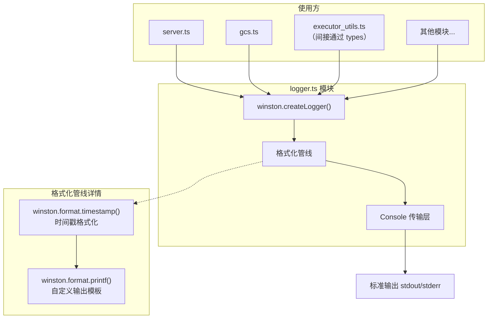
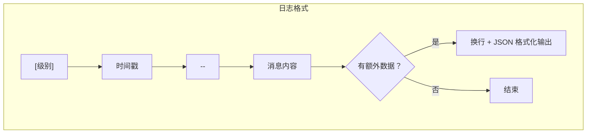

# logger.ts

## 概述

`logger.ts` 是 `a2a-server` 包的**统一日志模块**，基于 `winston` 日志库创建并导出一个预配置的全局 logger 实例。该模块为整个 A2A 服务器提供一致的日志格式和输出行为，是项目中所有其他模块记录日志的唯一入口。

该 logger 的设计理念是：
- **格式统一**：所有日志遵循 `[级别] 时间戳 -- 消息` 的固定格式。
- **简洁明了**：仅输出到控制台（Console），适合容器化/云原生部署环境（日志由基础设施层采集）。
- **额外数据可选展示**：当日志附带额外元数据时，以 JSON 格式附加在消息之后。

## 架构图





## 核心组件

### 常量：`logger`

```typescript
const logger: winston.Logger
export { logger }
```

- **类型**：`winston.Logger`
- **职责**：预配置的 winston Logger 实例，作为全项目的统一日志记录器。
- **导出方式**：具名导出 `{ logger }`。

#### 配置详情

| 配置项 | 值 | 说明 |
|---|---|---|
| `level` | `'info'` | 日志级别为 `info`，即 `info`、`warn`、`error` 级别的日志都会输出，`debug` 和 `silly` 级别被过滤 |
| `format` | `combine(timestamp, printf)` | 组合格式化器：先添加时间戳，再应用自定义输出模板 |
| `transports` | `[Console]` | 仅使用控制台传输层，日志输出到 stdout/stderr |

#### 时间戳格式

```
YYYY-MM-DD HH:mm:ss.SSS A
```

- **示例**：`2026-03-27 02:30:45.123 PM`
- 包含毫秒精度（`.SSS`）和 AM/PM 标记（`A`），便于人工阅读和调试。

#### 输出格式模板

```
[级别] 时间戳 -- 消息内容
{额外数据的 JSON（如果有）}
```

- **级别**：转为大写（`info` -> `INFO`，`error` -> `ERROR`）。
- **额外数据**：通过解构 `info` 对象获取 `level`、`timestamp`、`message` 之外的所有字段（`...rest`）。如果存在额外字段，以缩进 2 空格的 JSON 格式换行输出。

#### 输出示例

无额外数据：
```
[INFO] 2026-03-27 02:30:45.123 PM -- GCSTaskStore initializing with bucket: my-bucket
```

有额外数据：
```
[ERROR] 2026-03-27 02:30:46.456 PM -- Failed to save task abc-123 to GCS:
{
  "stack": "Error: Network timeout\n    at ...",
  "code": "ETIMEDOUT"
}
```

## 依赖关系

### 内部依赖

无。`logger.ts` 是一个叶子模块，不依赖项目中的其他模块。

### 外部依赖

| 模块 | 导入内容 | 用途 |
|---|---|---|
| `winston` | 默认导入 `winston` | Node.js 最流行的日志库之一，提供可配置的日志级别、格式化、传输层等能力 |

#### winston 使用的子 API

| API | 用途 |
|---|---|
| `winston.createLogger(options)` | 创建 Logger 实例 |
| `winston.format.combine(...formats)` | 组合多个格式化器为管线 |
| `winston.format.timestamp(options)` | 为日志添加时间戳字段 |
| `winston.format.printf(templateFn)` | 自定义日志输出格式模板 |
| `winston.transports.Console` | 控制台传输层，将日志输出到 stdout/stderr |

## 关键实现细节

1. **单例模式**：模块级别创建的 `logger` 实例在 ES Modules 中天然是单例的——无论被多少模块导入，都引用同一个 Logger 实例。这确保了全项目日志行为的一致性。

2. **格式化管线的执行顺序**：`winston.format.combine()` 按参数顺序执行格式化器：
   - 第一步：`timestamp()` 向日志 `info` 对象添加 `timestamp` 字段。
   - 第二步：`printf()` 使用 `info` 对象（包含刚添加的 `timestamp`）生成最终输出字符串。
   如果顺序颠倒，`printf` 中将无法获取 `timestamp`。

3. **额外数据的智能输出**：通过 `const { level, timestamp, message, ...rest } = info` 解构，将已知字段与额外数据分离。仅当 `Object.keys(rest).length > 0` 时才输出额外数据，避免空行或空 JSON 的输出噪音。额外数据使用 `JSON.stringify(rest, null, 2)` 格式化，缩进 2 空格，便于阅读。

4. **仅 Console 传输层**：没有配置文件传输层（如 `winston.transports.File`）或远程传输层。这是云原生/容器化部署的常见实践——应用只需输出到 stdout/stderr，日志采集和持久化由基础设施层（如 Cloud Logging、Fluentd、Logstash）负责。

5. **日志级别为 `info`**：默认级别为 `info`，意味着：
   - `error`（0）：输出
   - `warn`（1）：输出
   - `info`（2）：输出
   - `http`（3）：**不输出**
   - `verbose`（4）：**不输出**
   - `debug`（5）：**不输出**
   - `silly`（6）：**不输出**

   该配置未通过环境变量动态调整，如需调试级别日志，需要修改源码或在运行时通过 `logger.level = 'debug'` 动态设置。

6. **级别大写显示**：`level.toUpperCase()` 将 winston 默认的小写级别名转换为大写，提高日志的视觉辨识度（`[INFO]`、`[ERROR]`、`[WARN]`）。

7. **时间戳的 12 小时制**：使用 `A`（AM/PM）标记，输出 12 小时制时间。这在某些场景下可能不如 24 小时制（`HH:mm:ss`）直观，但对面向人类阅读的日志来说是可接受的。
