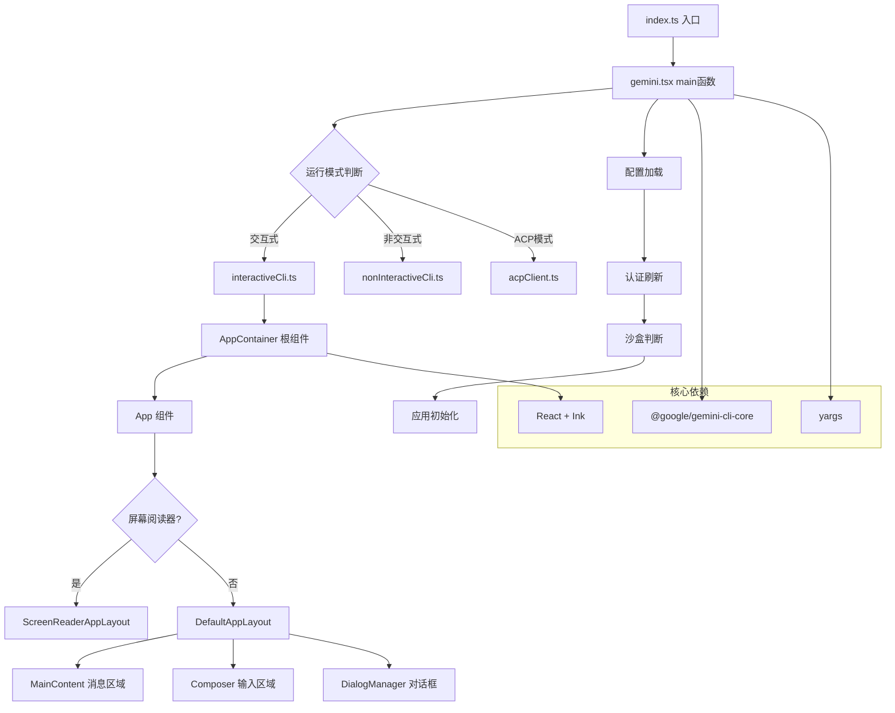

# packages/cli

## 概述

`@google/gemini-cli` 是 Gemini CLI 的主命令行界面包，提供交互式终端 UI 和非交互式批处理两种运行模式。该包基于 React + Ink 框架构建终端用户界面，支持与 Gemini AI 模型的实时对话、工具调用确认、主题切换、会话管理等功能。它是整个 Gemini CLI 工具链的用户入口。

## 目录结构

```
packages/cli/
├── index.ts                  # 全局入口点，启动 main() 并处理异常
├── package.json              # 包配置，定义依赖和脚本
├── src/
│   ├── gemini.tsx            # 核心启动逻辑：参数解析、认证、沙盒、UI 启动
│   ├── interactiveCli.ts     # 交互式 UI 启动器（动态导入 React/Ink）
│   ├── nonInteractiveCli.ts  # 非交互式（管道/脚本）模式
│   ├── config/               # 配置加载：CLI 参数、设置、认证、信任文件夹
│   ├── core/                 # 应用初始化逻辑
│   ├── ui/                   # 终端 UI 层（React + Ink 组件）
│   ├── utils/                # 通用工具函数
│   ├── services/             # 服务层（如斜杠命令冲突处理）
│   ├── acp/                  # ACP（Agent Client Protocol）客户端
│   └── commands/             # 命令定义和处理
└── dist/                     # 编译输出
```

## 架构图



## 核心组件

### `index.ts` - 全局入口
- 设置全局异常处理（`uncaughtException`、`unhandledRejection`）
- 调用 `main()` 函数启动应用
- 捕获 `FatalError` 并以对应退出码退出

### `gemini.tsx` - 主启动逻辑
- **`main()`**: 核心启动流程
  - 加载设置（`loadSettings`）和参数（`parseArguments`）
  - DNS 解析顺序配置
  - 认证刷新（支持 OAuth、API Key、Compute ADC 等）
  - 沙盒模式检测与启动
  - 工作树（worktree）设置
  - 交互/非交互模式分流
- **`startInteractiveUI()`**: 动态导入 UI 模块以延迟加载 React/Ink
- **`initializeOutputListenersAndFlush()`**: 设置输出事件监听，确保缓冲输出不丢失

### `AppContainer.tsx` - UI 根容器
- 作为 React 应用的根状态管理组件
- 提供所有 Context Provider（Config、UIState、UIActions、Settings、Session 等）
- 管理认证状态、历史记录、流式响应、对话框等核心 UI 状态
- 处理键盘事件和快捷键

### `App.tsx` - 应用壳组件
- 根据 UI 状态选择退出显示或正常布局
- 根据屏幕阅读器状态选择 `DefaultAppLayout` 或 `ScreenReaderAppLayout`
- 提供 `StreamingContext`

## 依赖关系

### 内部依赖
- `@google/gemini-cli-core`: 核心逻辑（配置、认证、工具系统、遥测、事件总线等）

### 主要外部依赖
| 依赖 | 用途 |
|------|------|
| `react` / `ink` | 终端 UI 框架 |
| `yargs` | 命令行参数解析 |
| `chalk` | 终端颜色输出 |
| `highlight.js` / `lowlight` | 代码语法高亮 |
| `zod` | 数据验证 |
| `clipboardy` | 剪贴板操作 |
| `simple-git` | Git 操作 |
| `ws` | WebSocket 通信 |
| `@modelcontextprotocol/sdk` | MCP 协议支持 |
| `@agentclientprotocol/sdk` | ACP 协议支持 |

## 数据流

### 启动流程
1. `index.ts` 调用 `main()`
2. 加载设置和命令行参数
3. 刷新认证（OAuth / API Key / ADC）
4. 检查是否需要进入沙盒
5. 初始化应用配置（`initializeApp`）
6. 判断运行模式：
   - **交互式**: 启动 React/Ink UI (`AppContainer` -> `App` -> Layout)
   - **非交互式**: 直接调用 `runNonInteractive` 处理单次请求
   - **ACP 模式**: 启动 ACP 客户端

### 交互式对话流程
1. 用户在 `Composer` 组件中输入文本
2. `AppContainer.handleFinalSubmit` 处理提交
3. 通过 `useGeminiStream` hook 发送请求到 Gemini API
4. 流式响应通过 `StreamingContext` 传递到 UI
5. 工具调用请求弹出确认对话框
6. 响应完成后追加到历史记录
