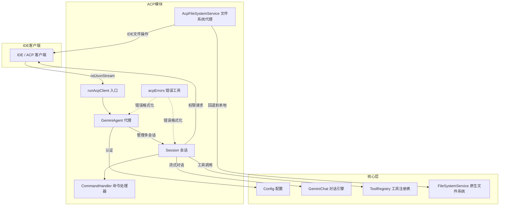
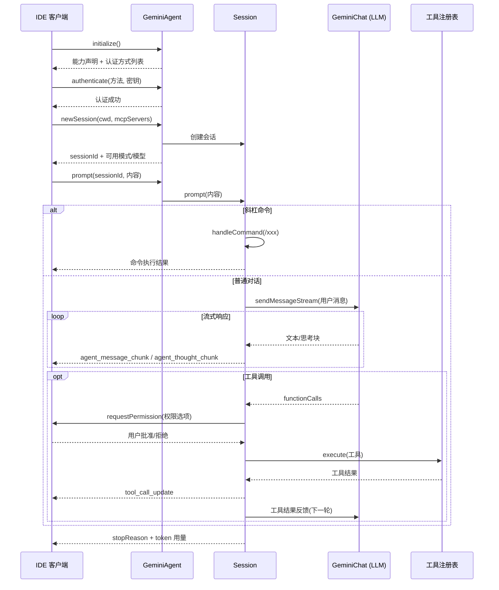

# acp (Agent Client Protocol)

## 概述

`acp` 模块是 Gemini CLI 与外部 IDE/客户端之间的通信桥梁，实现了 **Agent Client Protocol (ACP)** 规范。它将 Gemini CLI 的核心能力（对话、工具调用、认证、会话管理）以标准化协议暴露给上游客户端（如 VS Code 等 IDE 扩展），使 Gemini CLI 可以作为 ACP Agent 被嵌入到各种宿主环境中。

## 目录结构

```
acp/
├── acpClient.ts              # ACP Agent 主入口，包含 GeminiAgent 和 Session 类
├── acpClient.test.ts          # acpClient 单元测试
├── acpErrors.ts               # ACP 专用错误消息提取（递归解析 Google API JSON 错误）
├── acpErrors.test.ts          # acpErrors 单元测试
├── acpResume.test.ts          # 会话恢复相关测试
├── commandHandler.ts          # 斜杠命令(/command)路由与分发器
├── commandHandler.test.ts     # commandHandler 单元测试
├── fileSystemService.ts       # ACP 文件系统代理服务（IDE 侧读写 <-> 本地回退）
├── fileSystemService.test.ts  # fileSystemService 单元测试
└── commands/                  # 斜杠命令实现目录（见子目录文档）
```

## 架构图



## 核心组件

### 1. `acpClient.ts` — GeminiAgent & Session

**GeminiAgent** 是 ACP 服务端的核心类，负责：
- **初始化** (`initialize`)：返回 Agent 能力声明（支持图片、音频、MCP 等）
- **认证** (`authenticate`)：支持 Google 登录、Gemini API Key、Vertex AI、自定义网关四种方式
- **会话管理** (`newSession` / `loadSession`)：创建或恢复聊天会话，每个会话有独立的 Config 和 GeminiChat 实例
- **会话路由** (`prompt` / `cancel`)：将请求分发到对应的 Session 对象

**Session** 管理单次对话的完整生命周期：
- `prompt()` — 处理用户输入，支持命令拦截（`/` 或 `$` 开头）、流式 LLM 对话、多轮工具调用循环
- `runTool()` — 执行工具调用，处理权限请求 → 用户确认 → 执行 → 结果流回
- `#resolvePrompt()` — 解析用户提交的多模态内容（文本、图片、音频、文件引用、嵌入资源）
- `streamHistory()` — 恢复会话时将历史消息回放给客户端

### 2. `commandHandler.ts` — 斜杠命令处理器

注册并管理内置命令（`/memory`、`/extensions`、`/init`、`/restore`），解析命令路径和参数后分发执行。

### 3. `fileSystemService.ts` — ACP 文件系统代理

实现 `FileSystemService` 接口，文件读写请求优先通过 ACP 连接委托给 IDE 客户端执行；对于不在工作区内的文件（或 `~/.gemini` 目录下的文件），自动回退到本地原生文件系统操作。

### 4. `acpErrors.ts` — 错误消息提取

递归解析 Google API 返回的嵌套 JSON 错误结构，提取人类可读的错误消息，避免在 IDE UI 中显示原始 JSON。

## 依赖关系

| 依赖方向 | 目标 | 说明 |
|---------|------|------|
| `@agentclientprotocol/sdk` | ACP 协议 SDK | 连接管理、协议类型定义 |
| `@google/gemini-cli-core` | 核心库 | Config、GeminiChat、ToolRegistry、工具类型、认证等 |
| `../config/settings.ts` | 配置层 | 用户/项目设置加载 |
| `../config/config.ts` | 配置层 | CLI 配置加载、命令行参数解析 |
| `../config/policy.ts` | 策略层 | 工具审批策略持久化 |
| `../utils/cleanup.ts` | 工具层 | 退出时清理资源 |
| `../utils/sessionUtils.ts` | 工具层 | 会话选择与恢复 |
| `zod` | 校验库 | 运行时类型校验 |

## 数据流


