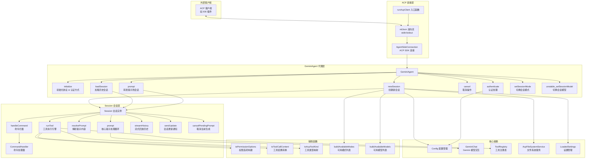

# acpClient.ts

## 概述

`acpClient.ts` 是 Gemini CLI 中 **Agent Client Protocol (ACP)** 的核心客户端实现文件。它负责通过 ACP 协议将 Gemini CLI 的能力以标准化的代理接口暴露给外部客户端（如 IDE 插件、桌面应用等）。

该文件包含三个核心导出：
- **`runAcpClient`** 函数：ACP 服务端入口，建立 ndJson 流连接并启动 `GeminiAgent`。
- **`GeminiAgent`** 类：代理层，管理初始化、认证、会话生命周期和模型/模式切换。
- **`Session`** 类：会话层，管理单个对话的提示处理、工具调用、命令拦截和流式历史回放。

此外，文件还包含若干辅助函数，用于权限选项构建、工具类型映射、可用模式/模型列表构建等。

## 架构图（Mermaid）

## 核心组件

### 1. `runAcpClient` 函数

**签名：** `async function runAcpClient(config: Config, settings: LoadedSettings, argv: CliArgs): Promise<void>`

ACP 服务的入口函数，职责如下：
- 创建可工作的 `stdout` 流（通过 `createWorkingStdio` 包装）
- 将 Node.js 的 `stdin`/`stdout` 转换为 Web 流（`ReadableStream`/`WritableStream`）
- 通过 `acp.ndJsonStream` 建立 ndJson 格式的双向通信流
- 创建 `acp.AgentSideConnection`，将 `GeminiAgent` 作为代理实例
- 等待连接关闭，并在 `finally` 中执行退出清理 (`runExitCleanup`)

### 2. `GeminiAgent` 类

代理层的核心类，管理整个 ACP 代理的生命周期。

**私有状态：**
| 属性 | 类型 | 说明 |
|------|------|------|
| `callIdCounter` | `number`（静态） | 工具调用 ID 的自增计数器 |
| `sessions` | `Map<string, Session>` | 会话 ID 到 Session 实例的映射 |
| `clientCapabilities` | `acp.ClientCapabilities` | 客户端能力声明 |
| `apiKey` | `string` | Gemini API 密钥 |
| `baseUrl` | `string` | 网关基础 URL |
| `customHeaders` | `Record<string, string>` | 自定义请求头 |

**关键方法：**

#### `initialize(args)`
- 保存客户端能力
- 初始化配置
- 返回协议版本、认证方式列表（Google 登录、Gemini API Key、Vertex AI、Gateway）、代理信息和能力声明（支持 loadSession、image/audio/embeddedContext、http/sse MCP）

#### `authenticate(req)`
- 解析认证方法 ID 为 `AuthType` 枚举
- 切换认证方式时清除缓存凭据
- 提取 `_meta` 中的 API Key 和 Gateway 配置
- 对 Gateway 配置使用 Zod 进行 schema 校验
- 调用 `config.refreshAuth` 完成认证
- 将选中的认证类型持久化到用户设置

#### `newSession({ cwd, mcpServers })`
- 生成随机 UUID 作为 sessionId
- 加载针对 cwd 的设置
- 创建会话配置（合并 MCP 服务器配置）
- 执行认证验证（包括 Gemini API Key 的额外校验）
- 如果客户端支持文件系统能力，创建 `AcpFileSystemService` 并注入
- 初始化配置、刷新启动性能分析器
- 启动 Gemini 聊天会话
- 创建 Session 实例并保存
- 异步发送可用命令列表
- 构建并返回可用模式和模型列表

#### `loadSession({ sessionId, cwd, mcpServers })`
- 初始化会话配置（含认证验证）
- 通过 `SessionSelector` 解析历史会话数据
- 将历史会话转换为客户端历史格式并恢复聊天
- 创建 Session 并异步流式回放历史消息
- 返回可用模式和模型列表

#### `newSessionConfig(sessionId, cwd, mcpServers, loadedSettings?)`
- 合并 MCP 服务器配置：支持 stdio、SSE、HTTP 三种类型
- 对 HTTP/SSE 类型提取 headers
- 对 stdio 类型提取环境变量
- 调用 `loadCliConfig` 创建配置
- 创建策略更新器

#### `cancel(params)` / `prompt(params)` / `setSessionMode(params)` / `unstable_setSessionModel(params)`
- 会话级别操作的代理方法，查找对应 Session 并委托执行

### 3. `Session` 类

单个对话会话的管理类，处理完整的提示-响应循环。

**构造参数：**
| 参数 | 类型 | 说明 |
|------|------|------|
| `id` | `string` | 会话 ID |
| `chat` | `GeminiChat` | Gemini 聊天实例 |
| `context` | `AgentLoopContext` | 代理循环上下文（含 config、toolRegistry 等） |
| `connection` | `AgentSideConnection` | ACP 连接实例 |
| `settings` | `LoadedSettings` | 加载的设置 |

**关键方法：**

#### `prompt(params)` -- 核心提示处理循环
1. 中止之前的挂起提示
2. 等待 MCP 初始化完成
3. 通过 `#resolvePrompt` 解析提示内容（处理文本、图片、音频、资源链接、嵌入资源）
4. **命令拦截**：检测以 `/` 或 `$` 开头的文本，交给 `handleCommand` 处理
5. 进入**工具调用循环**（`while (nextMessage !== null)`）：
   - 调用 `chat.sendMessageStream` 发送消息并获取流式响应
   - 处理流式事件：发送思考/消息文本块到客户端、收集函数调用
   - 累计 token 使用量（按模型分组）
   - 如有函数调用，逐个执行 `runTool`，收集结果作为下一轮消息
6. 返回停止原因和 token 使用量元数据

#### `runTool(abortSignal, promptId, fc)` -- 工具执行引擎
1. 生成调用 ID
2. 从工具注册表获取工具
3. 构建工具调用实例
4. **确认流程**：
   - 如果工具需要确认（`shouldConfirmExecute`），构建权限选项并通过 `requestPermission` 请求客户端确认
   - 对编辑类工具传递 diff 内容
   - 处理确认结果（取消/允许一次/始终允许等）
   - 更新安全策略
5. 如果无需确认，发送 `in_progress` 状态更新
6. 执行工具并发送 `completed`/`failed` 状态更新
7. 记录工具调用日志和完成的工具调用
8. 返回函数响应部分

#### `#resolvePrompt(message, abortSignal)` -- 提示解析
- 处理多种内容类型：`text`、`image`、`audio`、`resource_link`、`resource`
- 对 `file://` URI 转换为文件数据
- 处理 `@path` 引用：
  - 检查文件忽略规则
  - 验证路径访问权限
  - 对工作区外的绝对路径请求用户授权
  - 支持目录自动转 glob 模式
  - 支持 glob 模糊搜索（`ENOENT` 时）
  - 使用 `ReadManyFilesTool` 批量读取文件内容
- 处理嵌入式上下文资源

#### `streamHistory(messages)` -- 历史回放
- 遍历历史消息记录
- 按类型发送：用户消息、思考、代理消息、工具调用
- 对工具调用还原显示内容（文本或 diff）

#### `setMode(modeId)` / `setModel(modelId)`
- 切换会话的审批模式或模型

### 4. 辅助函数

#### `toToolCallContent(toolResult)`
将工具执行结果转换为 ACP 工具调用内容：
- 错误结果直接抛出异常
- 文本结果转为 `content` 类型
- 文件编辑结果转为 `diff` 类型（含 add/delete/modify 标记）

#### `toPermissionOptions(confirmation, config, enablePermanentToolApproval)`
根据确认类型构建权限选项列表：
- **edit**：允许会话级别 + 可选的永久文件级允许
- **exec**：允许会话级别 + 可选的永久命令级允许
- **mcp**：允许整个 MCP 服务器/单个工具/永久允许
- **info**：允许会话级别 + 可选永久允许
- **ask_user / exit_plan_mode**：仅基本选项（允许/拒绝）
- 始终追加基本的"允许"和"拒绝"选项

#### `toAcpToolKind(kind)`
将内部 `Kind` 枚举映射到 ACP `ToolKind`：
- `Agent` 映射为 `think`
- `Plan`/`Communicate` 映射为 `other`
- 其余直接映射

#### `buildAvailableModes(isPlanEnabled)`
构建可用的会话模式列表：
- Default（默认，需审批）
- Auto Edit（自动审批编辑工具）
- YOLO（自动审批所有工具）
- Plan（只读模式，仅在启用时显示）

#### `buildAvailableModels(config, settings)`
构建可用模型列表：
- 包含 Auto 模式（让 CLI 自动选择）
- 包含手动选择模式（Pro、Flash、Flash Lite）
- 根据 `shouldShowPreviewModels` 决定是否显示预览模型
- 根据 Gemini 3.1 是否已发布选择对应的预览模型 ID

#### `hasMeta(obj)`
类型守卫函数，检查对象是否包含 `_meta` 属性。

#### `RequestPermissionResponseSchema`
Zod schema，用于校验权限请求响应：
- `cancelled`：用户取消
- `selected`：用户选择了某个选项（包含 `optionId`）

## 依赖关系

### 内部依赖

| 模块路径 | 导入内容 | 用途 |
|----------|----------|------|
| `@google/gemini-cli-core` | `Config`, `GeminiChat`, `ToolResult`, `ToolCallConfirmationDetails`, `FilterFilesOptions`, `ConversationRecord`, `CoreToolCallStatus`, `AuthType`, `logToolCall`, `convertToFunctionResponse`, `ToolConfirmationOutcome`, `clearCachedCredentialFile`, `isNodeError`, `getErrorMessage`, `isWithinRoot`, `getErrorStatus`, `MCPServerConfig`, `DiscoveredMCPTool`, `StreamEventType`, `ToolCallEvent`, `debugLogger`, `ReadManyFilesTool`, `REFERENCE_CONTENT_START`, `resolveModel`, `createWorkingStdio`, `startupProfiler`, `Kind`, `partListUnionToString`, `LlmRole`, `ApprovalMode`, `getVersion`, `convertSessionToClientHistory`, 多个模型常量, `getDisplayString`, `processSingleFileContent`, `AgentLoopContext`, `updatePolicy` | 核心业务逻辑、类型定义、工具系统、认证、日志等 |
| `./fileSystemService.js` | `AcpFileSystemService` | ACP 文件系统服务适配 |
| `./acpErrors.js` | `getAcpErrorMessage` | ACP 错误信息格式化 |
| `./commandHandler.js` | `CommandHandler` | 斜杠命令处理 |
| `../config/settings.js` | `SettingScope`, `loadSettings`, `LoadedSettings` | 设置加载和管理 |
| `../config/policy.js` | `createPolicyUpdater` | 安全策略更新器 |
| `../config/config.js` | `loadCliConfig`, `CliArgs` | CLI 配置加载 |
| `../utils/cleanup.js` | `runExitCleanup` | 退出清理 |
| `../utils/sessionUtils.js` | `SessionSelector` | 会话选择和解析 |

### 外部依赖

| 包名 | 导入内容 | 用途 |
|------|----------|------|
| `@agentclientprotocol/sdk` | `acp`（命名空间导入） | ACP 协议 SDK，提供连接、消息类型、协议版本等 |
| `@google/genai` | `Content`, `Part`, `FunctionCall` | Google GenAI SDK 类型定义 |
| `node:stream` | `Readable`, `Writable` | Node.js 流转换（toWeb） |
| `node:fs/promises` | `fs` | 文件系统异步操作 |
| `node:path` | `path` | 路径处理 |
| `node:crypto` | `randomUUID` | 生成会话 UUID |
| `zod` | `z` | 运行时数据校验 |

## 关键实现细节

### 1. ndJson 双向通信

ACP 使用 **ndJson（Newline Delimited JSON）** 格式通过 stdin/stdout 进行双向通信。`createWorkingStdio` 创建一个包装后的 stdout 流，避免与其他日志输出混淆。这种设计允许 Gemini CLI 作为子进程被外部客户端调用。

### 2. 多认证方式支持

支持四种认证方式，每种在 `_meta` 中携带不同的附加信息：
- **Login with Google**：OAuth 登录
- **Gemini API Key**：`_meta` 中传递 `api-key`
- **Vertex AI**：使用 Vertex AI GenAI API
- **AI API Gateway**：`_meta` 中传递 `gateway` 对象（含 `baseUrl` 和 `headers`），使用 Zod 校验

切换认证方式时会自动清除旧的缓存凭据。

### 3. 工具调用确认机制

`runTool` 中实现了完整的工具确认流程：
1. 构建工具调用实例
2. 检查是否需要确认（`shouldConfirmExecute`）
3. 如需确认，根据工具类型（edit/exec/mcp/info 等）构建不同粒度的权限选项
4. 通过 ACP 的 `requestPermission` 将确认请求发送给客户端
5. 解析客户端响应并执行对应操作
6. 支持"始终允许"和策略持久化

### 4. 流式响应处理

`prompt` 方法使用 `sendMessageStream` 获取流式响应：
- 实时发送文本块（区分 `thought` 和普通消息）
- 累计 token 使用量（按模型分组统计）
- 支持 abort 中断（通过 `AbortController`）
- 处理 429 速率限制错误

### 5. 命令拦截

在发送到模型之前，检测以 `/` 或 `$` 开头的文本，交给 `CommandHandler` 处理。如果命令被成功处理，直接返回空 token 使用量的响应，不会发送到模型。

### 6. `@path` 文件引用解析

`#resolvePrompt` 实现了复杂的文件引用解析逻辑：
- 支持文件路径和目录路径
- 目录自动转为 glob 模式（`dir/**`）
- 工作区外文件需要用户显式授权
- 文件不存在时支持 glob 模糊搜索
- 使用 `ReadManyFilesTool` 批量读取
- 支持直接内容读取（绝对路径或授权路径）
- 处理忽略文件规则

### 7. 会话历史回放

`loadSession` + `streamHistory` 实现会话恢复：
- 从存储中加载历史会话数据
- 将消息转换为 Gemini 客户端历史格式恢复聊天状态
- 通过流式更新逐条回放历史消息给客户端（用户消息、思考、代理消息、工具调用）

### 8. MCP 服务器配置合并

`newSessionConfig` 将客户端传入的 MCP 服务器配置与用户设置中的配置合并，支持三种 MCP 传输类型：
- **stdio**：通过命令行启动，传递环境变量和 cwd
- **SSE**：通过 URL + headers
- **HTTP**：通过 httpUrl + headers

### 9. 模型自动选择

`buildAvailableModels` 提供 "Auto" 模式，让 Gemini CLI 根据任务自动选择最优模型（Pro 或 Flash），同时支持手动选择特定模型版本。预览模型的可见性受 `getHasAccessToPreviewModel` 控制。
