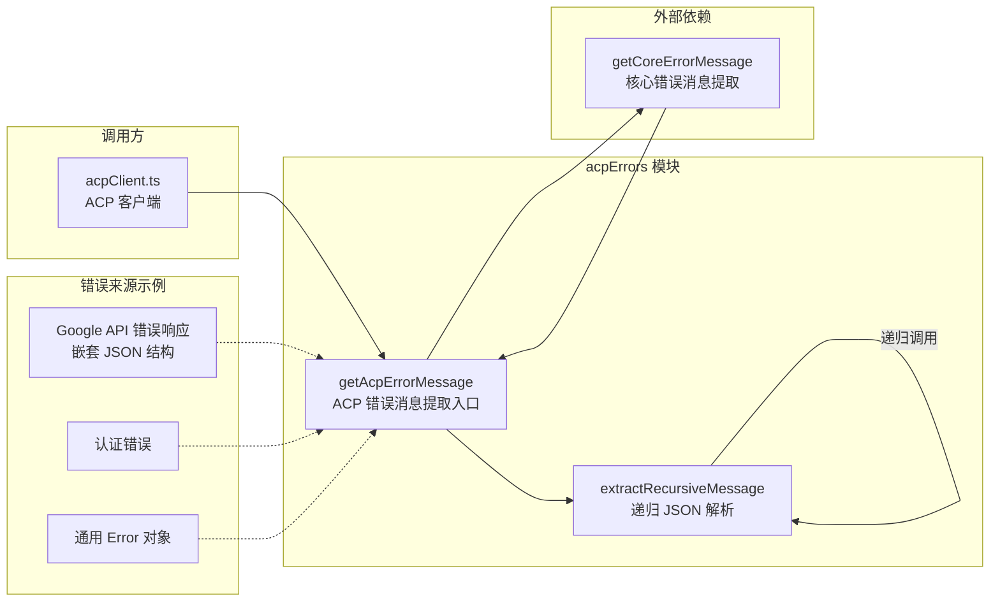

# acpErrors.ts

## 概述

`acpErrors.ts` 是 Gemini CLI ACP 模块中的**错误消息提取工具文件**。它专门为 ACP 客户端（如 IDE 插件）提供人类可读的错误信息。

Google API 返回的错误通常是嵌套的 JSON 结构，直接展示到 IDE 界面上会非常不友好。该文件的核心功能是**递归解析这些嵌套的 JSON 错误响应**，从中提取出最内层的、有意义的错误消息字符串。

整个文件非常精简，仅包含一个导出函数 `getAcpErrorMessage` 和一个内部递归解析函数 `extractRecursiveMessage`。

## 架构图（Mermaid）



## 核心组件

### 1. `getAcpErrorMessage(error: unknown): string`

**导出函数** -- ACP 错误消息提取的入口点。

**处理流程：**
1. 调用 `@google/gemini-cli-core` 中的 `getCoreErrorMessage(error)` 获取基础错误消息字符串
2. 将基础消息传递给 `extractRecursiveMessage` 进行递归 JSON 解析
3. 返回最终提取出的人类可读消息

**参数：**
- `error: unknown` -- 任意类型的错误对象（Error 实例、字符串、对象等）

**返回值：** 清理后的人类可读错误消息字符串

### 2. `extractRecursiveMessage(input: string): string`

**内部函数** -- 递归解析嵌套 JSON 错误消息。

**处理逻辑：**
1. 去除输入字符串两端空白
2. 检测字符串是否为 JSON 格式（以 `{}`或 `[]` 包裹）
3. 如果是 JSON，尝试解析并从以下路径提取 `message` 字段：
   - `parsed.error.message` -- 标准 Google API 错误格式
   - `parsed[0].error.message` -- 数组形式的错误（首个元素）
   - `parsed.message` -- 简单的 message 字段
4. 如果成功提取到非空且不同于输入的消息，**递归调用自身**继续解析（因为提取出的 message 本身可能还是一个 JSON 字符串）
5. 如果 JSON 解析失败或无法提取更深层消息，返回原始输入

**设计亮点 -- 递归解析：**

Google API 的错误响应经常出现多层嵌套的情况，例如：

```json
{
  "error": {
    "message": "{\"error\":{\"message\":\"API key not valid.\"}}"
  }
}
```

`extractRecursiveMessage` 会逐层解析，最终返回 `"API key not valid."`，而不是整个 JSON 字符串。

## 依赖关系

### 内部依赖

| 模块路径 | 导入内容 | 用途 |
|----------|----------|------|
| `@google/gemini-cli-core` | `getErrorMessage`（别名 `getCoreErrorMessage`） | 从任意类型的错误对象中提取基础错误消息字符串 |

### 外部依赖

无外部第三方依赖。

## 关键实现细节

### 1. 两阶段错误消息提取

错误消息的提取分两个阶段：
- **第一阶段**（`getCoreErrorMessage`）：由 `@google/gemini-cli-core` 处理，负责将任意类型的 `unknown` 错误转换为字符串（处理 Error 对象的 `.message`、字符串直传、对象的 `toString()` 等）
- **第二阶段**（`extractRecursiveMessage`）：ACP 特有的处理，专门对付嵌套 JSON 格式的错误消息

### 2. 防御性 JSON 解析

`extractRecursiveMessage` 使用 try-catch 包裹 `JSON.parse`，确保即使输入看起来像 JSON 但实际不是合法 JSON（例如被截断的 JSON 字符串），也不会抛出异常，而是安全地返回原始字符串。

### 3. 递归终止条件

递归在以下任一条件满足时终止：
- 输入不是 JSON 格式
- JSON 解析失败
- 无法从解析结果中提取 `message` 字段
- 提取出的 `message` 与当前输入相同（避免无限递归）
- 提取出的 `message` 不是字符串类型

### 4. 多路径 message 提取

函数同时尝试三种常见的 Google API 错误路径：
- `error.message` -- 最常见的 REST API 错误格式
- `[0].error.message` -- 批量操作错误（数组响应）
- `message` -- 简化的错误格式

这种多路径策略确保了对各种 Google API 错误格式的兼容性。

### 5. 使用场景

该函数在 `acpClient.ts` 中被广泛使用：
- `authenticate` 方法中认证失败时的错误消息
- `newSession` 方法中认证验证失败时的错误消息
- `prompt` 方法中 API 调用异常时的错误消息
- 所有通过 `acp.RequestError` 返回给客户端的错误
