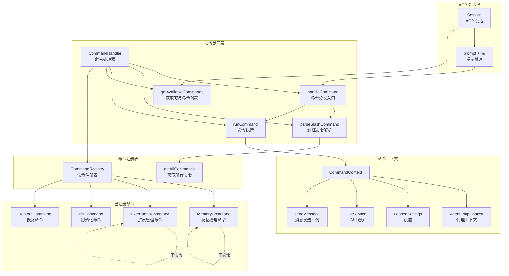

# commandHandler.ts

## 概述

`commandHandler.ts` 是 Gemini CLI ACP 模块中的**斜杠命令处理器**。它负责解析和执行用户在 ACP 会话中输入的以 `/` 或 `$` 开头的命令（如 `/memory`、`/extensions`、`/init`、`/restore` 等）。

该文件导出 `CommandHandler` 类，该类：
1. 在构造时注册所有可用的斜杠命令到 `CommandRegistry`
2. 提供 `getAvailableCommands` 方法供 ACP 客户端查询可用命令列表
3. 提供 `handleCommand` 方法作为命令拦截的入口，解析并执行匹配的命令
4. 支持多级子命令的解析和别名匹配

`CommandHandler` 是 `Session` 类的内部组件，在 `prompt` 方法中被调用以实现命令拦截——在消息发送到 Gemini 模型之前，先检查是否为已注册的斜杠命令。

## 架构图（Mermaid）



## 核心组件

### `CommandHandler` 类

#### 私有属性

| 属性 | 类型 | 说明 |
|------|------|------|
| `registry` | `CommandRegistry` | 命令注册表实例，存储所有已注册的命令 |

#### 构造函数

```typescript
constructor()
```

在构造时调用静态方法 `createRegistry()` 初始化命令注册表，注册以下四个内置命令：
1. `MemoryCommand` -- 记忆管理命令
2. `ExtensionsCommand` -- 扩展管理命令
3. `InitCommand` -- 初始化命令
4. `RestoreCommand` -- 恢复命令

#### `getAvailableCommands(): Array<{ name: string; description: string }>`

返回所有已注册命令的名称和描述列表。在 `Session.sendAvailableCommands()` 中被调用，用于通知 ACP 客户端当前会话支持哪些命令。

#### `handleCommand(commandText: string, context: CommandContext): Promise<boolean>`

**命令分发入口方法。**

**处理流程：**
1. 调用 `parseSlashCommand` 解析命令文本
2. 如果匹配到已注册命令，调用 `runCommand` 执行，返回 `true`
3. 如果没有匹配的命令，返回 `false`（命令文本将被作为普通提示发送给模型）

**返回值的意义：**
- `true`：命令已被处理，`Session.prompt` 不会将此消息发送给 Gemini 模型
- `false`：不是有效命令，消息将正常发送给 Gemini 模型

#### `runCommand(commandToExecute: Command, args: string, context: CommandContext): Promise<void>`（私有）

**命令执行方法。**

**处理流程：**
1. 调用命令的 `execute` 方法，传入上下文和参数（参数字符串按空白分割为数组）
2. 处理执行结果的三种格式：
   - **字符串**：直接作为消息内容
   - **包含 `content` 属性的对象**：提取 `content` 字段
   - **其他对象**：JSON 序列化（格式化缩进 2 空格）
3. 通过 `context.sendMessage` 将结果发送给客户端
4. 捕获执行异常，将错误消息以 `Error: ` 前缀发送给客户端

#### `parseSlashCommand(query: string): { commandToExecute: Command | undefined; args: string }`（私有）

**斜杠命令解析方法。** 逻辑镜像自 `packages/cli/src/utils/commands.ts`。

**解析流程：**
1. 去除首尾空白
2. 移除开头的 `/` 或 `$` 字符（`substring(1)`）
3. 按空白分割为路径部分数组
4. **多级命令遍历**：
   - 从顶层命令列表开始
   - 对每个路径部分，尝试匹配当前层级的命令：
     - 精确名称匹配（单段名称或多段拼接名称）
     - 别名匹配（同样支持单段和多段）
   - 匹配成功后，检查命令是否有子命令
     - 有子命令：进入下一层继续匹配
     - 无子命令：停止匹配
   - 匹配失败：停止匹配
5. 剩余未匹配的路径部分作为命令参数
6. 返回匹配到的命令和参数字符串

**多级命令解析示例：**
```
输入: "/extensions list"
第1步: 匹配 "extensions" -> 找到 ExtensionsCommand
第2步: ExtensionsCommand 有子命令 -> 进入子命令层
第3步: 匹配 "list" -> 找到 list 子命令
结果: commandToExecute = list 子命令, args = ""

输入: "/memory add 这是一条记忆"
第1步: 匹配 "memory" -> 找到 MemoryCommand
第2步: MemoryCommand 有子命令 -> 进入子命令层
第3步: 匹配 "add" -> 找到 add 子命令
结果: commandToExecute = add 子命令, args = "这是一条记忆"
```

## 依赖关系

### 内部依赖

| 模块路径 | 导入内容 | 用途 |
|----------|----------|------|
| `./commands/types.js` | `Command`, `CommandContext` | 命令接口和命令上下文类型定义 |
| `./commands/commandRegistry.js` | `CommandRegistry` | 命令注册表，管理命令的注册和查询 |
| `./commands/memory.js` | `MemoryCommand` | 记忆管理斜杠命令（GEMINI.md 管理等） |
| `./commands/extensions.js` | `ExtensionsCommand` | MCP 扩展管理斜杠命令 |
| `./commands/init.js` | `InitCommand` | 项目初始化斜杠命令 |
| `./commands/restore.js` | `RestoreCommand` | 会话恢复斜杠命令 |

### 外部依赖

无外部第三方依赖。

## 关键实现细节

### 1. 命令拦截模式

`CommandHandler` 采用**拦截模式**：在消息到达 Gemini 模型之前进行检查。这是在 `Session.prompt` 中实现的：

```typescript
// Session.prompt 中的命令拦截逻辑
if (commandText && (commandText.startsWith('/') || commandText.startsWith('$'))) {
  const handled = await this.handleCommand(commandText, parts);
  if (handled) {
    return { stopReason: 'end_turn', /* ... */ };
  }
}
```

只有以 `/` 或 `$` 开头的纯文本消息才会进入命令解析流程。如果消息包含非文本部分（图片等），命令检测会提前终止。

### 2. 静态注册表初始化

命令注册表通过静态方法 `createRegistry()` 初始化，所有命令在 `CommandHandler` 构造时就已注册完毕。这意味着：
- 每个 `Session` 实例拥有独立的 `CommandHandler` 实例
- 命令列表在会话创建时确定，运行期间不会动态变化
- 新增命令只需在 `createRegistry` 中添加一行 `registry.register(new XxxCommand())`

### 3. 多级子命令支持

`parseSlashCommand` 支持任意深度的子命令层级。通过检查命令的 `subCommands` 属性来决定是否继续向下遍历。这使得类似 `/extensions list`、`/memory add` 这样的多级命令成为可能。

### 4. 灵活的别名匹配

命令匹配同时支持：
- 单段名称匹配（`cmd.name === part`）
- 多段拼接名称匹配（`cmd.name === expectedName`，如 `"extensions list"`）
- 别名匹配（`cmd.aliases?.includes(part)` 和 `cmd.aliases?.includes(expectedName)`）

这种灵活的匹配策略允许命令定义多种调用方式。

### 5. 结果格式化

`runCommand` 对命令执行结果进行了统一的格式化处理，支持三种返回格式：
- 纯字符串：直接显示
- 含 `content` 字段的对象：提取内容显示
- 其他对象：JSON 格式化显示

这种设计让命令实现者可以灵活选择返回格式，而无需关心消息发送细节。

### 6. 错误处理

命令执行中的异常被统一捕获，转换为 `Error: {message}` 格式发送给客户端。这确保了命令执行失败不会导致整个 ACP 会话崩溃。
