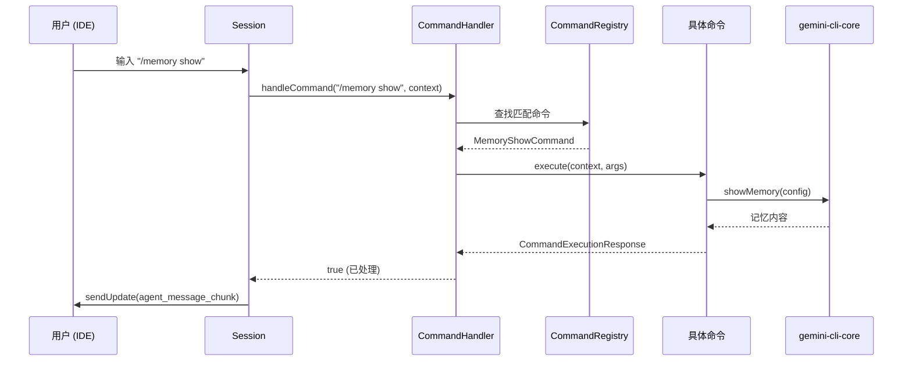

# acp/commands (ACP 斜杠命令)

## 概述

`commands` 子目录实现了 ACP 模式下的斜杠命令系统。当用户在 IDE 中输入 `/memory`、`/extensions`、`/init`、`/restore` 等命令时，这些命令会被 `CommandHandler` 拦截并分发到对应的 `Command` 实现类执行，而不经过 LLM 对话流程。

该命令系统采用**注册表模式**，支持命令嵌套（子命令）和别名匹配。

## 目录结构

```
commands/
├── types.ts            # Command / CommandContext / CommandExecutionResponse 接口定义
├── commandRegistry.ts  # CommandRegistry 命令注册表（Map 存储 + 递归子命令注册）
├── memory.ts           # /memory 命令族（show / refresh / list / add）
├── extensions.ts       # /extensions 命令族（list / explore / enable / disable / install / link / uninstall / restart / update）
├── init.ts             # /init 命令（分析项目并创建 GEMINI.md）
└── restore.ts          # /restore 命令族（恢复检查点 / list 列出检查点）
```

## 架构图

```mermaid
graph TD
    subgraph 命令系统
        Handler[CommandHandler<br/>命令处理器]
        Registry[CommandRegistry<br/>命令注册表]
        Types[Command 接口]
    end

    subgraph 具体命令
        Memory[/memory<br/>记忆管理]
        Ext[/extensions<br/>扩展管理]
        Init[/init<br/>项目初始化]
        Restore[/restore<br/>检查点恢复]
    end

    subgraph Memory子命令
        MemShow[memory show]
        MemRefresh[memory refresh]
        MemList[memory list]
        MemAdd[memory add]
    end

    subgraph Extensions子命令
        ExtList[extensions list]
        ExtExplore[extensions explore]
        ExtEnable[extensions enable]
        ExtDisable[extensions disable]
        ExtInstall[extensions install]
        ExtLink[extensions link]
        ExtUninstall[extensions uninstall]
        ExtRestart[extensions restart]
        ExtUpdate[extensions update]
    end

    subgraph Restore子命令
        RestoreList[restore list]
    end

    Handler --> Registry
    Registry --> Memory
    Registry --> Ext
    Registry --> Init
    Registry --> Restore

    Memory --> MemShow
    Memory --> MemRefresh
    Memory --> MemList
    Memory --> MemAdd

    Ext --> ExtList
    Ext --> ExtExplore
    Ext --> ExtEnable
    Ext --> ExtDisable
    Ext --> ExtInstall
    Ext --> ExtLink
    Ext --> ExtUninstall
    Ext --> ExtRestart
    Ext --> ExtUpdate

    Restore --> RestoreList
```

## 核心组件

### 1. `types.ts` — 接口定义

| 接口 | 说明 |
|------|------|
| `Command` | 命令接口：`name`、`aliases`、`description`、`subCommands`、`execute()` |
| `CommandContext` | 执行上下文：包含 `AgentLoopContext`、`LoadedSettings`、`GitService`、`sendMessage` 回调 |
| `CommandArgument` | 命令参数描述（名称、描述、是否必填） |
| `CommandExecutionResponse` | 执行结果：`name` + `data`（字符串或结构化对象） |

### 2. `commandRegistry.ts` — 命令注册表

使用 `Map<string, Command>` 存储所有命令。`register()` 方法会递归注册子命令，`getAllCommands()` 返回全部已注册命令用于枚举。

### 3. `memory.ts` — 记忆管理命令

| 子命令 | 功能 |
|--------|------|
| `/memory show` | 显示当前 GEMINI.md 记忆内容 |
| `/memory refresh` | 从磁盘重新加载记忆（别名 `/memory reload`） |
| `/memory list` | 列出所有 GEMINI.md 文件路径 |
| `/memory add <text>` | 通过工具调用将文本追加到记忆文件 |

### 4. `extensions.ts` — 扩展管理命令

提供完整的扩展生命周期管理，包括安装/卸载/启用/禁用/重启/更新/链接本地扩展。启用扩展时会自动启用并重启关联的 MCP 服务器。支持 `--scope` 参数指定作用域（user/workspace/session）和 `--all` 批量操作。

### 5. `init.ts` — 项目初始化命令

分析项目并在工作区根目录创建 `GEMINI.md` 模板文件。调用 `performInit()` 核心函数，根据项目结构生成初始化提示。

### 6. `restore.ts` — 检查点恢复命令

| 子命令 | 功能 |
|--------|------|
| `/restore <name>` | 恢复到指定检查点，重置对话和文件历史 |
| `/restore list` | 列出所有可用检查点及其元信息（工具名、状态、时间戳） |

## 依赖关系

| 依赖方向 | 目标 | 说明 |
|---------|------|------|
| `@google/gemini-cli-core` | 核心库 | `addMemory`、`showMemory`、`listExtensions`、`performInit`、`performRestore` 等核心函数 |
| `../../config/settings.ts` | 配置层 | `SettingScope` 用于扩展启用/禁用的作用域管理 |
| `../../config/extension-manager.ts` | 扩展管理器 | 扩展安装、卸载、启用等操作 |
| `../../config/mcp/mcpServerEnablement.ts` | MCP 服务器管理 | 扩展启用时自动启用关联的 MCP 服务器 |

## 数据流


