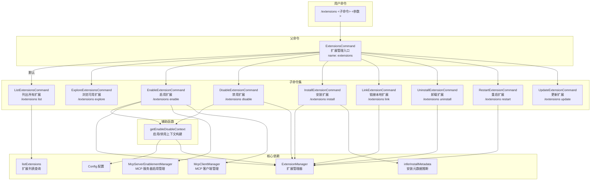

# extensions.ts

## 概述

`extensions.ts` 是 Gemini CLI ACP 命令系统中的**扩展管理命令集**实现文件。它提供了完整的 MCP 扩展（Extension）生命周期管理功能，包括列出、浏览、启用、禁用、安装、链接、卸载、重启和更新扩展。

该文件导出了一个父命令 `ExtensionsCommand` 及其 9 个子命令类，每个子命令实现了 `Command` 接口。用户可以通过 `/extensions <子命令>` 的形式调用这些功能。

扩展本质上是 MCP 服务器的封装，通过 `ExtensionManager` 进行管理。启用/禁用扩展时会联动管理其关联的 MCP 服务器。

## 架构图（Mermaid）

## 核心组件

### 1. `ExtensionsCommand` 类（父命令）

| 属性 | 值 |
|------|-----|
| `name` | `"extensions"` |
| `description` | `"Manage extensions."` |
| `subCommands` | 9 个子命令实例 |

**默认行为：** 直接执行时（`/extensions`），委托给 `ListExtensionsCommand` 执行，即列出所有已安装扩展。

### 2. `ListExtensionsCommand` 类

| 属性 | 值 |
|------|-----|
| `name` | `"extensions list"` |
| `description` | `"Lists all installed extensions."` |

**执行逻辑：**
- 调用 `listExtensions(config)` 获取所有已安装扩展的列表
- 如果有扩展则返回扩展数组，否则返回 `"No extensions installed."` 提示

### 3. `ExploreExtensionsCommand` 类

| 属性 | 值 |
|------|-----|
| `name` | `"extensions explore"` |
| `description` | `"Explore available extensions."` |

**执行逻辑：**
- 返回扩展浏览网站 URL：`https://geminicli.com/extensions/`
- 不需要任何参数或上下文

### 4. `EnableExtensionCommand` 类

| 属性 | 值 |
|------|-----|
| `name` | `"extensions enable"` |
| `description` | `"Enable an extension."` |

**用法：** `/extensions enable <extension> [--scope=<user|workspace|session>]`

**执行逻辑：**
1. 通过 `getEnableDisableContext` 解析参数并获取上下文
2. 遍历要启用的扩展名列表
3. 对每个扩展调用 `extensionManager.enableExtension(name, scope)`
4. **MCP 服务器联动**：如果扩展包含 MCP 服务器定义（`extension.mcpServers`）：
   - 通过 `McpServerEnablementManager.autoEnableServers` 自动启用关联的 MCP 服务器
   - 通过 `McpClientManager.restartServer` 重启这些服务器
   - 并行执行所有服务器重启（`Promise.all`）
5. 收集所有输出信息返回

**特殊支持：** `--all` 参数 -- 启用所有当前未激活的扩展。

### 5. `DisableExtensionCommand` 类

| 属性 | 值 |
|------|-----|
| `name` | `"extensions disable"` |
| `description` | `"Disable an extension."` |

**用法：** `/extensions disable <extension> [--scope=<user|workspace|session>]`

**执行逻辑：**
1. 通过 `getEnableDisableContext` 解析参数并获取上下文
2. 遍历要禁用的扩展名列表
3. 对每个扩展调用 `extensionManager.disableExtension(name, scope)`

**特殊支持：** `--all` 参数 -- 禁用所有当前激活的扩展。

### 6. `InstallExtensionCommand` 类

| 属性 | 值 |
|------|-----|
| `name` | `"extensions install"` |
| `description` | `"Install an extension from a git repo or local path."` |

**用法：** `/extensions install <source>`

**执行逻辑：**
1. 将参数拼接为源路径/URL 字符串
2. **安全检查**：使用正则 `/[;&|`'"]/` 检测是否包含危险字符（命令注入防护）
3. 调用 `inferInstallMetadata(source)` 推断安装元数据（类型、分支等）
4. 调用 `extensionLoader.installOrUpdateExtension(installMetadata)` 执行安装
5. 返回安装结果

### 7. `LinkExtensionCommand` 类

| 属性 | 值 |
|------|-----|
| `name` | `"extensions link"` |
| `description` | `"Link an extension from a local path."` |

**用法：** `/extensions link <source>`

**执行逻辑：**
1. 将参数拼接为本地文件路径
2. 使用 `fs.stat` 验证路径是否存在
3. 调用 `extensionLoader.installOrUpdateExtension` 以 `type: 'link'` 方式链接
4. 链接模式不会复制文件，而是创建符号链接，适合本地开发调试

### 8. `UninstallExtensionCommand` 类

| 属性 | 值 |
|------|-----|
| `name` | `"extensions uninstall"` |
| `description` | `"Uninstall an extension."` |

**用法：** `/extensions uninstall <extension-names...>|--all`

**执行逻辑：**
1. 解析 `--all` 标志和扩展名列表
2. `--all` 时获取所有已安装扩展的名称
3. 遍历并调用 `extensionLoader.uninstallExtension(name, false)` 逐个卸载
4. 第二个参数 `false` 表示不保留配置

### 9. `RestartExtensionCommand` 类

| 属性 | 值 |
|------|-----|
| `name` | `"extensions restart"` |
| `description` | `"Restart an extension."` |

**用法：** `/extensions restart <extension-names>|--all`

**执行逻辑：**
1. 解析 `--all` 标志和扩展名列表
2. 筛选出活跃的扩展（`isActive === true`）
3. 如果指定了名称，进一步过滤匹配的扩展
4. 遍历并调用 `extensionLoader.restartExtension(extension)` 逐个重启

### 10. `UpdateExtensionCommand` 类

| 属性 | 值 |
|------|-----|
| `name` | `"extensions update"` |
| `description` | `"Update an extension."` |

**用法：** `/extensions update <extension-names>|--all`

**当前限制：** 该命令目前不支持无头模式下的更新操作，因为更新需要内部 UI 调度。返回提示信息，建议用户在终端中直接使用 `gemini extensions update` 命令。

### 11. `getEnableDisableContext` 辅助函数

**签名：** `function getEnableDisableContext(config: Config, args: string[], invocationName: string)`

为 `enable` 和 `disable` 命令提供公共的参数解析和上下文构建逻辑。

**处理流程：**
1. 验证 `extensionLoader` 是否为 `ExtensionManager` 实例（环境兼容性检查）
2. 验证参数不为空
3. 解析作用域（`--scope=<user|workspace|session>`），默认为 `user`
4. 过滤出扩展名称参数（排除 `--scope` 前缀和作用域关键字）
5. 处理 `--all` 特殊参数：
   - `enable` 时：筛选所有未激活的扩展
   - `disable` 时：筛选所有已激活的扩展
6. 返回 `{ extensionManager, names, scope }` 或 `{ error }` 错误对象

## 依赖关系

### 内部依赖

| 模块路径 | 导入内容 | 用途 |
|----------|----------|------|
| `@google/gemini-cli-core` | `listExtensions`, `Config`, `getErrorMessage` | 扩展列表查询、配置类型、错误消息提取 |
| `../../config/settings.js` | `SettingScope` | 设置作用域枚举（User/Workspace/Session） |
| `../../config/extension-manager.js` | `ExtensionManager`, `inferInstallMetadata` | 扩展管理器（安装/卸载/启用/禁用/重启）、安装元数据推断 |
| `../../config/mcp/mcpServerEnablement.js` | `McpServerEnablementManager` | MCP 服务器启用状态管理 |
| `./types.js` | `Command`, `CommandContext`, `CommandExecutionResponse` | 命令接口、上下文和响应类型 |

### 外部依赖

| 包名 | 导入内容 | 用途 |
|------|----------|------|
| `node:fs/promises` | `stat` | 文件系统状态检查（`LinkExtensionCommand` 中验证本地路径） |

## 关键实现细节

### 1. 扩展与 MCP 服务器的联动

启用扩展时不仅仅是修改扩展状态，还会联动管理扩展关联的 MCP 服务器：
- 通过 `McpServerEnablementManager.autoEnableServers` 自动启用服务器
- 通过 `McpClientManager.restartServer` 重启服务器以使配置生效
- 重启操作并行执行，单个服务器重启失败不会影响其他服务器

禁用扩展时则不需要联动处理 MCP 服务器（可能是因为禁用扩展后 MCP 服务器会在下次初始化时自动跳过）。

### 2. 三级作用域系统

启用/禁用命令支持三级作用域：
- **User**（默认）：用户级别，影响所有工作区
- **Workspace**：工作区级别，仅影响当前项目
- **Session**：会话级别，仅影响当前会话

作用域可以通过 `--scope=<user|workspace|session>` 指定，也支持简写形式直接传入 `user`/`workspace`/`session`。

### 3. 命令注入防护

`InstallExtensionCommand` 对安装源进行了安全检查，拒绝包含 `;`、`&`、`|`、`` ` ``、`'`、`"` 等 shell 特殊字符的输入。这是因为安装过程可能涉及 git clone 等外部命令执行，需要防止命令注入攻击。

### 4. 安装与链接的区别

- **install**：从 git 仓库或本地路径**复制**安装扩展，通过 `inferInstallMetadata` 自动推断安装类型（git/local）
- **link**：从本地路径**符号链接**扩展（`type: 'link'`），修改源代码会立即生效，适合扩展开发调试

### 5. `--all` 批量操作

多个子命令支持 `--all` 参数进行批量操作：
- **enable --all**：启用所有未激活的扩展
- **disable --all**：禁用所有已激活的扩展
- **uninstall --all**：卸载所有已安装的扩展
- **restart --all**：重启所有活跃的扩展
- **update --all**：（未实现）更新所有扩展

### 6. 环境兼容性检查

每个涉及扩展管理操作的命令都会先检查 `extensionLoader` 是否为 `ExtensionManager` 实例。这是因为在某些环境下（如测试环境或受限环境），扩展加载器可能不是完整的 `ExtensionManager`，而是一个简化的实现，不支持安装/卸载等操作。

### 7. 父命令的默认行为

`ExtensionsCommand` 作为父命令，直接执行时（`/extensions` 不带子命令）会委托给 `ListExtensionsCommand`，这是一种常见的 CLI 设计模式 -- 无参数时显示帮助或列表信息。

### 8. 更新命令的临时限制

`UpdateExtensionCommand` 目前返回提示信息而非实际执行更新，因为无头更新需要"内部 UI 调度"。这可能意味着更新过程需要用户交互（如确认版本、处理冲突等），在 ACP 无头模式下尚未实现。
