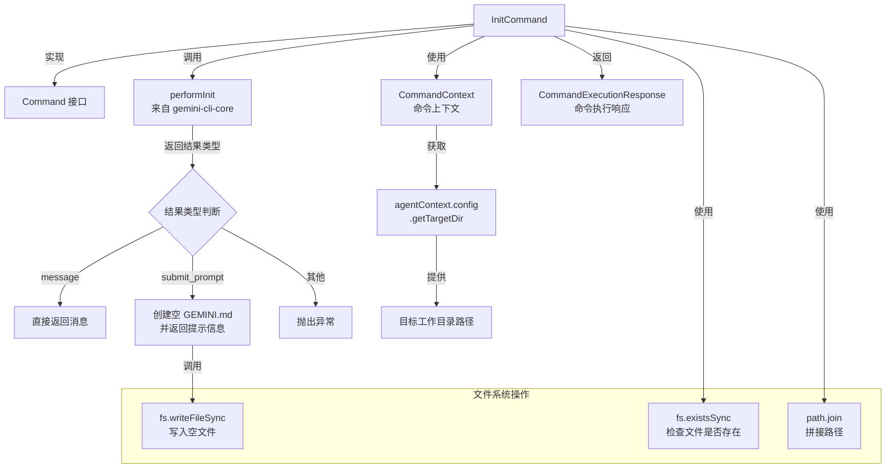

# init.ts

## 概述

`init.ts` 是 Gemini CLI 中 ACP（Agent Communication Protocol）命令体系的初始化命令实现文件。该文件定义了 `InitCommand` 类，负责分析当前项目并在项目根目录创建定制化的 `GEMINI.md` 配置文件。`GEMINI.md` 文件是 Gemini CLI 理解项目上下文的重要配置文件，包含项目结构、技术栈等信息，帮助 AI 更好地理解和协助项目开发。

## 架构图（Mermaid）

## 核心组件

### InitCommand 类

| 属性/方法 | 类型 | 说明 |
|-----------|------|------|
| `name` | `string` | 命令名称，固定值 `'init'` |
| `description` | `string` | 命令描述：分析项目并创建定制的 GEMINI.md 文件 |
| `requiresWorkspace` | `boolean` | 是否需要工作区，固定为 `true` |
| `execute(context, _args)` | `async method` | 命令执行入口，接收命令上下文和参数 |

### execute 方法执行流程

1. **获取目标目录**：通过 `context.agentContext.config.getTargetDir()` 获取当前工作区的目标目录路径。
2. **校验工作区**：若目标目录不存在，抛出 `'Command requires a workspace.'` 错误。
3. **构建文件路径**：使用 `path.join` 将目标目录与 `'GEMINI.md'` 拼接为完整路径。
4. **调用核心初始化逻辑**：调用 `performInit(fs.existsSync(geminiMdPath))`，传入 `GEMINI.md` 是否已存在的布尔值。
5. **处理返回结果**：
   - **`message` 类型**：直接将结果包装为 `CommandExecutionResponse` 返回，通常表示文件已存在时的提示信息。
   - **`submit_prompt` 类型**：先创建一个空的 `GEMINI.md` 文件，然后返回包含提示内容的信息消息，告知用户如何在新对话中填充项目上下文。
   - **其他类型**：抛出未知结果类型错误。

### 结果处理的两种场景

| 场景 | 结果类型 | 行为 |
|------|----------|------|
| GEMINI.md 已存在 | `message` | 返回提示消息（可能提示文件已存在） |
| GEMINI.md 不存在 | `submit_prompt` | 创建空 GEMINI.md，返回填充指引 |

## 依赖关系

### 内部依赖

| 模块 | 导入内容 | 用途 |
|------|----------|------|
| `./types.js` | `Command`, `CommandContext`, `CommandExecutionResponse` | 命令接口定义和类型约束 |

### 外部依赖

| 模块 | 导入内容 | 用途 |
|------|----------|------|
| `node:fs` | `fs` (整体导入) | 文件系统操作：检查文件存在性 (`existsSync`)、写入文件 (`writeFileSync`) |
| `node:path` | `path` (整体导入) | 路径操作：拼接文件路径 (`join`) |
| `@google/gemini-cli-core` | `performInit` | 核心初始化逻辑函数，封装了初始化的具体业务判断 |

## 关键实现细节

1. **工作区强制要求**：`requiresWorkspace = true` 标记该命令必须在有效工作区下执行。`execute` 方法内部也做了双重校验——即使框架层已根据 `requiresWorkspace` 做过校验，方法内仍显式检查 `targetDir` 是否为空。

2. **performInit 的参数设计**：`performInit` 接收一个布尔值参数，表示 `GEMINI.md` 文件是否已存在。这使得核心逻辑可以根据文件是否存在返回不同的处理策略（`message` 或 `submit_prompt`）。

3. **空文件创建策略**：当需要创建新的 `GEMINI.md` 时，命令先用 `fs.writeFileSync(geminiMdPath, '', 'utf8')` 创建一个空文件作为占位符。实际的内容填充需要用户在新的聊天对话中使用返回的提示文本手动触发。

4. **UI 解耦设计**：代码注释明确指出，该命令无法直接触发基于 UI 的交互式 Agent 循环。因此采用了输出提示文本的方式，让用户手动在新对话中执行生成操作。这体现了命令层与 UI 层的解耦设计。

5. **类型安全校验**：在 `submit_prompt` 分支中，显式检查 `result.content` 是否为字符串类型，不满足则抛出异常，确保类型安全。

6. **返回值统一格式**：所有分支均返回 `CommandExecutionResponse` 格式的对象，包含 `name` 和 `data` 两个字段，保证了命令响应格式的一致性。
