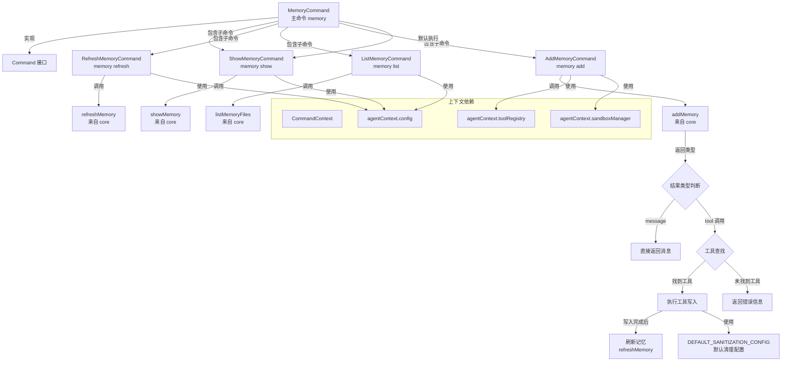

# memory.ts

## 概述

`memory.ts` 是 Gemini CLI 中 ACP 命令体系的记忆管理命令实现文件。该文件定义了一个主命令 `MemoryCommand` 和四个子命令（`ShowMemoryCommand`、`RefreshMemoryCommand`、`ListMemoryCommand`、`AddMemoryCommand`），共同构成了完整的记忆管理功能。

"记忆"（Memory）在 Gemini CLI 中指的是通过 `GEMINI.md` 文件存储的项目上下文信息。这些命令允许用户查看、刷新、列出和添加记忆内容，使 AI 能够持续了解项目的关键信息和用户偏好。

## 架构图（Mermaid）



## 核心组件

### 1. MemoryCommand 主命令

| 属性 | 类型 | 说明 |
|------|------|------|
| `name` | `readonly string` | 值为 `'memory'` |
| `description` | `readonly string` | `'Manage memory.'` |
| `subCommands` | `readonly Command[]` | 包含四个子命令实例 |
| `requiresWorkspace` | `readonly boolean` | `true`，需要工作区 |

**行为**：当不带子命令执行时，默认委托给 `ShowMemoryCommand` 执行，即显示当前记忆内容。

### 2. ShowMemoryCommand 子命令

| 属性 | 值 | 说明 |
|------|-----|------|
| `name` | `'memory show'` | 显示记忆命令 |
| `description` | `'Shows the current memory contents.'` | 显示当前记忆内容 |

**执行逻辑**：调用核心模块的 `showMemory(config)` 函数，传入配置对象，返回记忆内容。

### 3. RefreshMemoryCommand 子命令

| 属性 | 值 | 说明 |
|------|-----|------|
| `name` | `'memory refresh'` | 刷新记忆命令 |
| `aliases` | `['memory reload']` | 别名：`memory reload` |
| `description` | `'Refreshes the memory from the source.'` | 从源文件刷新记忆 |

**执行逻辑**：调用核心模块的 `refreshMemory(config)` 函数（异步），从源 `GEMINI.md` 文件重新加载记忆内容。

### 4. ListMemoryCommand 子命令

| 属性 | 值 | 说明 |
|------|-----|------|
| `name` | `'memory list'` | 列出记忆文件命令 |
| `description` | `'Lists the paths of the GEMINI.md files in use.'` | 列出所有使用中的 GEMINI.md 文件路径 |

**执行逻辑**：调用核心模块的 `listMemoryFiles(config)` 函数，返回当前使用的所有 `GEMINI.md` 文件路径列表。

### 5. AddMemoryCommand 子命令

| 属性 | 值 | 说明 |
|------|-----|------|
| `name` | `'memory add'` | 添加记忆命令 |
| `description` | `'Add content to the memory.'` | 向记忆中添加内容 |

**执行逻辑**（最复杂的子命令）：

1. 将所有参数拼接为待添加的文本内容 `textToAdd`。
2. 调用 `addMemory(textToAdd)` 获取处理结果。
3. **如果结果类型为 `message`**：直接返回消息内容（通常是错误提示或验证信息）。
4. **如果结果为工具调用类型**：
   - 从工具注册表中查找指定工具。
   - 若找到工具：创建 `AbortController`，发送状态消息，通过工具的 `buildAndExecute` 方法执行写入操作，完成后调用 `refreshMemory` 刷新记忆缓存。
   - 若未找到工具：返回错误信息。

### DEFAULT_SANITIZATION_CONFIG 常量

```typescript
const DEFAULT_SANITIZATION_CONFIG = {
  allowedEnvironmentVariables: [],     // 允许的环境变量列表（空）
  blockedEnvironmentVariables: [],     // 阻止的环境变量列表（空）
  enableEnvironmentVariableRedaction: false, // 禁用环境变量脱敏
};
```

该配置用于 `AddMemoryCommand` 中工具执行时的安全清理设置。默认配置下不做任何环境变量的过滤或脱敏处理。

## 依赖关系

### 内部依赖

| 模块 | 导入内容 | 用途 |
|------|----------|------|
| `./types.js` | `Command`, `CommandContext`, `CommandExecutionResponse` | 命令接口定义和类型约束 |

### 外部依赖

| 模块 | 导入内容 | 用途 |
|------|----------|------|
| `@google/gemini-cli-core` | `addMemory` | 添加记忆内容的核心逻辑 |
| `@google/gemini-cli-core` | `listMemoryFiles` | 列出记忆文件路径的核心逻辑 |
| `@google/gemini-cli-core` | `refreshMemory` | 刷新记忆内容的核心逻辑 |
| `@google/gemini-cli-core` | `showMemory` | 显示记忆内容的核心逻辑 |

## 关键实现细节

1. **子命令模式设计**：`MemoryCommand` 通过 `subCommands` 数组组织子命令，形成了层次化的命令结构。主命令的 `execute` 方法默认委托给 `ShowMemoryCommand`，这是一种常见的 CLI 设计模式——无子命令时执行最常用操作。

2. **别名支持**：`RefreshMemoryCommand` 定义了 `aliases = ['memory reload']`，允许用户使用 `memory reload` 或 `memory refresh` 两种方式调用相同功能，提升了用户体验。

3. **工具注册表集成**：`AddMemoryCommand` 通过 `context.agentContext.toolRegistry` 获取工具实例，展示了命令系统与工具系统的集成方式。`addMemory` 核心函数返回需要调用的工具名和参数，命令层负责从注册表中查找并执行。

4. **AbortController 模式**：在工具执行时创建 `AbortController` 并传入 `signal`，为异步操作提供了取消能力。虽然当前代码中未实际使用 abort 功能，但预留了中断执行的接口。

5. **写后刷新策略**：`AddMemoryCommand` 在工具执行写入操作后，立即调用 `refreshMemory` 刷新内存中的记忆缓存，确保后续读取操作能获取最新内容。这是一种典型的写后刷新（write-through）缓存策略。

6. **沙箱执行环境**：工具执行时通过 `shellExecutionConfig` 传入沙箱管理器 (`sandboxManager`) 和清理配置 (`sanitizationConfig`)，确保命令在受控环境中执行，防止潜在的安全风险。

7. **消息通知机制**：`AddMemoryCommand` 在执行工具前通过 `context.sendMessage()` 发送状态消息 `"Saving memory via ${result.toolName}..."`，为用户提供操作进度反馈。

8. **readonly 修饰符**：所有命令类的属性均使用 `readonly` 修饰，确保命令元数据在实例化后不可变，增强了类型安全性。
